# Importar mapas de Garry's Mod a Epsilon

Guía por **NORTE.m2** · Versión 1.0

---

En esta guía vamos a aprender a importar mapas desde la workshop de Garry's Mod.

Es una guía avanzada de **WMOs**. Aunque iremos paso a paso, si tienes poca experiencia te recomiendo primero consultar:
- [Uso básico de Blender para crear un WMO](https://nortedwg.github.io/compendio-del-modding/WMO/Uso-basico-de-Blender-para-WMO)
- [Creación de un WMO Custom para Epsilon](https://nortedwg.github.io/compendio-del-modding/WMO/Crear-un-WMO-custom)

(*Especialmente recomiendo tener claros los conceptos y herramientas de la primera*)

---

## Requisitos

Garry's Mod:

- [**Blender 4.3.2**](https://download.blender.org/release/Blender4.3/) — 4.3.2 para importar los mapas.
- [**Blender 3.6 LTS**](https://www.blender.org/download/lts/3-6/#versions) — 3.6 LTS para convertirlos a la 3.4.
- [**GWTool**](https://www.moddb.com/mods/garrys-mod/downloads/gwtool-file-made-by-zombieslayer103)
- [**SourceIO**](https://github.com/REDxEYE/SourceIO) — Addon de Blender 4.3.2 (instálalo para esa versión) *[[Ayuda]](https://nortedwg.github.io/compendio-del-modding/WMO/Uso-basico-de-Blender-para-WMO#c%C3%B3mo-instalar-un-addon)* *[[Video]](https://youtu.be/q1Nvbl8oNpQ?si=7elpRkRGVa6TXrWL)*

WMO:
- [**Blender 3.4**](https://download.blender.org/release/Blender3.4/)
- [**WoW: Atajos Útiles**](https://github.com/nortedwg/WoW-Atajos-Utiles) — Addon de Blender 3.4 (instálalo para esa versión) *[[Ayuda]](https://nortedwg.github.io/compendio-del-modding/WMO/Uso-basico-de-Blender-para-WMO#c%C3%B3mo-instalar-un-addon)* *[[Video]](https://youtu.be/q1Nvbl8oNpQ?si=7elpRkRGVa6TXrWL)*

*(Sí. Necesitaremos 3 versiones de Blender diferentes. Es la mejor forma que he encontrado por el momento.)*

No obligatorio: (*Puede hacerse de otras formas*)
- [**SteamCMD**](https://steamcdn-a.akamaihd.net/client/installer/steamcmd.zip) 
- [**7ZIP**](https://www.7-zip.org/download.html)
- [**wow.export**](https://www.kruithne.net/wow.export)

---

## Descargar el Mapa

:::tip[Dato]
Si tienes el juego puedes extraer el mapa desde la carpeta de tu workshop una vez lo descargas. Aquí se va a mostrar como descargarse si no lo tienes.
:::

Entra en la [**workshop de Garry's Mod**](https://steamcommunity.com/workshop/browse/?appid=4000&requiredtags[]=Map) y activa el filtro de **MAPA**

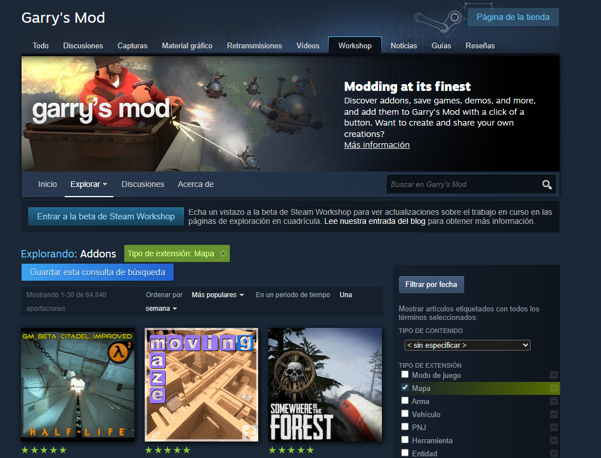

Entramos en el mapa que queramos y copiamos su **URL**.


Entramos a una web para descargar el mapa. En mi caso utilizo https://steamworkshopdownloader.io/

Pego el enlace, puslo enter y le daré a [**YES**]

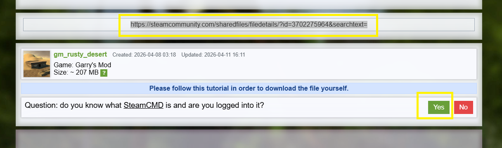

Ahora copio el enlace que me ha generado la web:

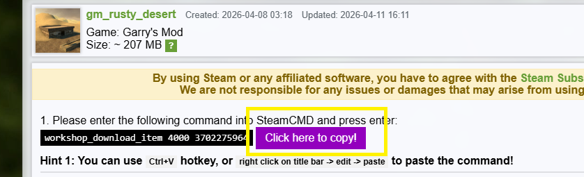

Abro el programa de **SteamCMD** y cuando se abra escribo `login anonymous` y pulso enter.

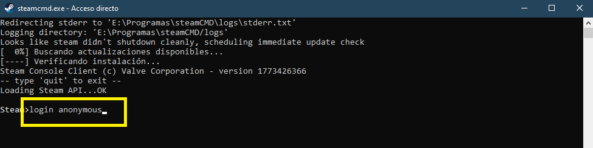

Ahora pego el comando que me generó la web anterior y pulso enter.

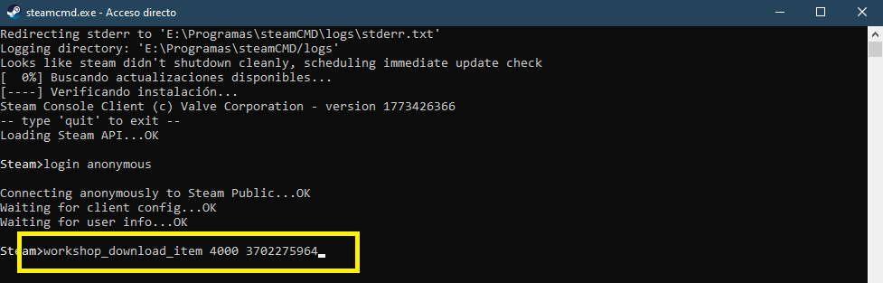

:::note[Dato]
Puede tardar unos segundos o unos minutos, depende de cuanto pese el mapa y tu velocidad de internet. **No** hay barra de progreso, por lo que deberás tener paciencia hasta que acabe.
:::

Cuando termine nos avisará con un mensaje de *Success*. A continuación nos dirá en qué carpeta se ha descargado nuestro mapa.

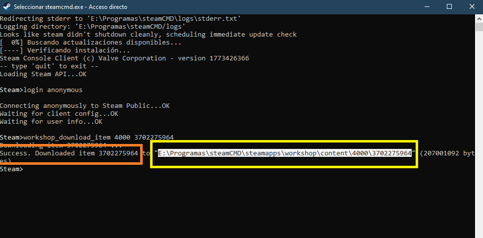
:::tip[Consejo]
Yo selecciono la ruta, la copio y la pego en el explorador de archivos.
:::

Ya tenemos nuestra descarga hecha. Podemos cerrar el SteamCMD.

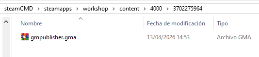

---

## Conversión

Ejecutaremos el programa **GWTool.exe**.

Se nos abrirá una ventana. Arrastraremos el archivo **.gma** que hemos descargado hasta el interior de la ventana.

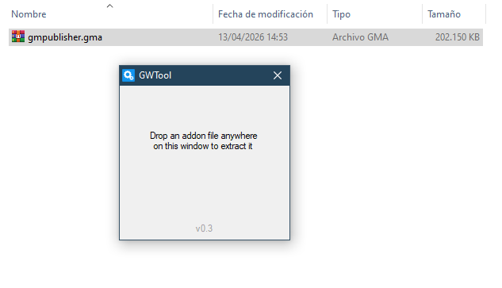

Tras ello, en unos segundos, se nos generará una carpeta con el contenido extraido. Ya lo podemos cerrar.


:::warning[¡Se me ha extraido un archivo .7zip!]
Algunos mapas tienen doble compresión. Si se extrae un .7zip abrelo con el programa [**7ZIP**](https://www.7-zip.org/download.html), dentro extrae el **.gma** y vuelve a arrastrarlo sobre la ventana de **GWTool**. Esta vez sí tendrás la carpeta.
:::

---

## Importar el Mapa en Blender

Abrimos **Blender 4.3.2**. Con el addon **SourceIO** ya instalado. *[[Ayuda]](https://nortedwg.github.io/compendio-del-modding/WMO/Uso-basico-de-Blender-para-WMO#c%C3%B3mo-instalar-un-addon)* *[[Video]](https://youtu.be/q1Nvbl8oNpQ?si=7elpRkRGVa6TXrWL)*

Importamos nuestro mapa **.bsp**


Lo encontraremos en la carpeta que hemos extraido dentro de `/maps/archivo.bsp`


:::tip[Consejo]
Recuerda que si no puedes verlo completo por el tamaño puedes ampliar la visión pulsando N y luego:
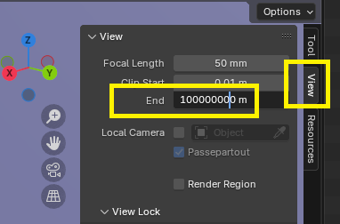
:::

Con esto ya hemos importado nuestro mapa:


:::tip[Consejo]
Recuerda que puedes activar las texturas. Ya se habrán importado automáticamente.

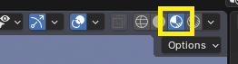
:::
:::warning[¡He activado las texturas y no se ven!]
Algunos mapas traen las texturas en otros paquetes de la workshop. Asegúrate que no tiene dependencias donde debas descargarlas. 
Algunos mapas usan las texturas base del propio Garry's Mod. En este caso aún no sé como obtenerlas. Si las descargas deberían funcionar.
En un futuro cuando sepa como hacerlo con exactitud se actualizará esta sección.
:::

---

## Cargar Entidades

Lo primero que vamos a hacer va a ser cerrar las collections en el explorador para tener un poco de orden:

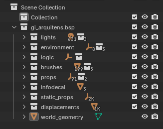

Los que nos interesarán son:
- **world_geometry**: Es en si el propio mapa.
- **displacements**: Suele corresponder al terreno.
- **static_props**: Objetos sólidos.
- **props y brushes:** Props especiales con animación. Por ejemplo puertas.

Como puedes ver en el mapa los **props**, de ningún tipo, no aparecen.

---

## Activar Props

Pulsa en cualquiera de los props en el listado de archivos.

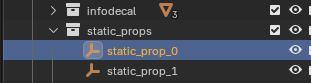

Luego pulsa la tecla [**A**]. Se seleccionarán todos los objetos del mapa.

Pulsa la tecla [**N**] y accede al panel de **SourceIO**. Después pulsa en [**Load Entity**]:

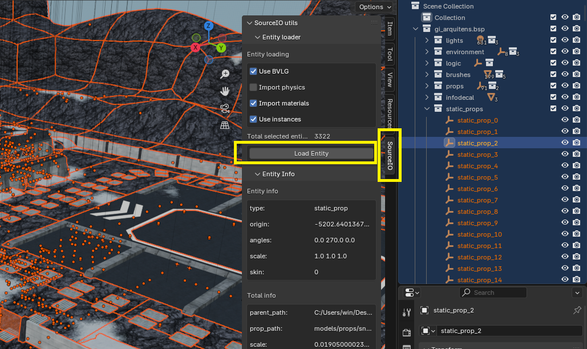

Se habrán cargado todos los props del mapa.

---

## Convertir Props a Objetos

Si te fijas en **static_props** podrás ver que no son objetos sólidos. El icono es el de "un contenedor" en blender.
Para ser un objeto debería ser un triángulo hacia debajo.

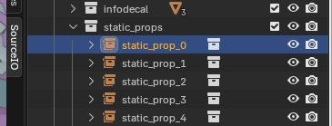

Seleccionamos todos los objetos que tienen ese símbolo. (*Los que indican un triángulo hacia debajo no hace falta*)


Despues pulsamos [**CONTROL**]+[**A**] (*el ratón debe estar en la ventana principal de Blender, no sobre el listado de archivos*) y pulsamos en [**Make Instances Real**]:


---

## Limpieza y preparar la Exportación

Vamos a eliminar todo lo que no queremos exportar.
:::tip[Consejo]
Yo arrastro todas las collection que no quiero a una que voy a utilizar para borrar.


Luego simplemente click derecho y [**Delete Hierarchy**]:

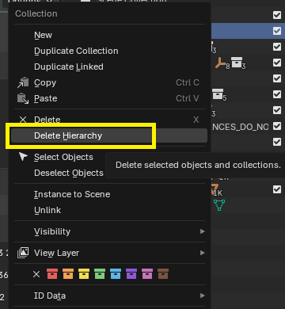
:::
:::warning[Aviso]
No tienes por qué borrar los mismos archivos que yo. Dependerá de cada mapa y tu criterio. Por norma general, eliminaremos todo lo que no son props o el propio mapa.
:::

Continuaremos con la limpieza.


:::warning[Ten en cuenta...]
En el WoW hay un límite de polígonos por cada sub-grupo de WMO. Todo lo que podamos borrar será menos trabajo después y menos texturas que importar.
:::

En mi caso, he decidido borrar todos los árboles y rocas para luego colocarlos dentro del wow como gobs.

:::tip[Recuerda...]
Que puedes activar esta opción para ver el número de polígonos totales de la escena.

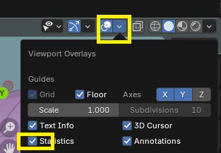
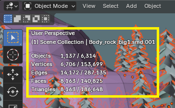
:::
:::note[Dato]
Cada sub-grupo de WMO no deberá superar los 40.000 caras. Un WMO puede tener hasta 20 sub-grupos aproximadamente. Dependerá de qué WMO elijas. Con más de 7 u 8 hay menos modelos.
:::

---

## De Blender 4.3 a Blender 3.4

Una vez tenemos todo limpio guardamos nuestro archivo como un proyecto normal de Blender.


- Abrimos el proyecto con **Blender 3.6 LTS**. Funcionará como una versión intermedia. Lo volveremos a guardar en el mismo sitio sobreescribiendo el que ya teníamos.

- Ya podemos abrir nuestro proyecto con nuestro **Blender 3.4** normal.

:::warning[Cuidado]
Si intentas abrir el archivo guardado con Blender 4, con el Blender 3.4 sin haberlo reescrito primero con Blender 3.6, crasheará el programa.
:::

---

## Hacer los sub-grupos del WMO

:::note[Dato]
Cada sub-grupo de WMO no deberá superar los 40.000 caras. Un WMO puede tener hasta 20 sub-grupos aproximadamente. Dependerá de qué WMO elijas. Con más de 7 u 8 hay menos modelos.
:::

Este paso es bastante manual. Se trata de crear varios grupos que no superen las 40.000 caras.

Puedes hacerlo de varias formas:
- Puedes unir todo en nuna misma malla y luego ir haciendo divisiones.
- Puedes ir combinando uno a uno hasta ir sumando.

El método es libre.

:::note[Dato]
Separar entre WMO exteriores y WMO interiores es mucho trabajo. Normalmente todo como exterior se ve bastante bien pudiendo arreglarse la iluminación con cavelights. Por simplificación de la guía todo van a ser exteriores.
:::

**PROCESO:**

Voy a realizar el proceso de forma un poco burda por simplificar para la guía. Tú puedes dedicarle el esmero que consideres. 

Lo primero que he hecho es comprobar world_geometry él solo.
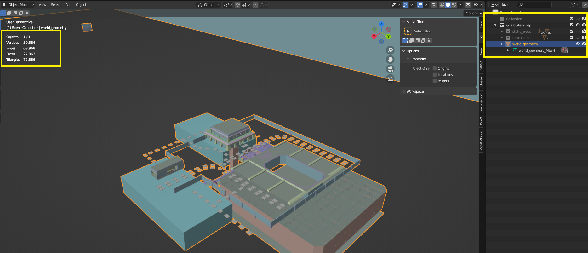
Veo que tiene 27.000 caras por lo que lo dejaré como sub-grupo solo. Por orden propio lo renombraré como grupo-1.

Ahora voy con el terreno.

Veo que tiene 47.000 caras, por lo que deberé separarlo en dos.
Primero voy a unirlo todo en un mismo grupo.

:::warning[Cuidado]
Es muy probable que sin este paso crashee el programa al unirlo.
Sigue estos pasos, con todo seleccionado en editar, y pulsa en Merge by Distance.
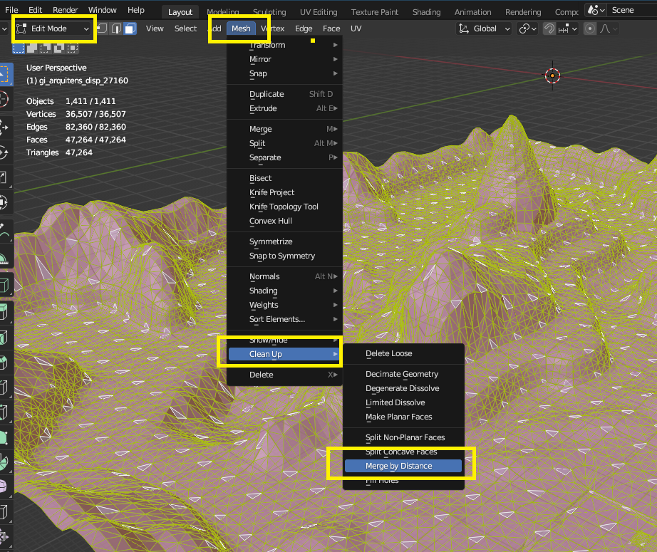
Esto puede ocurrir con otros grupos, no solo con el terreno.
:::
:::note[Dato]
No hace falta que lo hagas. Pero... Si sigue crasheando puedes probar de la misma forma Edit Mode > Mesh > Clean Up > Fill Holes.
:::

He unido todo el terreno en un mismo grupo.


Y ahora lo divido en dos partes. (*He entrado en Edit mode > 3 para seleccionar las caras > P para separar*)

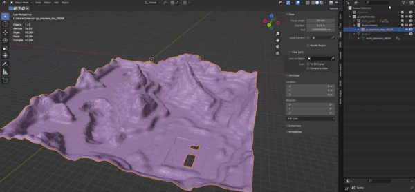

Ahora, por orden propio, los renombro como grupo 2 y 3.

**Repetiría** el mismo proceso con el resto de props y objetos.

Iría creando grupos que no superen el límite hasta tener todos los necesarios. (*Por simplificación del tutorial y evitar repetición he ignorado los props. El proceso es exactamente el mismo.*). Quedando así:

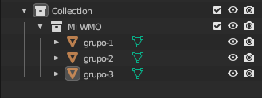

---

## Materiales y UVs

Lo primero que hago es utilizar el addon para que todas las UV se llamen correctamente.


Compruebo que todos los materiales tengan imagen. Uso el botón del addon.


En este caso me indica que en el grupo-1 hay 3 materiales sin imagen asignada.

Veo que es un material con una textura blanca, asi que entro en modo edición, selecciono las caras con ese material y pulso en otro parecido para asignarlas.


:::note[Dato]
Puedes solucionarlo de diferentes métodos. Creando un nuevo material, añadiendo la imagen, borrando esas caras, etc... Mientras que al final no quede ningún material sin imagen asignada no importa.
:::
:::tip[¿Qué es una imagen asignada?]
Me refiero a que en sus nodos de materiales base color tenga una imagen de cualquier tipo enlazada.

:::

Una vez he terminado de arreglar los problemas, limpio de todos mis grupos los materiales que no están utilizando.
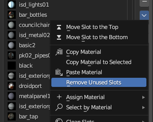

Vuelvo a asegurarme de que no hay imágenes sin textura:


Por último, renombro todos los materiales como su imagen. Uso el botón del addon:


---

## Enlazar materiales custom con materiales del WoW

Utilizamos el primer botón para exportar una lista de nuestros materiales al escritorio.


Pulsamos el botón de ver el Nº Total de materiales. Nos fijaremos en el apartado "con objeto".

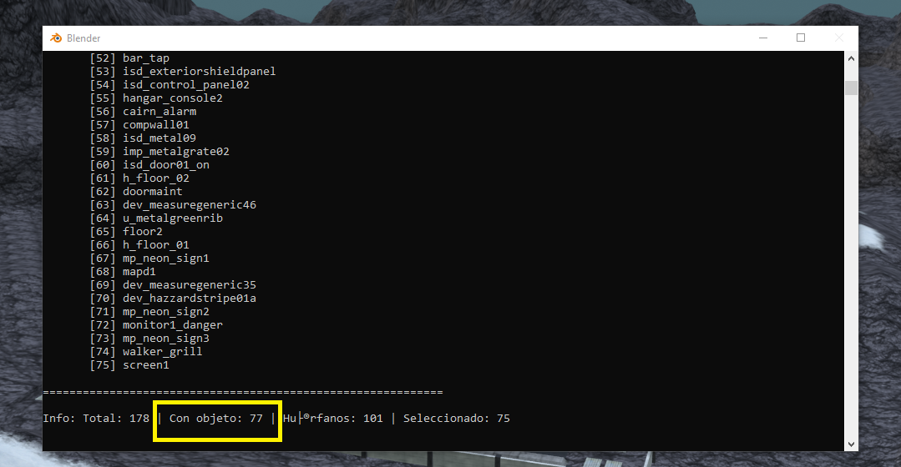

Iremos a **wow.export** u otra herramienta similar [(como wago.tools)](https://wago.tools/files) y buscaremos ese número de texturas.
:::note[En este caso]
Dice que requiero de 77 texturas. Voy a wow.export y busco 77 blps facilmente remplazables.

En este caso he buscado 77 texturas de un mapa para reemplazarlas.
:::
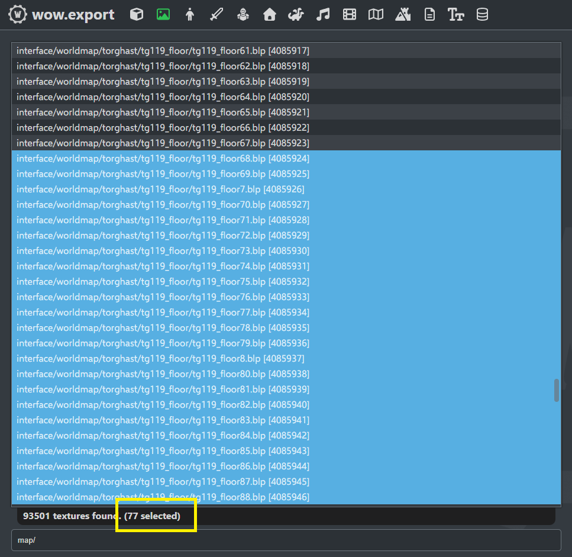

Con click derecho copio los file path. Uso la segunda opción.


Lo pego en un bloc de notas o cualquier herramienta similar y guardo.


Utilizo una IA para generar el JSON con las texturas, ya que hacerlo a mano sería muy laborioso.

En este caso estoy utilizando **Claude** Sonnet 4.6 Extendido.
Con este prompt:
```
Hazme un JSON con este formato.
"textura": "carpeta/carpeta/archivo.blp",
En textura debes poner las texturas del archivo materiales.txt.
A cada una de esas texturas, le asignas una ruta hasta el blp, sin la ID, de listadetexturas.txt.
```

Le he adjuntado los dos **.txt**:
- listadetexturas.txt es el que acabamos de crear con las rutas de wow.export.
- materiales.txt es el que se exportó automaticamente con el addon al pulsar el botón al escritorio.

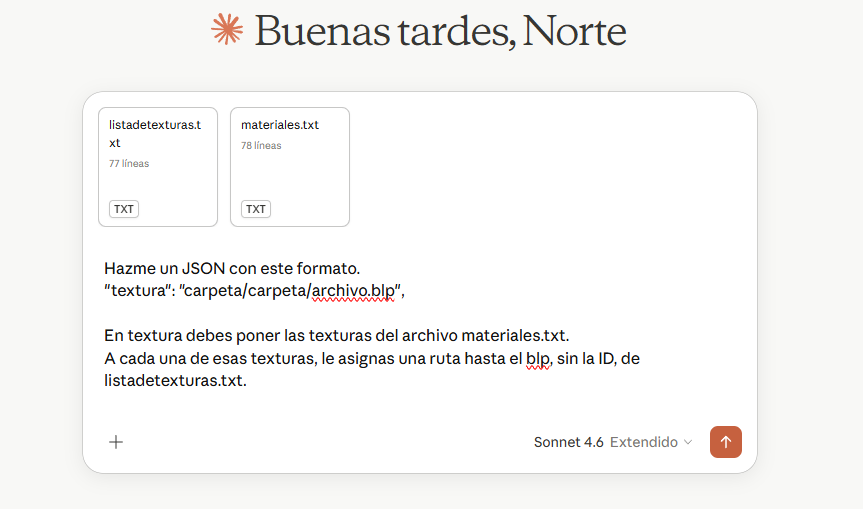

El **.json** resultante que me da lo nombro como quiera, en este caso el nombre será tutorial.JSON

Vuelvo a Blender y voy a usar en este caso el botón para importar un JSON con texturas custom.

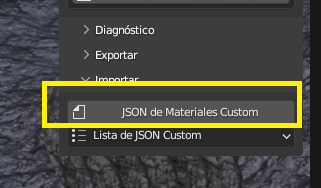

Selecciono el que hemos creado.

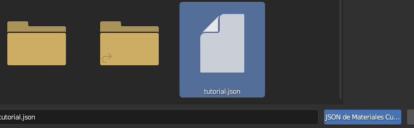

Compruebo en el desplegable que se ha activado el **.json**.


---

## Crear el WMO

Activamos la siguiente opción para habilitar la creación del WMO:

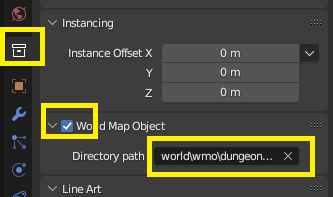

En **directory path** deberemos introducir el directorio del WMO **original** del WoW que vamos a sustituir al hacer el parche.

**Ejemplo:**

Si el WMO que vamos a sustituir es `world/wmo/brokenisles/suramar/7sr_hub_statue.wmo`, el **directory path** será `world/wmo/brokenisles/suramar`

*(Es decir, eliminamos el nombre del archivo: `/7sr_hub_statue.wmo`)*


Al haber activado el paso anterior, se nos habrán formado diferentes grupos automáticamente.

Introducimos todos nuestros objetos en **outdoor** y eliminamos las otras collections restantes.


Con uno de los grupos seleccionados, le damos a WMO > Generate Materials. Los creará para todos. Momentáneamente perderán la textura.


Volvemos al addon de Atajos Útiles y le daremos a [Rellenar Texturas de WMO].

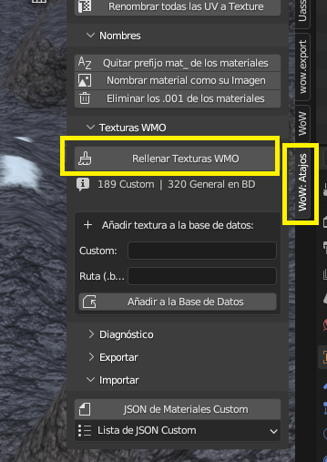

Como ya les hemos asignado un **.blp** al crear el **.json** se han adjudicado todas automáticamente.

Para añadir colisión, dentro del panel del addon de WMO haz click en **QUICK COLLISION**.


Generará una colisión básica según la forma del objeto 3D.

:::tip[Tip]
Por defecto deja el número que aparece. Si ingame la colisión no funciona como debe, cambia el número. Normalmente otro mayor dará mejores resultados, sin embargo, tras haber probado, hay veces que números como 100 o 200 solucionan el problema. Recomiendo probar primero 5000, etc. Ve probando hasta que uno funcione.
:::

---

## Exportar el WMO


Una vez todo completado, exportamos desde el panel del addon:

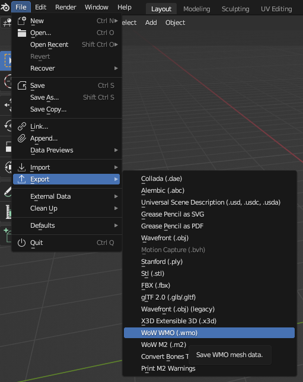

El objeto exportado será de la versión 3.3.5 (Lichking). Hay que convertirlo a Shadowlands usando el convertidor.

Introducimos los archivos que habrá exportado Blender en la carpeta `INPUT`, **con el nombre del WMO original**:


Hacemos click en el *MultiConverter.exe* y en la carpeta `OUTPUT` aparecerán 3 archivos. Con los dos `.wmo` se crea el parche del Epsilon. ¡Listo!

---

## Exportar las Texturas Custom

Ya que nuestro proyecto usa una gran cantidad de texturas custom vamos a exportarlas a Epsilon.

Volvemos al addon de atajos y pulsamos en exportar PNGs a escritorio.


:::warning[Cuidado]
Si no hacemos este paso después de haber generado las texturas de WMO no saldrán correctamente.
:::

Se habrá creado una carpeta en el escritorio con todas las texturas en **.png**.

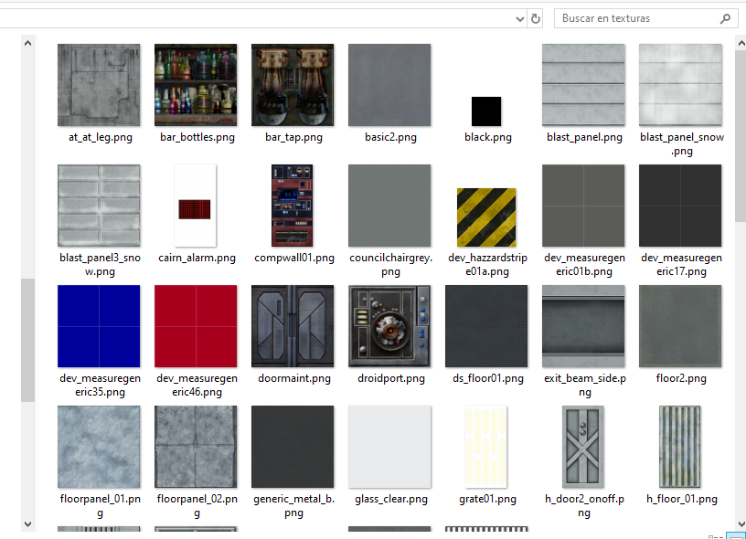

:::tip[Convertir .png > .blp]
Para convertir los archivos necesitaremos:
[https://www.wowinterface.com/downloads/landing.php?s=734452651e00d9554b435e4acbc95c05&fileid=22128](https://www.wowinterface.com/downloads/landing.php?s=734452651e00d9554b435e4acbc95c05&fileid=22128)

Simplemente arrastramos los `.png` sobre el `.exe` y nos creará un `.blp` en la misma carpeta. Si son muchos o de gran tamaño pueden tardar un rato.
:::

Volveremos al chat de la IA que hemos utilizado antes, ahora para pedir que nos haga el **.json** con las IDs que utilizaremos para el parche del Epsilon.

En este caso mi prompt es:
```
Hazme un json con este formato utilizando los archivos de antes:
{"name":null,"version":"1","url":null,"files":[{"file":"textura.blp","id":numero}]}

En textura pon el nombre de la textura que has generado en el último .json pero añadiendole .blp a cada una. Luego, comprueba qué ruta le adjudicaste y en el .txt de antes, donde estaban las rutas, busca la ID y reemplaza donde dice numero de cada una por su ID correcta.
```


El **.json** que me exporte lo renombro como **patch.json** y lo introduzco en la carpeta con los **.blp**.

---

## Unir Parches.

Tendré por tanto un parche con todas las texturas preparadas para el WoW.

Puedes unirlo con el parche que generes con el WMO y tendrás el proyecto finalizado.

---
