# Editar un M2 para Epsilon (Método M2i)

Guía por **NORTE.m2** · Versión 2.0

---

## Programas necesarios

- **M2MOD** *(versión ya preparada, incluye listfile.csv actualizado)*
  [Descargar M2MOD](https://drive.google.com/file/d/1myLD8lj_pfrGMykKlWnP9eSKlyuO7c7i/view?usp=sharing)
  
 ---
 Ahora deberás elegir una de estas dos versiones de Blender para trabajar:

 ### Versión 3.4
Esta es una versión modificada para maximilizar compatibilidad con los WMO. Recomiendo utilizar esta.
- **Blender Addon M2i Import**
  [Descargar Addon](https://github.com/nortedwg/m2i-blender-3.4)

- **Blender 3.4.0**
  [Descargar Blender 3.4.0](https://download.blender.org/release/Blender3.4/)
---
### Versión 2.9
Esta es la versión **original** del AddOn. Sin embargo, recomiendo utilizar la 3.4 para maximilizar compatibilidad con los WMO.
- **Blender Addon M2i Import**
  [Descargar Addon](https://bitbucket.org/suncurio/blender-m2i-scripts/src/master/)

- **Blender 2.90.0**
  [Descargar Blender 2.90.0](https://download.blender.org/release/Blender2.90/)
---
:::note[Otros links de utilidad (no necesarios)]
**M2MOD Original** *(Sin listfile)*: https://bitbucket.org/suncurio/m2mod/downloads/
:::

---

## 1. Preparar el programa

- Descargar **Blender** — únicamente una de las dos versiones anteriormente propuestas.
- Descargar el programa **M2MOD** — se recomienda la versión ya preparada, pues ya incluye un `listfile.csv` actualizado dentro de la carpeta `mappings`.
- Instalar el **Addon** de Blender en Blender.

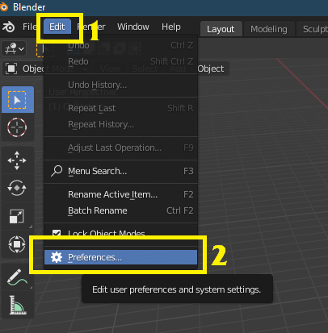

Al pulsar **[Install]** seleccionamos el `.zip` del addon.

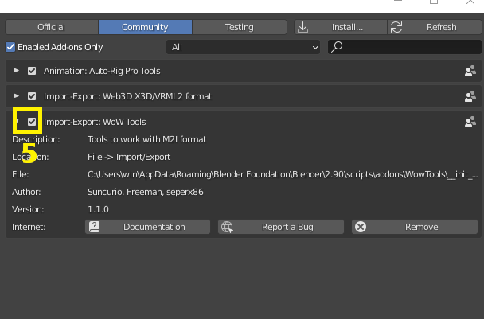

Activamos el llamado **"Import-Export: WoW Tools"**.

---

## 2 — Preparar los archivos

Este método de parcheo funciona por **sustitución**. Deberemos elegir la pieza de armadura base que vamos a modificar o sustituir.

En este caso vamos a elegir estas hombreras:

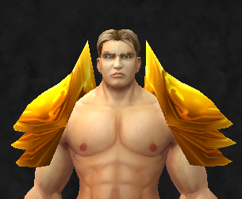

Accedemos a un listador de archivos del WoW. En este caso **wago.tools**. Buscamos nuestro item — en este caso `shoulder_plate_dungeonpaladin_a_01`:

Descargaremos:

- El archivo **`.m2`** *(es uno por item; en este caso se muestran dos porque "l" es la hombrera izquierda y "r" la derecha — vamos a editar solo la izquierda)*.
- Todos sus **`.skin`** *(solo tiene uno; si tuviera más, descargamos todos)*.
- Los **`.blp`** (texturas) que queramos modificar.

:::note[Dato]
Si estuviéramos modificando un modelo de **NPC** o **Jugador**, deberíamos descargar también sus archivos `.skel`.
:::

---

## 2.2 — Conversion a M2I

Con los archivos ya descargados, los introducimos en una carpeta:

Abrimos el **M2MOD.exe**. En **Source M2** seleccionamos el archivo `.m2` del item. Automáticamente nos rellenará el **Target M2I**, que es donde creará el archivo intermedio — el **M2I** para Blender. *(Podemos cambiarlo si lo preferimos.)*

Al pulsar **Go!** se nos creará.

:::tip[Bonus no necesario]
Si queremos que en Blender tenga textura, deberemos convertir el `.blp` a `.png`:
[https://www.wowinterface.com/downloads/landing.php?s=734452651e00d9554b435e4acbc95c05&fileid=22128](https://www.wowinterface.com/downloads/landing.php?s=734452651e00d9554b435e4acbc95c05&fileid=22128)

Simplemente arrastramos el `.blp` sobre el `.exe` y nos creará un `.png` en la misma carpeta.
:::

---

## 2.3 — Importar a Blender

Importamos el `.m2i` que nos ha creado en Blender:

:::tip[Bonus no necesario — Añadir textura]
Únicamente servirá para que tú en Blender veas la textura, pero no afectará a como se ve ingame.

Seleccionamos el Mesh y le creamos un nuevo material:

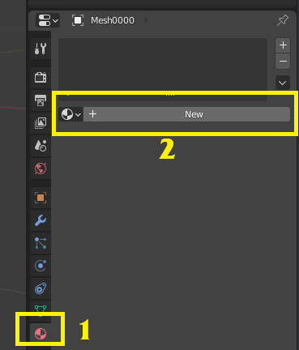

En la pestaña **Shading**, seleccionamos el material:

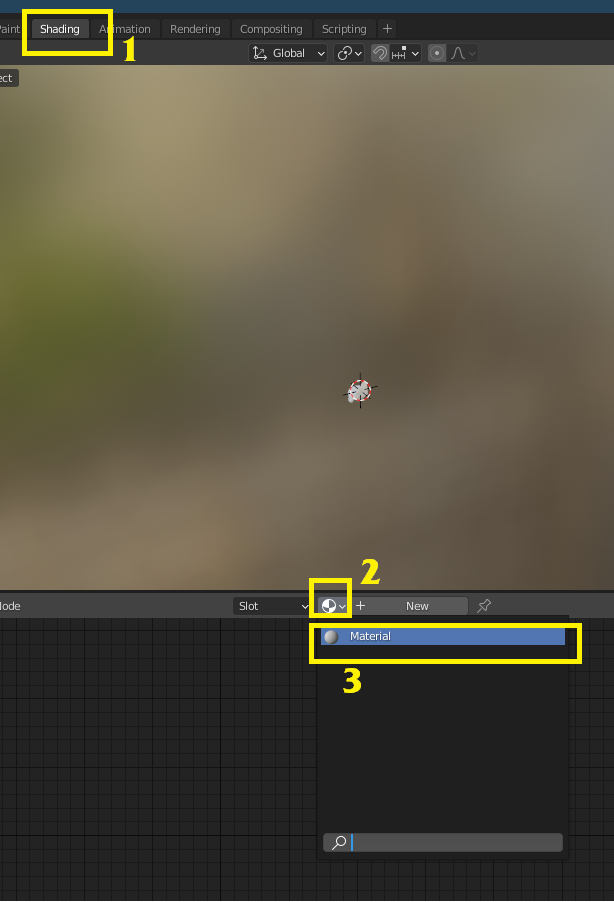

Añadimos una **Image Texture** seleccionando el `.png` que hemos convertido desde el `.blp`:

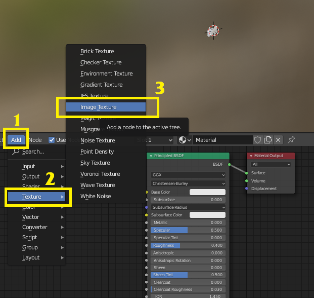

Después unimos los dos puntos arrastrando, entre **Color** y **Base Color**. Para que se vea igual que en el WoW: **Specular** a 0 y **Roughness** a 1.

Recuerda activar la opcion de ver texturas en Blender:

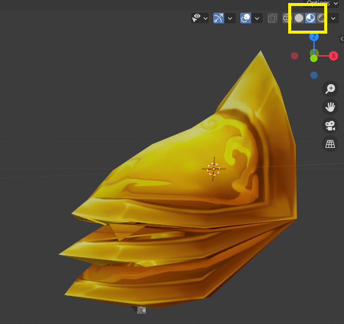
:::

---

## 3 — Editar en Blender

En este ejemplo vamos a reemplazar la hombrera por un modelo custom. También podríamos simplemente editar el modelo original borrando partes, lo cual serían los mismos pasos obviando los de importar el otro modelo.

Vamos a sustituir la hombrera por esta otra:

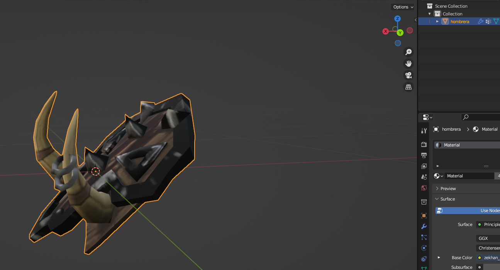

Exportamos la hombrera nueva como **FBX** en su proyecto propio de Blender:

Volvemos a nuestro proyecto de la hombrera e importamos el **FBX** de la nueva hombrera:

Ajustamos su posición para que quede lo más cercana posible a la hombrera original:

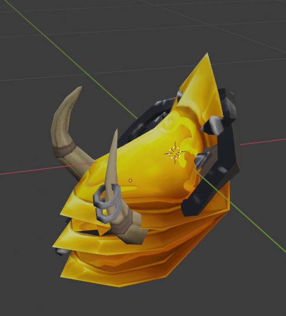

Nos aseguramos de que la nueva hombrera tenga como **UV Map** principal uno llamado `Texture`. De no ser así, le cambiaremos el nombre:

Escalamos la hombrera original hasta ser muy pequeña y la escondemos dentro del modelo de la nueva hombrera:

Cuando lo tengamos, pulsamos **CONTROL + A** y seleccionamos **"All Transforms"**. Hacemos esto tanto en la hombrera nueva como en la original, para que se aplique el escalado, posicion y rotacion:

---

## 3.2 — Exportar el M2I desde Blender

:::tip[Consejo]
Antes de continuar, guarda una version del proyecto de Blender a modo de copia. Siempre son necesarios ajustes posteriores y es util poder volver a este punto.
:::

Seleccionamos en este orden: la hombrera nueva, la hombrera vieja, y pulsamos **CONTROL + J**:

El resultado es que se habrán unido, debiendo quedar con el nombre del archivo original del WoW — en este caso `Mesh0000`:

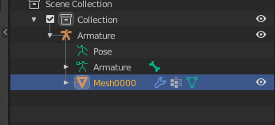

:::warning[Y si mi archivo tiene mas de un Mesh]
La mayoría de modelos modernos tienen varios MESH: `0000`, `0001`, `0002`, etc.

Los otros pueden borrarse sin problema, mientras que al menos quede **uno de los originales**. No importa si es el `0001`, el `0002` o el `0004` — siempre debe quedar un original.

**No sirve** eliminar el mesh, renombrar nuestra nueva hombrera y colocarla en la misma posición. Dará error. Siempre debe conservarse uno de los mesh original oculto en el modelo.
:::

Exportamos nuestro modelo como **M2I** de nuevo, pudiendo reemplazar el M2I original o dándole otro nombre — no importa:

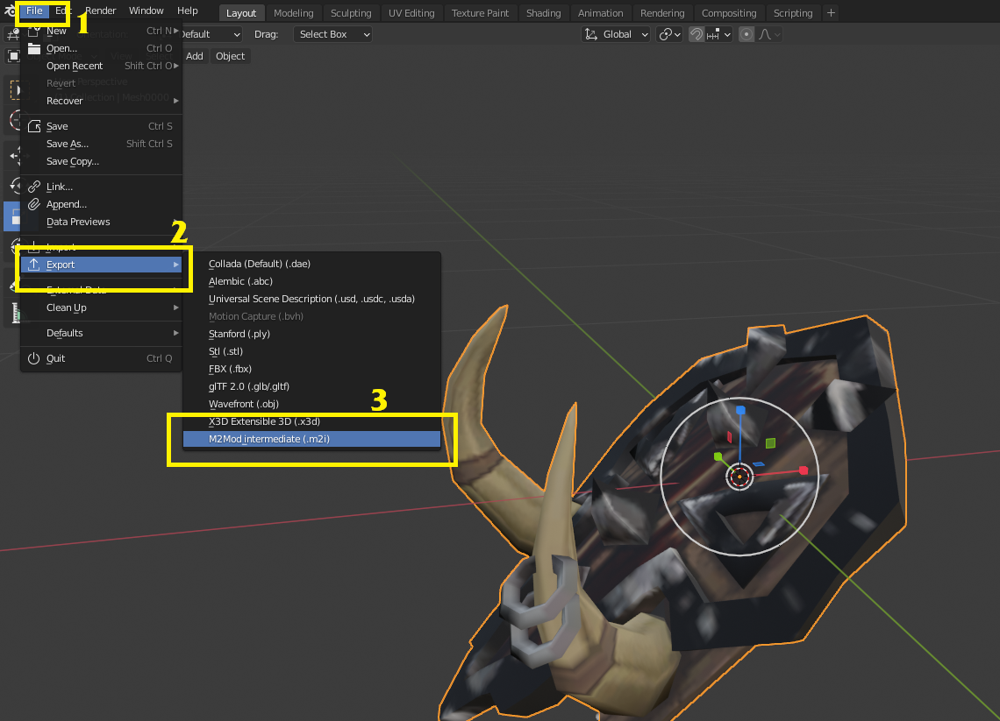

---

## 4 — Convertir a M2 para Epsilon

Volvemos al **M2MOD.exe**, en la segunda pestaña.

- En **Source M2** tendremos por defecto el `.m2` original.
- En **Source M2i** seleccionamos nuestro nuevo `.m2i` exportado desde Blender.

Pulsamos **Preload** y luego **Go!**:

Nos saldrá este error — ¡tranquilidad, siempre sale! Pulsamos **OK**:

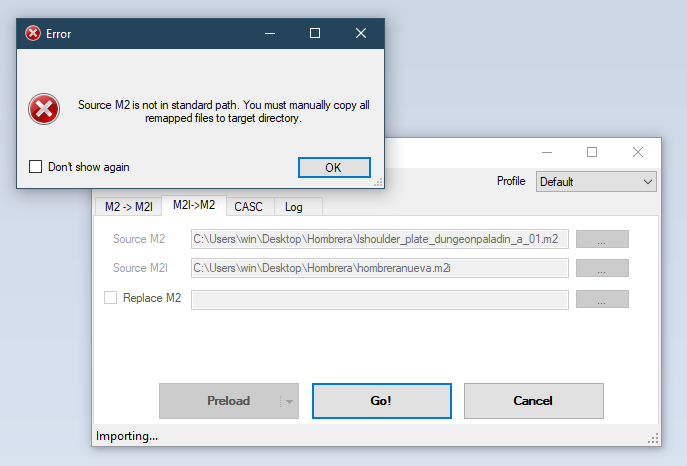

Ya tenemos nuestros archivos exportados. Se habrá creado en la carpeta del `.m2` una nueva llamada `Export`:

Dentro están los archivos con los que creamos el parche del Epsilon.

:::note[Recordatorio]
Introducir en el parche el `.blp` de la textura de la nueva hombrera, **con el nombre de la textura de la hombrera antigua**.
:::

---

## 4.2 — Arreglar fallos tras convertir

Muchas veces vemos nuestro item ingame y hay errores. Para ello:

1. Abrimos el backup guardado antes de unir los dos mesh.
   *(O en Blender hacemos Ctrl+Z hasta volver al paso anterior a unirlos.)*
2. Modificamos la posicion de nuevo.
3. **Ctrl+A** → All Transforms.
4. Unimos los dos Mesh.
5. Exportamos el M2I.
6. En M2MOD: Preload → Go!
7. Cogemos los archivos de la carpeta `Export` y los metemos manualmente dentro de la carpeta del parche del Epsilon, dándole a reemplazar.

Desconectamos el PJ en Epsilon y al reconectar se habrá actualizado la hombrera a la nueva versión.

:::tip[TIP]
Yo hago todo este proceso sin haber cerrado ninguno de los 3 programas en ningun momento, realizando pequenos cambios y conectando/desconectando el PJ en Epsilon para actualizar el modelo hasta obtener el resultado deseado.
:::

---

## Bonus — Collections

El proceso con una **collection** es el mismo, sin embargo tiene un añadido: tiene diferentes piezas, cada una unida a un hueso diferente.

### Los archivos

Los archivos de una collection involucran partes de todo el cuerpo entero. Ejemplo tras convertir:

### Como se ve en Blender

A diferencia de un casco u hombrera, veremos muchos más modelos *(mesh)* y huesos *(attach)*. Es normal y no hay que asustarse:

### Como editarlo

Seguiremos los mismos pasos que en la guia anterior. Podemos unir nuestro nuevo modelo a cualquiera de los Mesh y borrar los otros.

*(Todo en una misma pieza, o diferentes partes en diferentes piezas. Si hay muchas caras en un mismo Mesh dará error, con lo que habrá que dividir el modelo en diferentes Mesh.)*

La diferencia es que tendremos que indicar **a qué hueso** estará unido nuestro nuevo modelo.

### Los huesos

Si pulsamos en cualquier hueso y pulsamos **TAB** podremos ver el esqueleto y sus uniones. Arriba a la izquierda nos dirá el nombre de cada hueso:

### Unir el modelo al hueso

Como ejemplo, estamos uniendo una pieza de pechera 3D. Hemos visto que el hueso del pecho es el número 10:

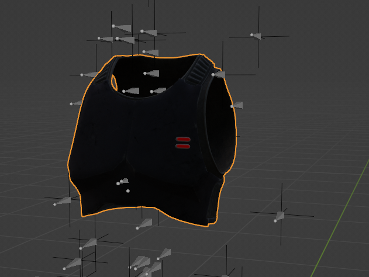

Vamos al menú de **Vertex Groups** y añadimos un nuevo grupo con el nombre del hueso al que queremos que esté unido. Pueden haber varios huesos sin ningún problema — no importa el orden.

Una vez añadido, cambiamos el modo de la escena a **Weight Paint**:

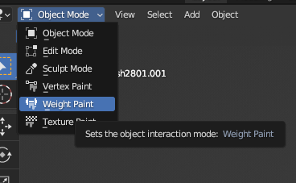

Pintamos los pesos sobre el hueso:

- **Rojo** → el modelo está más unido a ese hueso.
- **Azul** → menos unido.

Como es una pieza que únicamente va a estar unida a un solo hueso, la pintaremos entera de rojo. En los menus superiores podemos modificar los parametros del pincel:

---

Hay modelos que van unidos a **más de un hueso**. Por ejemplo, una falda irá unida en cada lado a una pierna diferente, mientras que la parte superior se uniría al hueso de la cadera.

Por ejemplo, en Zekhan podemos ver que su falda tiene lo siguiente:

Tras ajustar los pesos de cada hueso, se uniría al **MESH** correspondiente y se exportaría el modelo con normalidad.
