# Editar un M2 para Epsilon (Método M2i)

Guía por **NORTE.m2** · Versión 2.0

---

## Programas necesarios

- **M2MOD** *(versión ya preparada, incluye listfile.csv actualizado)*
  [Descargar M2MOD](https://drive.google.com/file/d/1myLD8lj_pfrGMykKlWnP9eSKlyuO7c7i/view?usp=sharing)

- **Blender Addon M2i Import**
  [Descargar Addon](https://bitbucket.org/suncurio/blender-m2i-scripts/src/master/)

- **Blender 2.90.0** *(solo funciona en esta versión)*
  [Descargar Blender 2.90.0](https://download.blender.org/release/Blender2.90/blender-2.90.0-windows64.zip)

:::note[Otros links de utilidad (no necesarios)]
M2MOD Original *(Sin listfile)*: https://bitbucket.org/suncurio/m2mod/downloads/
:::

---

## 1. Preparar el programa

- Descargar **Blender 2.90.0** — únicamente funciona en esta versión, no en otras.
- Descargar el programa **M2MOD** — se recomienda la versión ya preparada, pues ya incluye un `listfile.csv` actualizado dentro de la carpeta `mappings`.
- Instalar el **Addon** de Blender en Blender 2.90.0.

Para instalar el addon: ve a **Edit → Preferences**

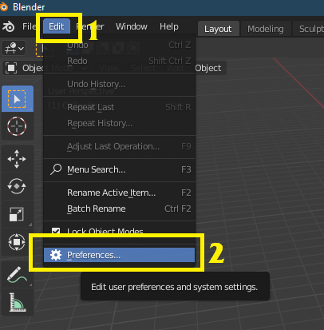

Haz clic en **Add-ons**, luego en **Install** y selecciona el `.zip` del addon.

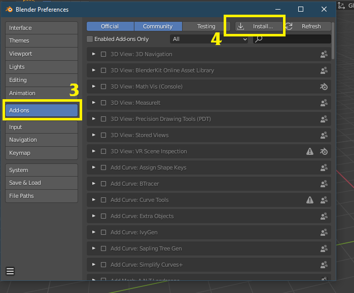

Activa el llamado **"Import-Export: WoW Tools"**

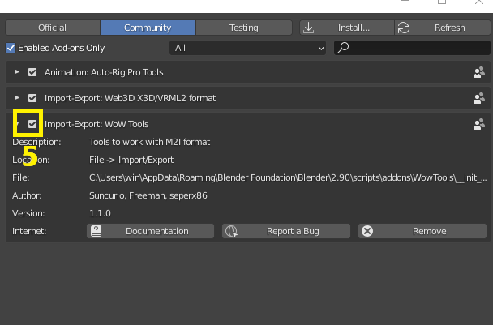

---

## 2.1 Preparar los archivos

Este método de parcheo funciona por **sustitución**. Deberemos elegir la pieza de armadura base que vamos a modificar o sustituir.

En este ejemplo usaremos estas hombreras:

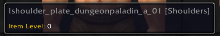

Accedemos a un listador de archivos del WoW. En este caso **[wago.tools](https://wago.tools)**

Buscamos nuestro item. En este caso `shoulder_plate_dungeonpaladin_a_01`

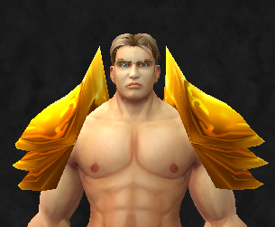

Descargaremos:
- El archivo **`.m2`** — uno por item. Si hay `l` y `r`, son la izquierda y derecha. Editamos solo la que queramos.
- Todos sus **`.skin`** — si tiene más de uno, descargamos todos.
- Los **`.blp`** (texturas) que queramos modificar.

:::tip
Si estuviéramos modificando un modelo de **NPC o JUGADOR**, deberíamos descargar también sus archivos **`.skel`**
:::

---

## 2.2 Conversión a M2I

Con los archivos ya descargados, los introducimos en una carpeta.

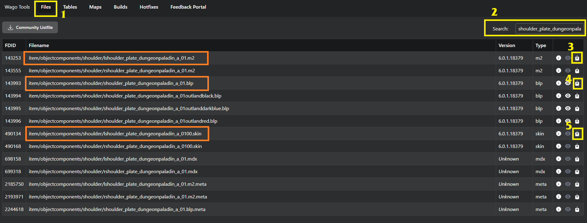

Abrimos el **M2MOD.exe** y en **Source M2** seleccionamos el archivo `.m2` del item.

Automáticamente nos rellenará el **Target M2I**, que es donde creará el archivo intermedio — el M2I para Blender. Podemos cambiarlo si lo preferimos.

Al pulsar **Go!** se nos creará.

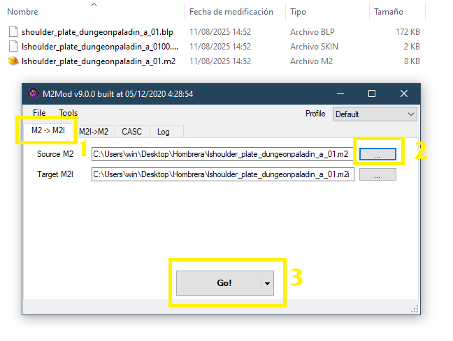

:::note[Bonus no necesario: añadir textura en Blender]
Si queremos que en Blender tenga textura, deberemos convertir el `.blp` a `.png`.
:::

[Descargar conversor BLP](https://www.wowinterface.com/downloads/landing.php?s=734452651e00d9554b435e4acbc95c05&fileid=22128)

Simplemente arrastramos el `.blp` sobre el `.exe` y nos creará un `.png` en la misma carpeta.
:::

---

## 2.3 Importar a Blender

Importamos el `.m2i` que nos ha creado en Blender: **File → Import → M2Mod Intermediate (.m2i)**

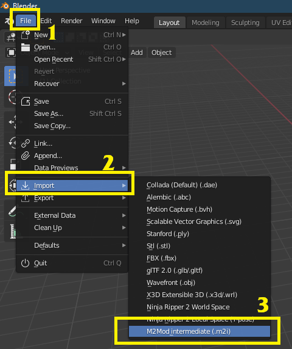

### Bonus: añadir textura

Seleccionamos el Mesh y le creamos un nuevo material. Vamos a la pestaña **Shading** y seleccionamos el material.

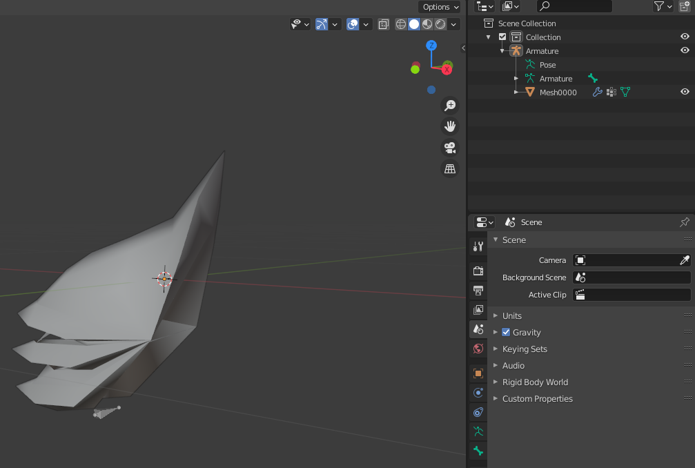

Añadimos una **Image Texture** seleccionando el `.png` que hemos convertido desde el `.blp`.

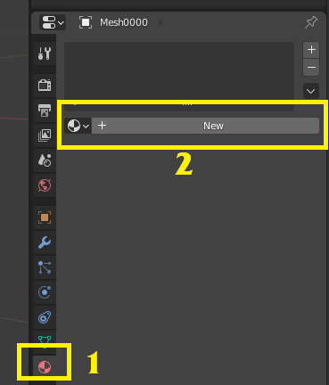

Después unimos los dos puntitos arrastrando entre **Color** y **Base Color**.

Para que se vea igual que en WoW: **Specular** a `0` y **Roughness** a `1`.

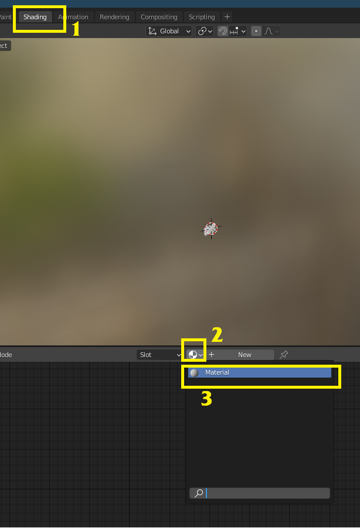

Recuerda activar la opción de ver texturas en Blender.

---

## 3.1 Editar en Blender

En este caso vamos a reemplazar la hombrera por un modelo custom.

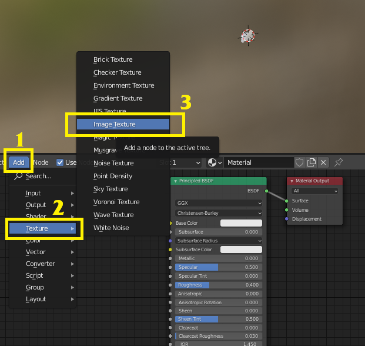

Podríamos simplemente editar el modelo de la hombrera borrando partes, lo cual serían los mismos pasos pero obviando los de importar el otro modelo.

En este ejemplo realizaremos el caso más complejo, que abarca todos los supuestos: sustituir la hombrera por otra diferente.

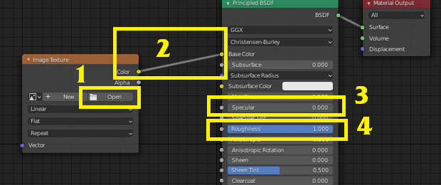

Exportamos la hombrera nueva como **FBX** en su proyecto propio de Blender.

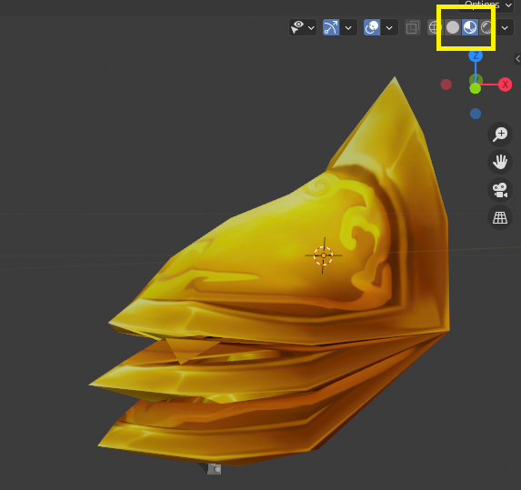

Volvemos a nuestro proyecto de la hombrera e importamos el `.fbx` de la nueva hombrera.

Ajustamos su posición para que quede lo más cercana posible a la hombrera original.

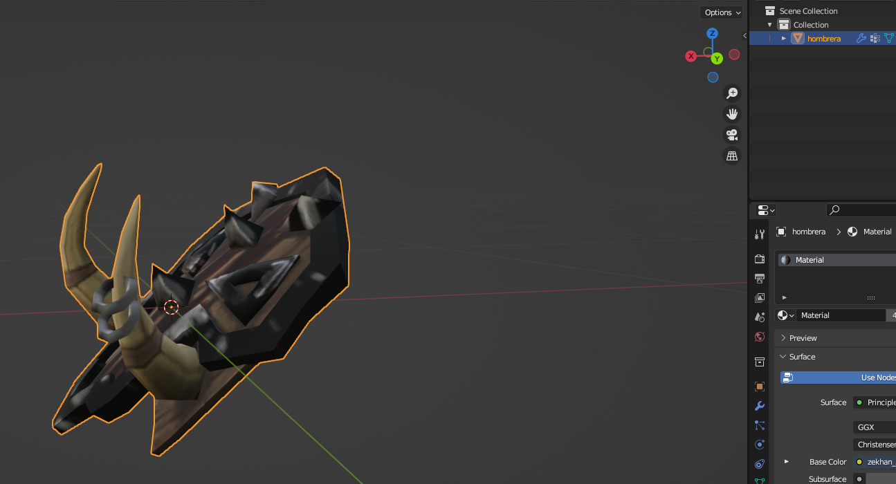

Nos aseguramos de que la nueva hombrera tenga como **UV Map** principal uno llamado `Texture`. De no ser así, le cambiaremos el nombre.

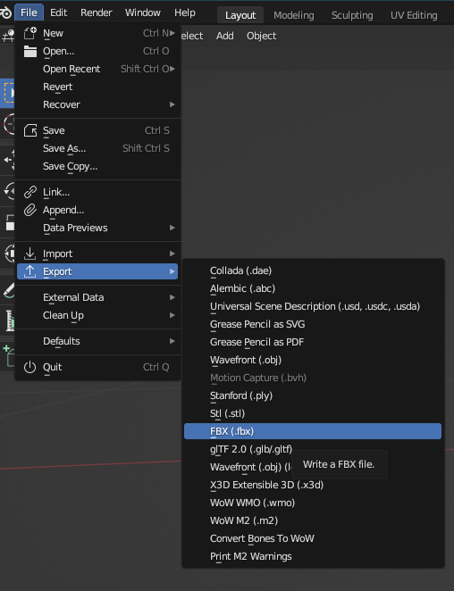

Escalamos la hombrera original hasta ser muy pequeña y la escondemos dentro del modelo de la nueva hombrera.

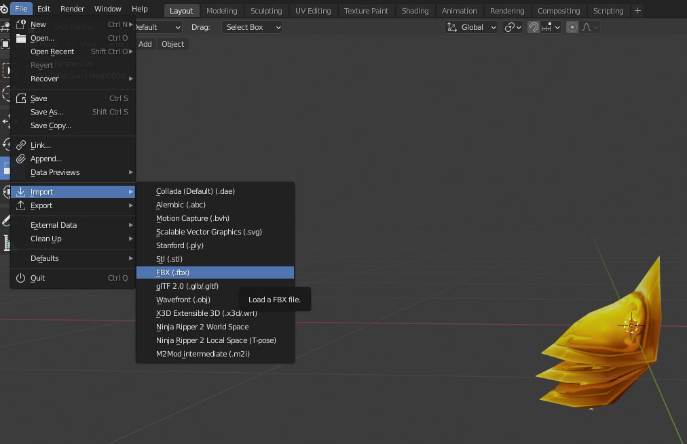

Cuando lo tengamos, pulsamos **CONTROL+A** y seleccionamos **"All Transforms"**.

Hacemos esto tanto en la hombrera nueva como en la original, para que se aplique el escalado, posición y rotación.

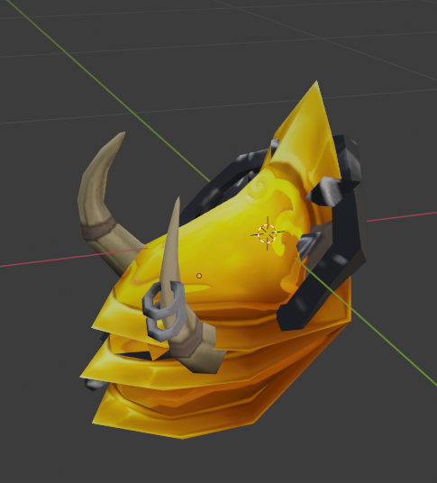

:::tip[Recomendación]
Una vez ajustada la posición, guarda una versión del proyecto de Blender a modo de copia antes de continuar. Siempre son necesarios ajustes posteriores.
:::

Seleccionamos en este orden: la hombrera nueva, la hombrera vieja, y pulsamos **CONTROL+J**.

El resultado es que se habrán unido, debiendo quedar con el nombre del archivo original de WoW — en este caso `Mesh0000`.

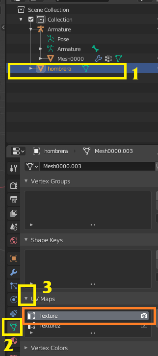

### ¿Y si mi archivo tiene más de un Mesh?

La mayoría de modelos modernos tienen varios Mesh: `0000`, `0001`, `0002`, etc.

Los otros pueden borrarse sin problema, mientras que al menos quede **uno de los originales** (no importa si es el 0001, el 2 o el 4, siempre debe quedar un original).

:::danger Aviso importante
No sirve eliminar el Mesh, renombrar la nueva hombrera y colocarla en la misma posición — dará error. **Siempre debe conservarse uno de los Mesh originales oculto dentro del modelo.**
:::

Exportamos nuestro modelo como **M2I** de nuevo, pudiendo reemplazar el M2I original o dándole otro nombre — no importa.

---

## 4.1 Convertir a M2, para Epsilon

Volvemos al **M2MOD.exe**, en la segunda pestaña (**M2I→M2**).

- En **Source M2** tendremos por defecto el `.m2` original.
- En **Source M2i** seleccionamos nuestro nuevo `.m2i` exportado desde Blender.

Pulsamos **Preload** y luego **Go!**

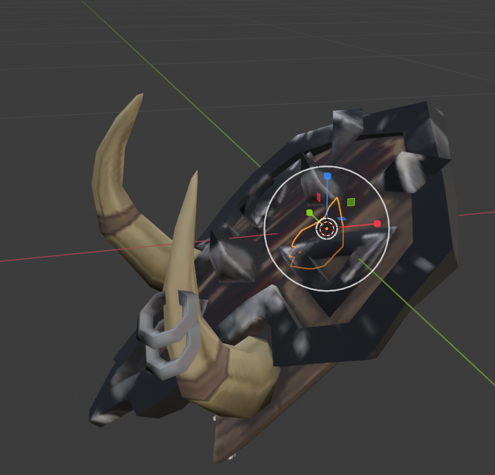

Nos saldrá un error — **¡tranquilidad, siempre sale!** Pulsamos **OK**.

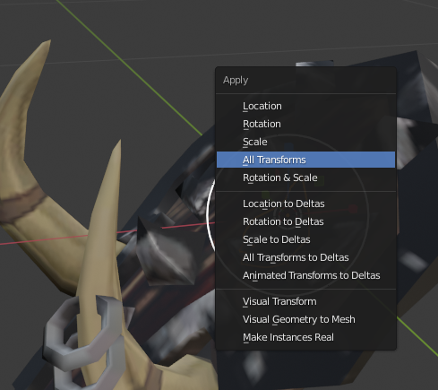

Ya tenemos nuestros archivos exportados. Se habrá creado en la carpeta del `.m2` una nueva carpeta llamada **Export**.

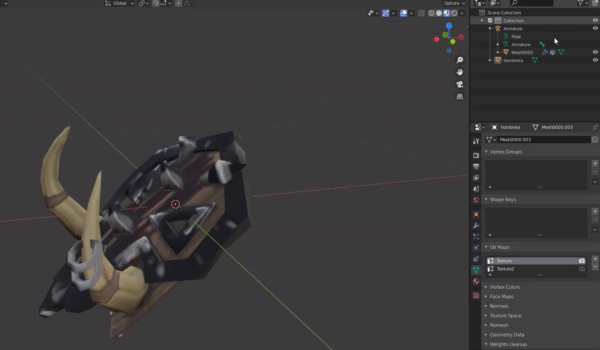

Dentro están los archivos con los que creamos el parche de Epsilon.

:::tip[Recordatorio]
Introducir en el parche el `.blp` de la textura de la nueva hombrera, con el nombre de la textura de la hombrera antigua.
:::

---

## 4.2 Arreglar fallos tras convertir

Muchas veces vemos el item en el juego y encontramos errores. Para solucionarlos:

1. Abrimos el backup del paso anterior, justo antes de unir los dos Mesh. *(O en Blender hacemos `Ctrl+Z` hasta volver a ese punto.)*
2. Volvemos a modificar la posición.
3. `Ctrl+A` → All Transforms.
4. Unimos los dos Mesh.
5. Exportamos.
6. Con M2MOD abierto: Preload → Go!
7. Cogemos los archivos de la carpeta `Export` y los metemos dentro de la carpeta del parche de Epsilon, reemplazando archivos.
8. Desconectamos el PJ en Epsilon — al desconectar, se actualizará el modelo.

:::tip[Flujo de trabajo recomendado]
Mantén los 3 programas abiertos en todo momento y realiza pequeños cambios, conectando y desconectando el PJ en Epsilon para ver el resultado en tiempo real, hasta conseguir el resultado querido.
:::

---

## Bonus: Collections

El proceso con una **collection** es el mismo, pero tiene un añadido: tiene diferentes piezas, cada una unida a un hueso diferente.

### 1. Los archivos

Los archivos de una collection involucran partes de todo el cuerpo entero.

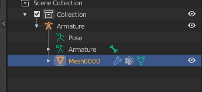

### 2. ¿Cómo se ve en Blender?

A diferencia de un casco u hombrera, veremos muchos más modelos (Mesh) y huesos (Attach). Es normal y no debemos asustarnos.

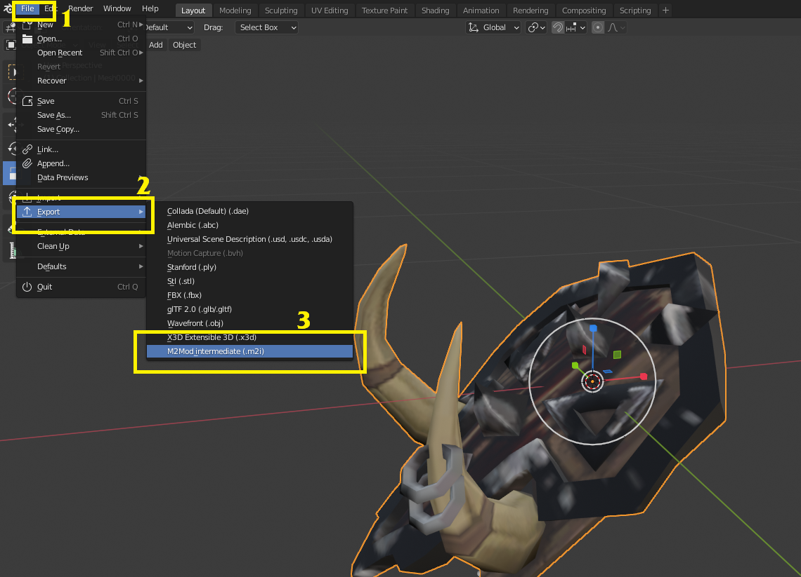

### 3. ¿Cómo lo edito?

Seguiremos los mismos pasos que en la guía anterior. Podemos unir nuestro nuevo modelo a cualquiera de los Mesh y borrar los otros.

:::warning
Si hay muchas caras en un mismo Mesh, dará error. En ese caso habrá que dividir nuestro modelo en diferentes Mesh.
:::

La diferencia es que tendremos que indicar a qué **hueso** estará unido nuestro nuevo modelo.

### 4. Los huesos

Si pulsamos en cualquier hueso y pulsamos **TAB**, podremos ver el esqueleto y sus uniones. Arriba a la izquierda nos dirá el nombre de cada hueso.

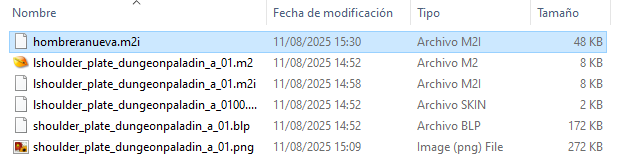

### 5. Unir nuestro modelo al hueso

Vamos al menú de **Vertex Groups** y añadimos un nuevo grupo con el nombre del hueso al que queremos que esté unido. Pueden haber varios huesos sin ningún problema y no importa el orden.

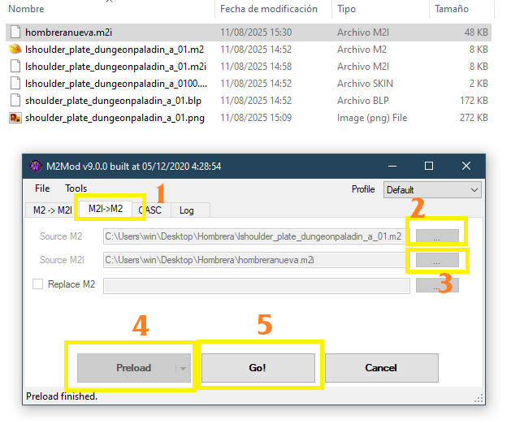

Una vez añadido, cambiamos el modo de la escena a **Weight Paint**.

Pintamos los pesos sobre el hueso:
- **Más rojo** → el modelo está más unido a ese hueso.
- **Más azul** → menos unido.

Como es una pieza unida a un solo hueso, la pintaremos entera de rojo.

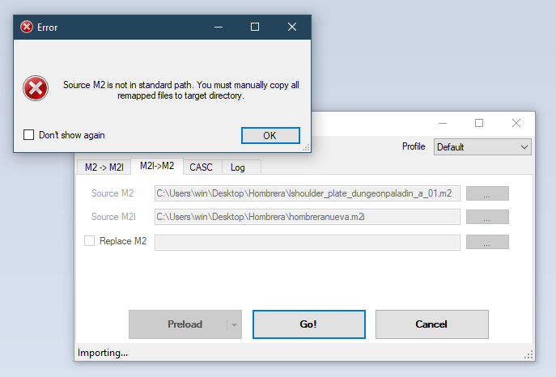

Hay modelos que van unidos a más de un hueso. Por ejemplo, una falda irá unida en cada lado a una pierna diferente, mientras que la parte superior se uniría al hueso de la cadera.

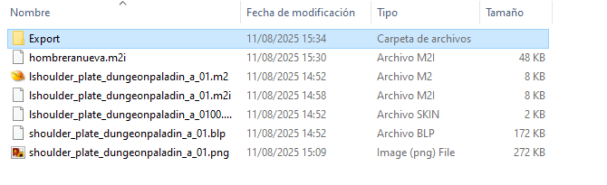

Tras ajustar los pesos de cada hueso, se uniría al Mesh correspondiente y se exportaría el modelo con normalidad.

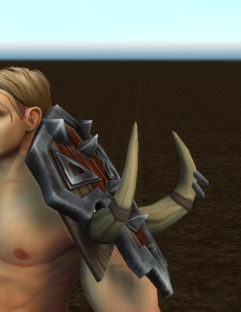
