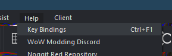
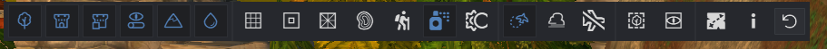
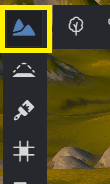
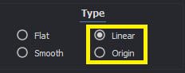
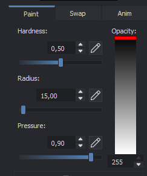
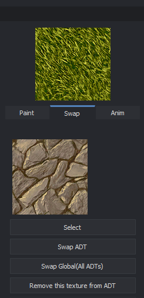
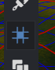

# Controles basicos e introduccion a Noggit

Guía por **NORTE.m2** · Versión 1.0

---

En esta guía se explican los controles más básicos y otras recomendaciones del programa.

**Guías anteriores:**

- **Instalación:** Instalación de Noggit para Epsilon SL
- **Mapas custom:** Mapas Custom en Epsilon con Noggit SL

---

:::tip[TIP]
En **Help > Key Bindings** hay una lista completa de todos los atajos del programa.
:::

---

## Diferentes formas de ver

En la parte superior encontramos el siguiente panel:

Al pulsar cada botón se activará/desactivará lo siguiente:

1. M2s
2. WMO
3. WMO Doodads (Base del terreno)
4. WMO Terrain
5. Terreno
6. Agua
7. Cuadrículas de ADT y Chunks
8. Líneas de los agujeros en el terreno
9. Malla del terreno
10. Líneas de altura del terreno
11. Zona caminable / No caminable
12. Vertex painting
13. Sombras

*Del 14 en adelante no hay nada útil.*

:::tip[Consejo]
Desactivar todo menos el terreno. En Epsilon ya vaciamos los ADT con el ph shift, no hace falta quitarlos en Noggit — desactivamos todos los objetos y editamos tal cual.
:::

Configuración recomendada:

En ocasiones, es útil activar también las líneas de altura:

---

## Subir y bajar terreno

Primer botón del menú vertical:

- **SHIFT + Click Izquierdo** → el terreno **SUBE**
- **CONTROL + Click Izquierdo** → el terreno **BAJA**

:::tip[TIP]
**ALT + Click Derecho** cambia el **radio** del pincel directamente en la vista.
:::

En el menú derecho:

- **Radius** — modifica el radio del pincel.
- **Inner radius** — controla el difuminado del pincel.
- **Speed** — la velocidad. Usar 1-2 para detalles pequeños, 10-15 para montañas, 30 para terrenos muy grandes.

---

## Suavizar terreno

Segundo botón del menú vertical:

Se recomiendan solo dos modos: **Linear** y **Origin**.

### Linear — Suavizado general

Hace una rampa entre donde pulsas la primera vez y donde te mueves. Si estás quieto, suaviza entre el centro y el extremo del pincel. En gran tamaño suaviza una zona entera.

- **SHIFT + Click Izquierdo** → el terreno **SE SUAVIZA**
- **CONTROL + Click Izquierdo** → el terreno **BAJA suavizándose**

:::tip[TIP]
El **Speed** siempre al 10. **ALT + Click Derecho** cambia el radio del pincel.
:::

### Origin — Aplanar

Aplana una base extendiendo la altura original del punto donde comenzaste a clickar.

:::tip[Consejo]
Utilizarlo para crear zonas planas y luego arreglar con Linear. Sirve también para crear rampas, caminos o futuras montañas de forma rápida:

1. Crear forma con **ORIGIN**
2. Suavizar con **LINEAR**
:::

---

## Pintar terreno

Tercer botón del menú vertical:

- **SHIFT + Click Izquierdo** → el terreno **se pinta**
- **CONTROL + Click Izquierdo** → **elige** una textura del terreno

:::warning[Importante]
Un chunk solo puede tener **4 texturas**. Hay que elegir con cuidado.
:::

Para **resetear** las texturas de un chunk: **ALT + CONTROL + SHIFT + Click Izquierdo**

:::tip[TIP]
Del menú lateral, solo suele ser necesario tocar **Radius** y **Pressure**.
:::

- **Pressure 0.5-0.7** para una textura que debe verse claramente.
- **Pressure 0.1-0.3** para una textura muy suave.

En el segundo menú **SWAP** podemos cambiar una textura por otra sin tener que borrar el chunk:

---

## Agua

Séptimo botón del menú vertical:

- **SHIFT + Click Izquierdo** → **pone** agua
- **CONTROL + Click Izquierdo** → **quita** el agua

:::warning[TIP]
No usar jamás la herramienta de poner agua — aparece rota. Es mejor poner un **laketile** en Epsilon directamente.
:::

---

## Agujeros

Cuarto botón del menú vertical:

- **SHIFT + Click Izquierdo** → **arregla** el terreno
- **CONTROL + Click Izquierdo** → **hace** un agujero

---

*El resto de botones del menú vertical no tienen utilidad práctica.*
