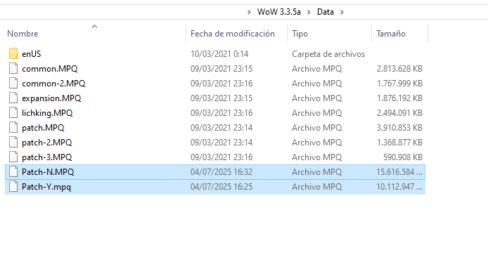
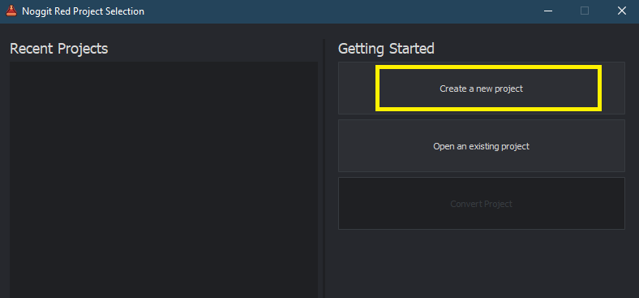
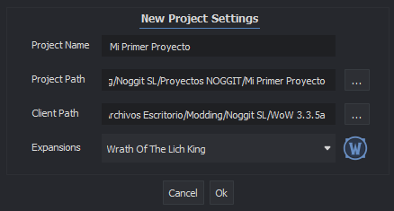
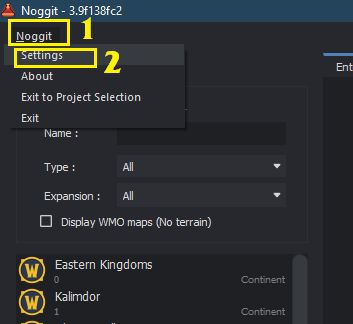
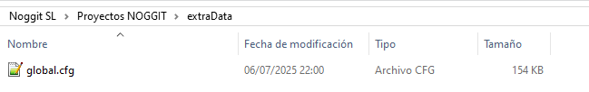
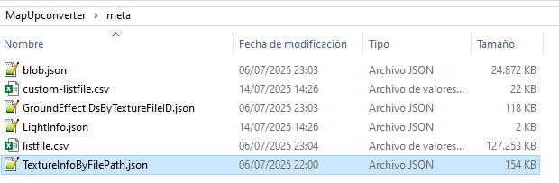

# Instalación de Noggit para Epsilon SL

Guía por **NORTE.m2** · Versión 1.0

---

:::note[Aviso]
Es una adaptación de las siguientes guías con información ampliada:

- **Instalación de Noggit:** [https://marlamin.github.io/modern-map-making/](https://marlamin.github.io/modern-map-making/)
- **Videotutorial de instalación:** [https://www.youtube.com/watch?v=TP8YpgiGOPs](https://www.youtube.com/watch?v=TP8YpgiGOPs)
:::

### Otros links de utilidad *(no necesarios)*

- **Discord Modern Map Making:** [https://discord.gg/C85673kkWd](https://discord.gg/C85673kkWd)

---

## 1 — Descargar los programas necesarios

### Un WoW 3.3.5

Noggit solo puede ejecutarse en esa versión. Necesitaremos un cliente 3.3.5.

:::tip[TIP]
En mi caso lo he descargado de [https://www.chromiecraft.com/en/downloads/](https://www.chromiecraft.com/en/downloads/), pero hay otras muchas versiones en internet. Cualquiera sirve.
:::

### El Noggit

El programa base.

Puedes obtener la última versión en su canal de discord: [https://ptb.discord.com/channels/1264317233190928385/1264319052583801059](https://ptb.discord.com/channels/1264317233190928385/1264319052583801059)

:::tip[TIP]
En el momento de redactar la guía, la última versión y la que utilizo es: [https://marlam.in/u/FrankenNoggit12092024.7z](https://marlam.in/u/FrankenNoggit12092024.7z)
:::

### El Map Upconverter GUI

Sirve para convertir los mapas de Noggit *(Lich King)* a Epsilon *(Shadowlands)*.

Puedes obtener la última versión en su canal de discord: [https://ptb.discord.com/channels/1264317233190928385/1264319052583801059](https://ptb.discord.com/channels/1264317233190928385/1264319052583801059)

:::tip[TIP]
En el momento de redactar la guía, la última versión y la que utilizo es: [https://github.com/ModernWoWTools/MapUpconverter/releases/download/0.9.7/Release-win-x64.zip](https://github.com/ModernWoWTools/MapUpconverter/releases/download/0.9.7/Release-win-x64.zip)
:::

### El archivo `global.cfg`

Puedes obtener la última versión en el canal de discord indicado arriba.

:::tip[TIP]
En el momento de redactar la guía, la última versión y la que utilizo es: [https://cdn.discordapp.com/attachments/1264319052583801059/1264346842976489653/global.cfg](https://cdn.discordapp.com/attachments/1264319052583801059/1264346842976489653/global.cfg)
:::

---

## 2 — Descargar los assets modernos

Deberemos descargar los assets de las futuras expansiones *(texturas, wmos… etc)* para poder utilizarlos en Noggit.

Son dos parches:

**Parche N** *(15 GB)*:
[https://drive.google.com/file/d/1i0KWP8fmiEGjFi5tIP-Lo-POpxyHwPzU/view](https://drive.google.com/file/d/1i0KWP8fmiEGjFi5tIP-Lo-POpxyHwPzU/view)

**Parche Y** *(10 GB)*:
[https://drive.google.com/file/d/1nUzJ7oSf87WaN_OMCx90lzHaZXSofPj5/view](https://drive.google.com/file/d/1nUzJ7oSf87WaN_OMCx90lzHaZXSofPj5/view)

Una vez descargados, hay que introducirlos en la carpeta **Data** del WoW 3.3.5 que hemos descargado.

---

## 3 — Preparar la carpeta de Noggit

Dentro de la carpeta de Noggit, crearemos una carpeta para los futuros proyectos.

*El nombre puede ser cualquiera: "Proyectos", "Proyectos Noggit", etc.*

:::warning[Aviso]
Para cada proyecto deberemos crear una carpeta antes de crear el proyecto. Noggit no la crea automáticamente. En este caso, nuestro proyecto será "Mi Primer Proyecto".
:::

Deberemos crear un primer proyecto de prueba para que se generen todos los archivos necesarios.

### Paso 1 — Ejecutar Noggit

Creamos un nuevo proyecto. *Será un TEST. Luego podremos borrarlo.*

- El **project path** será la carpeta del proyecto. Cada proyecto tendrá su propia carpeta.
- El **client path** será la carpeta del WoW 3.3.5 que hemos descargado.

Le damos a **OK** y luego doble click sobre el proyecto para abrirlo.

### Paso 2 — Activar Modern Features

*Este paso solo hay que ejecutarlo la primera vez. Las siguientes no hará falta.*

Abriremos el panel de **[Settings]**:

En el panel de ajustes, activaremos la opción **[Modern features]**:

Pulsamos en **[Save]** y **cerramos** Noggit.

### Paso 3 — Carpeta extraData y global.cfg

En la carpeta de proyectos, crearemos una carpeta llamada `extraData` e introduciremos el archivo `global.cfg` que hemos descargado anteriormente.

Después, en la carpeta del programa **Map Upconverter GUI** que hemos descargado en el primer paso, crearemos la carpeta `meta` y en ella introduciremos una copia del `global.cfg`, que renombraremos como `TextureInfoByFilePath.json`.

:::tip[TIP]
Si prefieres directamente el archivo ya renombrado, puedes descargarlo aquí: [https://drive.google.com/file/d/1NyvlFa3Pj-pQV46bADC7jQ0cBY0Cyuew/view?usp=sharing](https://drive.google.com/file/d/1NyvlFa3Pj-pQV46bADC7jQ0cBY0Cyuew/view?usp=sharing)
:::

---

## 4 — Mi primer proyecto

Por cada proyecto, crearemos una carpeta en la carpeta de proyectos.

En Noggit, crearemos un proyecto nuevo, volviendo a colocar los paths correctamente:

Seleccionaremos el mapa que queramos, ¡y a editar!

Una vez terminado, guardaremos y lo exportaremos a Epsilon.

---

**Continuacion:**

Para editar un mapa moderno consultar:
[https://docs.google.com/document/d/1JwAfvu1efA288rXxWgAZZLIFQweJ75q9rApANx3Owa8/edit?usp=sharing](https://docs.google.com/document/d/1JwAfvu1efA288rXxWgAZZLIFQweJ75q9rApANx3Owa8/edit?usp=sharing)
*"PARTE 1: IMPORTAR UN MAPA MODERNO"*

Para exportar nuestro mapa a Epsilon, consultar:
[https://docs.google.com/document/d/1JwAfvu1efA288rXxWgAZZLIFQweJ75q9rApANx3Owa8/edit?tab=t.0](https://docs.google.com/document/d/1JwAfvu1efA288rXxWgAZZLIFQweJ75q9rApANx3Owa8/edit?tab=t.0)
*"PARTE 2: EXPORTAR UN MAPA A EPSILON"*
