# Mapas Custom / Modernos en Epsilon con Noggit SL

Guía por **NORTE.m2** · Versión 1.0

---

:::note[Aviso]
La guía **no** incluye instrucciones para la instalación de Noggit, ya que parte del supuesto de que el programa ya se encuentra instalado y listo para su uso.

- **Instalación de Noggit:** [https://marlamin.github.io/modern-map-making/](https://marlamin.github.io/modern-map-making/)
- **Videotutorial de instalación:** [https://www.youtube.com/watch?v=TP8YpgiGOPs](https://www.youtube.com/watch?v=TP8YpgiGOPs)
:::

---

## Necesario

**Convertidor ya preparado:**

- [https://drive.google.com/file/d/1u1T_OJgSUUAyU_Tffo4kxeqeMWnrT_vk/view?usp=sharing](https://drive.google.com/file/d/1u1T_OJgSUUAyU_Tffo4kxeqeMWnrT_vk/view?usp=sharing)
- **Link alternativo (mismo archivo):** [https://www.mediafire.com/file/47ckt1it8f6dz0y/Conversor_de_ADT_para_NOGGIT_Moderno.zip/file](https://www.mediafire.com/file/47ckt1it8f6dz0y/Conversor_de_ADT_para_NOGGIT_Moderno.zip/file)

:::note[Atencion]
Este material ya está presente en la guía de instalación, sin embargo esta versión ya se encuentra preparada con el formato y archivos necesarios, ahorrando varios pasos.
:::

### Otros links de utilidad *(no necesarios)*

- **Wow.Export:** [https://www.kruithne.net/wow.export/](https://www.kruithne.net/wow.export/)
- **Discord Modern Map Making:** [https://discord.gg/C85673kkWd](https://discord.gg/C85673kkWd)

---

:::note[Aviso sobre las imagenes]
En las imágenes del tutorial hay mezclados dos proyectos: "zandalar" y "crestfall". Ignorar el nombre del archivo — es el mismo procedimiento.
:::

Noggit solo tiene de forma nativa los mapas de **WoW Classic**. Si queremos modificar mapas posteriores hay que realizar los siguientes pasos.

---

## Parte 1 — Importar un mapa moderno a Noggit

### 1 — Descargar los mapas

Abrir **wow.export** e ir al apartado **MAPS**, buscar el mapa correspondiente.

Seleccionar los **ADT** (Ctrl+A para seleccionar todos). En export options marcar únicamente: **Export RAW**. Pulsamos **[Exportar Tiles]**.

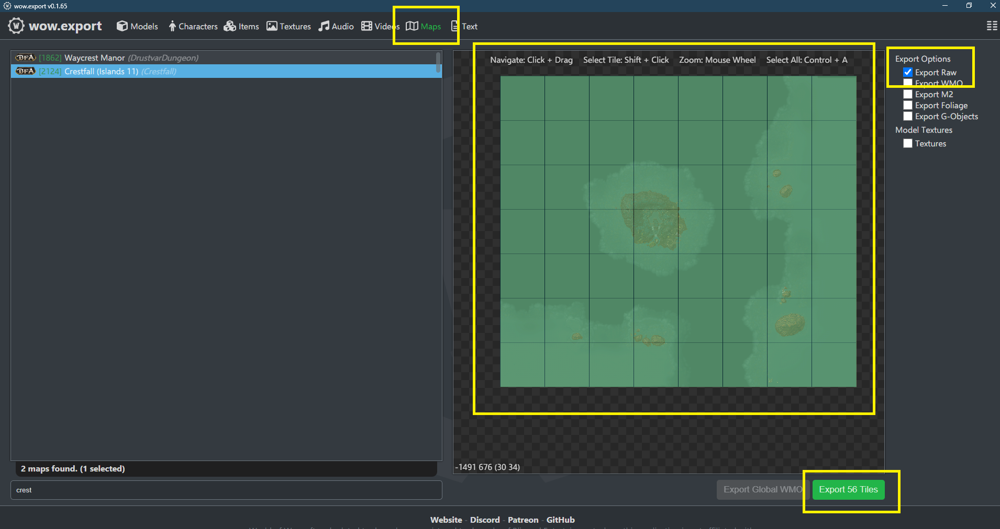

---

### 2 — Mover los archivos al convertidor

Seleccionar todos los `.adt` y el `.wdt` principal *(si exportamos crestfall, será `crestfall.wdt`)* y moverlos a la carpeta **[1]** del convertidor.

:::warning[Aviso]
El convertidor se compone de las carpetas **[1]** y **[2]**. Deberán estar en el directorio base del disco duro. Si tu disco duro es el C:, deberán ser `C:/1` y `C:/2`.
:::

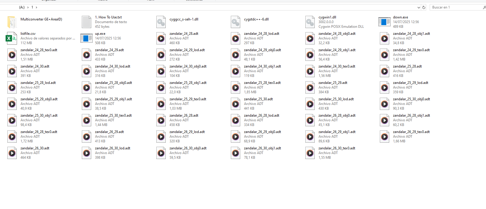

---

### 3 — Ejecutar el convertidor

*(En el archivo `How to use it.txt` están las instrucciones.)*

Abrimos el **CMD** (tecla Windows+R y escribir `cmd`) e introducimos el siguiente comando. En este ejemplo el disco duro es el `A:` — sustituye la letra por la tuya:

```
A:/1/down.exe A:/1/listfile.csv A:/2 A:/1/*adt
```

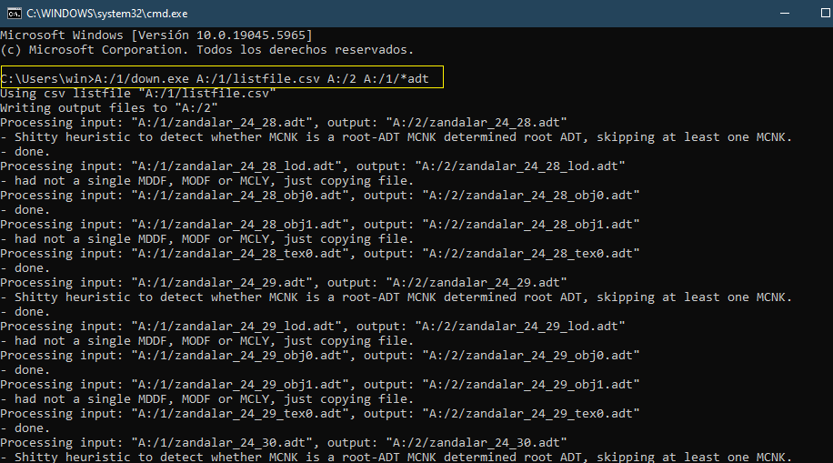

---

### 4 — Dejar lista la carpeta 2

Abrir la carpeta **[1]** y seleccionar el `.WDT`. Moverlo a la carpeta **[2]**.

---

### 5 — Convertir los archivos

Ejecutar el `multiconverter.exe` *(presente en la carpeta `1/Multiconverter`)*.


Arrastrar todos los archivos de **[2]** al cuadrado blanco del programa y pulsar **FIX**.

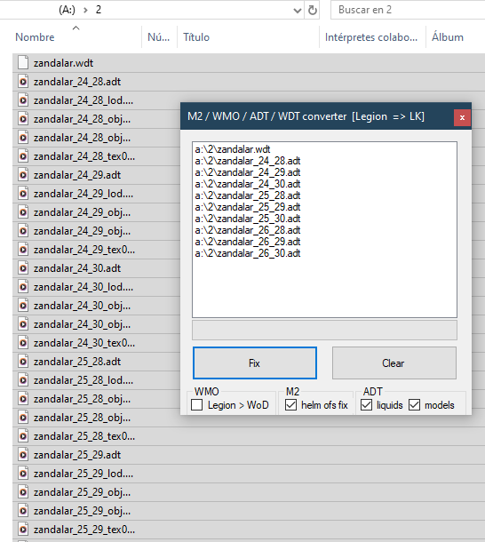

---

### 6 — Preparar el proyecto en Noggit

En la carpeta de proyectos de Noggit, crear una carpeta nueva con el nombre del proyecto *(el programa no la crea automáticamente)*.

Luego creamos un nuevo proyecto al abrir el programa. El nombre no importa. Lo abrimos con doble click.

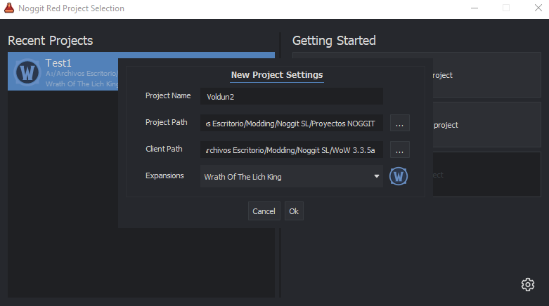

Creamos un nuevo mapa:

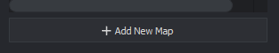

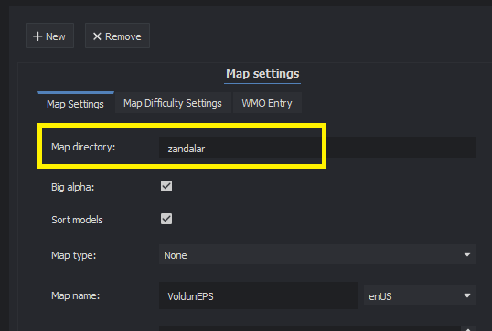

- **Map Directory:** Se recomienda que sea el mismo que el de los `.adt` *(en este caso `zandalar` porque nuestros adt son `zandalar_01.adt` etc.)*.
- **Map name:** Podemos elegirlo libremente.

Le damos a **[SAVE]** y nos saldrá un aviso, el cual aceptamos.


Se habrá creado un nuevo mapa vacío:


Una vez listo, **cerramos** Noggit.

---

### 7 — Introducir el mapa custom en Noggit

Entramos en la carpeta del proyecto de Noggit, luego a `world/maps/nombre-del-mapa` y la veremos casi vacía.


Seleccionamos los archivos de la carpeta de exportación **[2]** y los colocamos ahí.


Abrimos **Noggit de vuelta**. Tras haber reemplazado los archivos, ahora el mapa no está vacío — podemos seleccionar un ADT y editar el mapa.

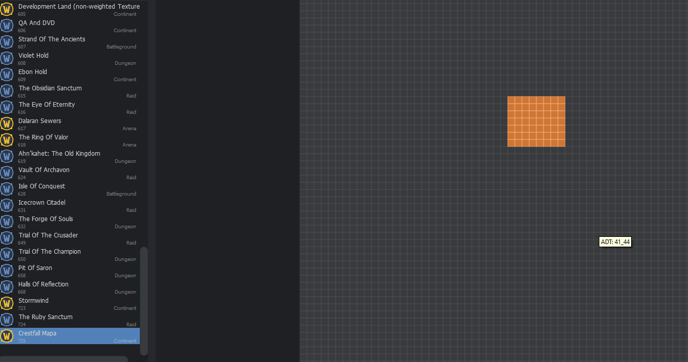

---

## Parte 2 — Exportar el mapa a Epsilon

Una vez editado el mapa, guardar y luego abrir **MapUpconverterGUI.exe** en la carpeta del Noggit.

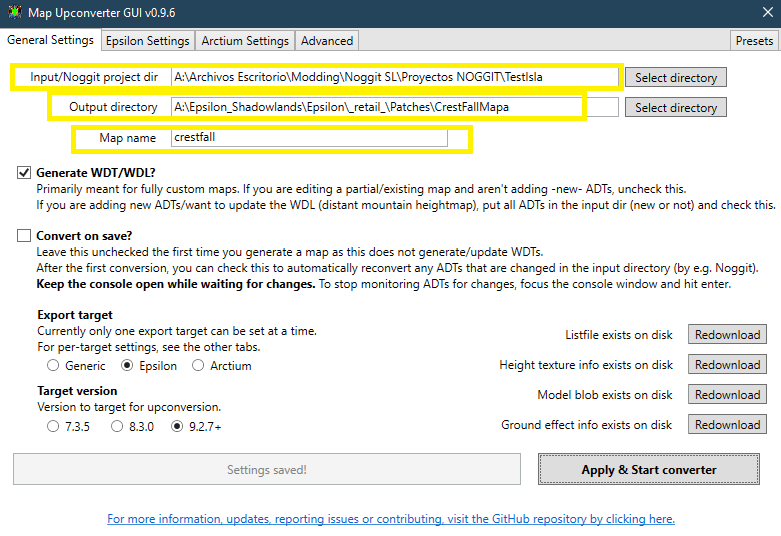

- **Noggit Project dir:** Debe ser la carpeta de nuestro proyecto.
- **Output:** La carpeta del parche del Epsilon.
- **Map name:** Debe coincidir con el nombre de los `.adt` *(ej: `zandalar`, `crestfall`, etc.)*.

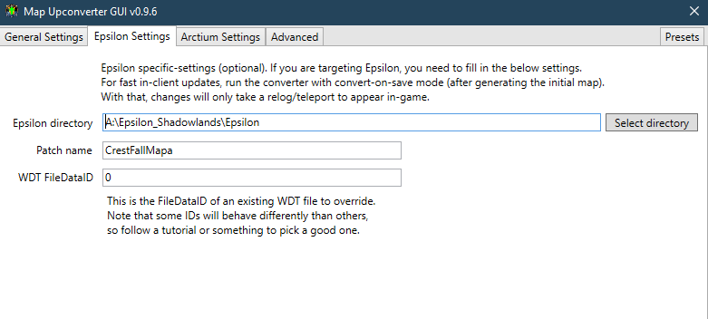

Rellenamos también los **Epsilon Settings**.

Tras darle a **Apply & Start Converter**, el programa crea automáticamente el parche en el Epsilon. Lo activamos y ¡listo!

---

## Parte 3 — Informacion extra y recomendaciones

### Editar un continente

*(Por ejemplo: Los Reinos del Este, Zandalar)*

Las zonas del WoW se agrupan por mapas completos. No existe división entre una región y otra — Elwynn, Tuercespina y Tirisfal pertenecen al mismo mapa: Los Reinos del Este.

Es posible editar un continente, pero ya que Noggit maneja información de la Lich King (3.3.5), **hay que dividir nuestro parche** para que no afecte a las zonas no editadas. Especialmente si hemos *downporteado* el mapa de una versión superior.

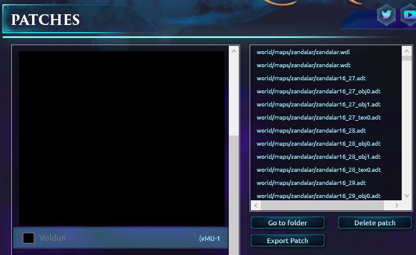

En este ejemplo hemos editado Voldun, y para ello todo Zandalar. Buscaremos cuáles son los **ADT** que hemos editado.

**Hay dos formas de saberlo:**

- Abajo a la izquierda, Noggit indica el tile en el que nos encontramos. Anotamos los números.


- En Noggit, al guardar, pulsar **"Save changed tiles"**.


Al entrar en la carpeta del proyecto, ordenando los archivos por **tiempo**, podemos ver cuáles hemos guardado:


Como se puede ver, `25_29` ha sido modificado más recientemente.

---

### Como preparar el parche parcial

Convertimos el archivo completo a Epsilon de forma normal *(todos los ADT del continente)* y se nos creará un parche.

Entramos en la carpeta de ese parche y **extraemos** únicamente el/los ADT que hemos **modificado**. También extraemos del parche el `.wdt` y el `.wdl`.

En este caso solo hemos modificado el `25_29`:

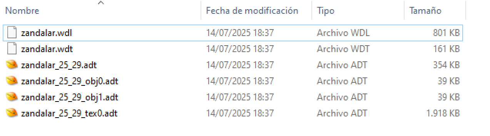

Con ello, hacemos el parche de forma **manual**, eliminando el que nos creó automáticamente el programa.

¡Listo! El resto de ADT cargarán del juego base.

---

## Parte 4 — Activar modo "ver cambios al instante" en Epsilon

Una vez exportada la primera versión y teniendo ya el parche creado en Epsilon, podemos activar este modo.

Este método hará que cada vez que guardemos en Noggit, se actualice al instante en Epsilon **sin necesidad de reiniciar el juego**.

### Paso 1 — Pestaña Advanced

En el programa **Map Upconverter GUI**, accedemos a la pestaña **[Advanced]**:

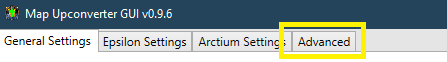

Activamos la casilla **[Enable client refreshing]** e introducimos el **MapID**:

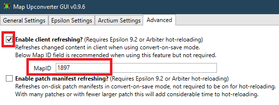

:::tip[Extra]
El MapID se puede obtener en Epsilon con el comando `.gps`.
:::

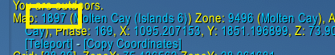

### Paso 2 — Convert on Save

Volvemos a **[General Settings]**, marcamos **[Convert on Save]** y le damos a **[Apply & Start Converter]**:


Se ejecutará el programa. Mientras esté activo, cada vez que pulsemos **Ctrl+S** en Noggit, los cambios se actualizarán al instante en Epsilon.

:::tip[Consejo]
La proxima vez que quieras seguir editando el mapa, simplemente enciende el programa y dale al boton. Se queda guardado de la ultima vez, no hace falta rellenar todo cada vez.
:::

:::warning[Recuerda]
La proxima vez que crees un parche desde cero, **desactiva estas opciones**.
:::
