# Creación de un WMO Custom para Epsilon

Guía por **NORTE.m2** · Versión 4.0

---

:::note[Aviso]
Esta guía comienza una vez tenemos ya creado nuestro Modelo 3D en Blender.

Puedes ver cómo crearlo aquí: **Uso básico de Blender para crear un WMO**

Se requiere tener instalado el **Addon** de Blender de **Wow Blender Studio** y **Blender 3.4** *(los links están disponibles en la sección de requisitos)*.

El apartado 14 es una guía rápida para crear el WMO. Recomiendo pasar directamente a esta, aunque no profundiza tanto, si quieres ir más rápido.
:::

---

## Requisitos

- [**Convertidor 3.3.5 → Shadowlands**](https://mega.nz/file/EM1AzChB#HnGe6m8LoJRTq6vjJuQ6-z4_w6ziCW7zBe5ddWdCsAk)
- [**Blender 3.4**](https://download.blender.org/release/Blender3.4/)
- **WBS – Wow Blender Studio:** [https://drive.google.com/file/d/11RFIqoz6zncmGiFw6dUGgpMvZR0iKJQ6/view](https://drive.google.com/file/d/11RFIqoz6zncmGiFw6dUGgpMvZR0iKJQ6/view)

Después, instalar el WBS en Blender como un addon normal. *(Ayuda: [https://youtu.be/q1Nvbl8oNpQ?si=7elpRkRGVa6TXrWL](https://youtu.be/q1Nvbl8oNpQ?si=7elpRkRGVa6TXrWL))*

### Otros links de utilidad *(no necesarios)*

- **Wow.Export:** [https://www.kruithne.net/wow.export/](https://www.kruithne.net/wow.export/)
- **Discord Modern Map Making:** [https://discord.gg/C85673kkWd](https://discord.gg/C85673kkWd)
- **Discord Wow Modding:** [https://discord.gg/Dnrztg7dCZ](https://discord.gg/Dnrztg7dCZ)
- **Discord WowBlenderStudio (antiguo):** [https://discord.gg/SBEDRXrSnd](https://discord.gg/SBEDRXrSnd)
- **Videotutorial WBS:** [https://youtu.be/RYQT0J8LuY4?si=L8UvGkpCOBWszQ0j](https://youtu.be/RYQT0J8LuY4?si=L8UvGkpCOBWszQ0j)

---

## Directorio del WMO

Una vez tenemos listo nuestro modelo en Blender, activamos la siguiente opción para habilitar la creación del WMO:

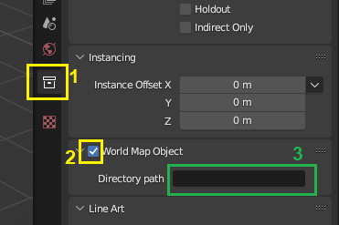

En **directory path** deberemos introducir el directorio del WMO **original** del WoW que vamos a sustituir al hacer el parche.

**Ejemplo:**

Si el WMO que vamos a sustituir es `world/wmo/brokenisles/suramar/7sr_hub_statue.wmo`, el **directory path** será:

```
world/wmo/brokenisles/suramar
```

*(Es decir, eliminamos el nombre del archivo: `/7sr_hub_statue.wmo`)*


---

## El tipo de WMO

Al haber activado el paso anterior, se nos habrán formado diferentes grupos automáticamente:

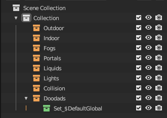

Introducimos nuestro modelo 3D en su categoría correspondiente. *Cada categoría es el tipo de WMO.*


*(En este caso **outdoor** porque va a ser un WMO únicamente exterior.)*

- Los **WMO INTERIORES** requieren portales para su funcionamiento *(ver sección WMO con Interior)*. Tienen iluminación propia y puede editarse.
- Los **WMO EXTERIORES** no requieren de ello; su iluminación es la del mundo.

---

## El renderizado ingame

Esta pestaña muestra las diferentes flags disponibles para el renderizado del modelo.

**No es necesario** activarlas, pero pueden ser útiles en circunstancias concretas.

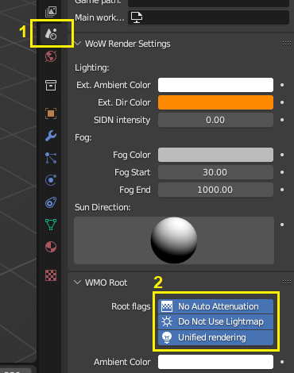

---

## Generar los materiales


En el panel del addon WMO **(1)**, click en **Generate Materials (2)**.

:::tip[No ves el panel?]
Si el panel no aparece, ábrelo pulsando **N** o la flechita superior.
:::

Al ejecutar este paso, todos los materiales de tu objeto 3D habrán desaparecido. ¡Es normal!

### Volver a ver los materiales


Para volver a visualizarlos: en la pestaña materiales **(1)**, selecciona tu material **(2)**, y en Texture **(3)** elige la textura original que tenía antes **(4)**.

Repite uno a uno hasta verlos todos de nuevo.

:::tip[Consejo]
Intercala este paso con el siguiente para ir más rápido.
:::

---

## Materiales del WoW

A cada material hay que establecerle un vínculo con el `.blp` del WoW que vaya a utilizar.


En **path**, introduce la ruta del blp. Por ejemplo:

```
dungeons/textures/6hu_garrison/6hu_garrison_armorystone.blp
```


Repite con cada material, asignándole su futuro archivo dentro del WoW.

**Otras opciones** *(no necesarias)*:

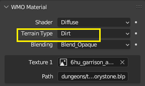

**Terrain Type** define el sonido que tendrán las pisadas del personaje sobre el WMO dentro del juego.

:::tip[Recomendación]
Usa el addon **WoW: Añadir Automáticamente Texturas de WMO** — disponible como el segundo addon en la guía: **Uso básico de Blender para crear un WMO**.
:::

---

## Colision del WMO

Para añadir colisión, dentro del panel del addon haz click en **QUICK COLLISION**.

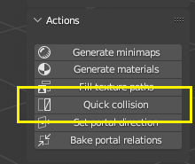

Generará una colisión básica según la forma del objeto 3D.

---

## Posibles errores

:::warning[Cuidado!]
La UV del objeto deberá llamarse **UVMap** o dará error al exportar.
:::


Para poder exportar también deberemos haber creado un **proyecto** en el addon. Solo hace falta hacerlo la primera vez; un mismo "proyecto" vale para todo lo que hagas en adelante. Se puede crear sin problema al final.


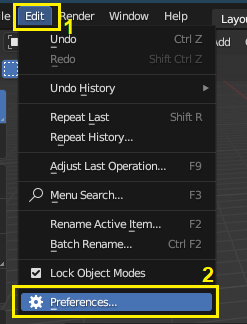

---

## Exportar

Una vez todo completado, exportamos desde el panel del addon:


El objeto exportado será de la versión 3.3.5 (Lichking). Hay que convertirlo a Shadowlands usando el convertidor.

Introducimos los archivos que habrá exportado Blender en la carpeta `INPUT`, **con el nombre del WMO original**:

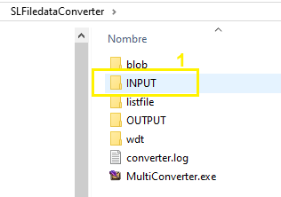


Hacemos click en el *MultiConverter.exe* y en la carpeta `OUTPUT` aparecerán 3 archivos. Con los dos `.wmo` se crea el parche del Epsilon. ¡Listo!

---

## WMO con Interior


### Interior y Exterior


Los interiores funcionan de forma diferente a los exteriores. Hay que añadirlos de forma separada, con otro modelo 3D.

Tendremos un modelo interior dentro del otro modelo exterior. Lo colocamos en su categoría correspondiente: **Indoor**.

:::note[Dato]
El interior debe estar conectado con el exterior; los modelos no deben tener un hueco en medio.
:::

:::warning[Cuidado]
La luz interior y exterior se trata de forma diferente: habrá un corte visible entre ambas.
:::

### Portales

Para conectar el interior y el exterior, debemos colocar un elemento en medio llamado **portal**.

:::note[Dato]
Sin portal, desde el exterior no veremos el interior y viceversa, aunque el personaje sí podrá pasar de uno a otro.
:::

Creamos un plano justo en el punto de transición:

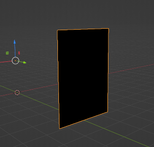
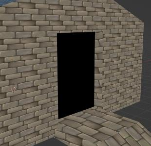
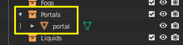

Ese plano lo introducimos en la categoría **"portals"** y lo configuramos:


Seleccionando el portal, en la categoría *WMO Portal*, elegimos en *First Group* el objeto exterior y en *Second Group* el interior.

:::note[Datos]
- Los portales no necesitan texturas. Basta con asignarles un material en blanco.
- Podemos colocar todos los portales que queramos (puertas, ventanas…).
:::

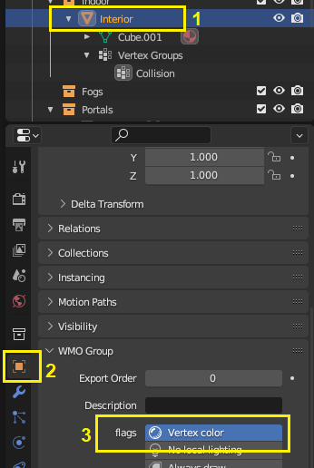

---

## Luces en los WMO

### Paso 1 — Activar Vertex Color

Activamos la opción **Vertex Color** en el panel del addon.

:::warning[Cuidado]
Ten seleccionado en el menú superior el objeto en el cual vas a trabajar; en este caso el modelo interior.
:::

### Paso 2 — El vértice Col

En la pestaña **Color Attributes** encontrarás un vertex llamado **"Col"**. Es el canal donde vamos a pintar las luces del WMO.

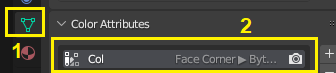

:::note[Dato]
Debería existir por defecto. Si no, pulsa **+** y créalo con la configuración: *Face corner, Byte color*.
:::

### Paso 3 — Entrar en Vertex Paint

Accedemos al modo **Vertex Paint**:


Establecemos la iluminación plana de la siguiente forma:

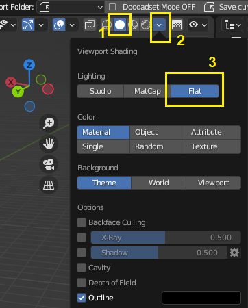

### Paso 4 — Pintar las luces

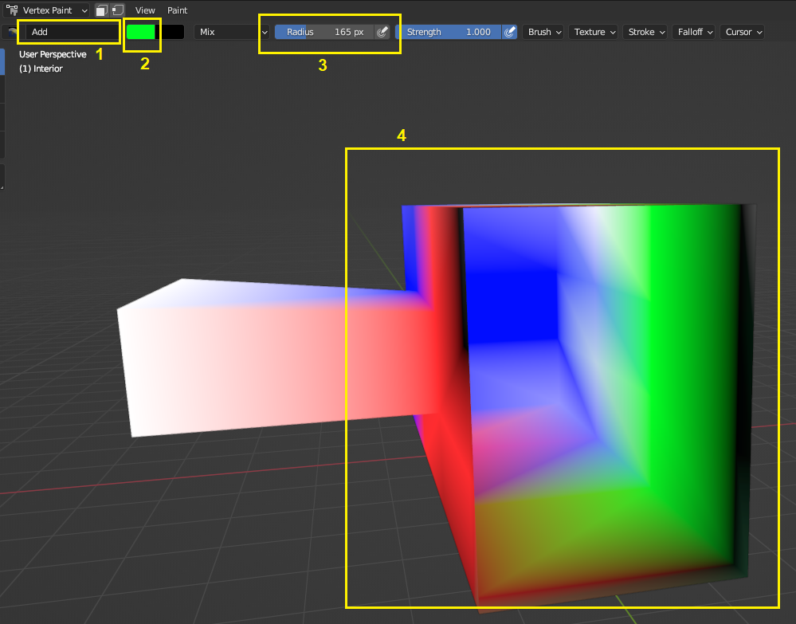

- **(1)** Seleccionamos **Add** para establecer el modo de pincel.
- **(2)** Elegimos el color que vamos a pintar — será el color de la luz.
- **(3)** Ajustamos el radio del pincel.
- Pintamos el objeto según las luces que queremos.

:::note[Datos]
- **Blanco** = luz blanca.
- **Negro** = la zona se iluminará naturalmente por el ciclo de día/noche o por objetos de luz del juego. *(Negro no es oscuridad, es el valor predeterminado.)*
- Se recomienda pintar todo en negro y luego añadir luz en los puntos que interesen.
:::

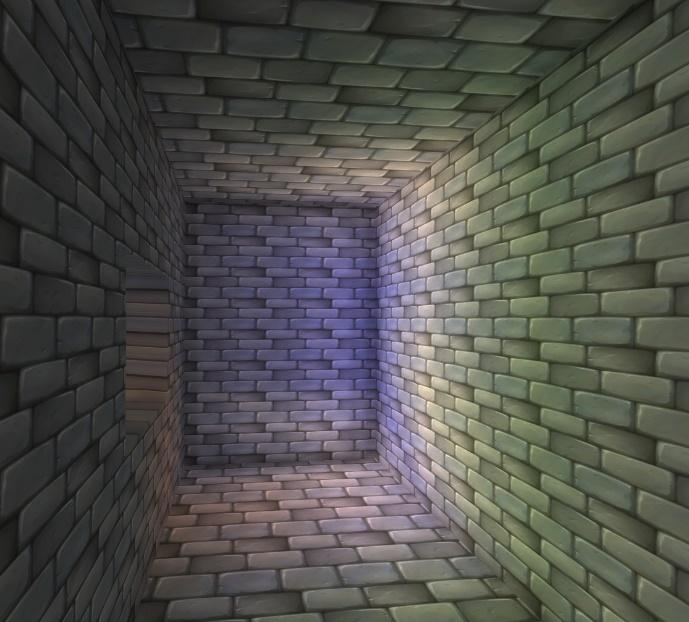

:::note[Dato]
La luz ingame se verá mucho más suavizada que en Blender.
:::

### Paso 5 — Activar Unified Rendering

Para que la luz se aplique ingame, activa **únicamente** la opción **"Unified Rendering"**, independientemente de lo que hayas activado al principio:

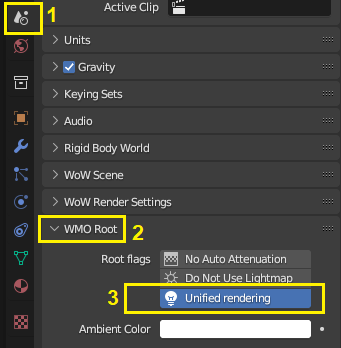

¡Las luces ya funcionarán!

---

## Transicion de luz exterior e interior


En la pestaña **Color Attributes** hay que crear **dos** archivos vertex con la siguiente configuración:


- El primero se llamará: **`BatchmapTrans`**
- El segundo: **`BatchmapInt`**

Quedando así:


Entramos en el modo **Vertex Paint** (igual que en los pasos 3 y 4 de la sección anterior):


Pintamos el objeto de forma que la zona de la puerta quede en **blanco** y la zona interior en **negro**.

:::note[Importante]
Aplica el mismo pintado en ambas capas: tanto `BatchmapTrans` como `BatchmapInt`.
:::

- Zona **blanca** → transición de luz.
- Zona **negra** → WMO usa la luz pintada por nosotros.

¡Listo!


---

## WMO Complejo: Subgrupos

Los WMO tienen un límite de caras y vértices por subgrupo:

| | Límite |
|---|---|
| **Vértices** *(vertex)* por subgrupo | 65.535 |
| **Caras** *(faces)* por subgrupo | 65.535 |

*(edges y triangles no cuentan para el límite)*

:::warning[Recomendación]
**NUNCA** superar los 50.000 por subgrupo. A partir de ese número aparecen errores.
:::

Puedes comprobar las estadísticas de tu modelo aquí:


Para sobrepasar el límite total, los WMOs se dividen en **subgrupos**. Usando [wow.export](https://www.kruithne.net/wow.export/) podemos buscar un WMO que ya tenga varias partes y usarlo como base de reemplazo:

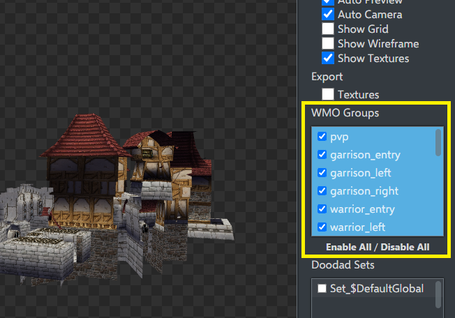

En Blender, cada parte del WMO original se convierte en un subgrupo propio. *El nombre de cada subgrupo es irrelevante; aquí se han nombrado a modo de ejemplo:*


Con 5 subgrupos podríamos tener hasta 325.000 caras, muy por encima del límite de un solo grupo.

---

## Anexo: otros errores documentados

:::note[Aviso]
Esta sección es **teórica**. La información aquí expuesta puede no ser del todo exacta — es una recopilación tras experimentar e investigar.
:::

### Las caras sobresalen atravesando el modelo de forma incorrecta

Se supera el límite de vértices o caras de un subgrupo.

| | Límite |
|---|---|
| Vértices por subgrupo | 65.535 |
| Caras por subgrupo | 65.535 |


**Solución:** Dividir el modelo en partes que no superen el límite.

---

### Caras invisibles pese a que las normales están correctas

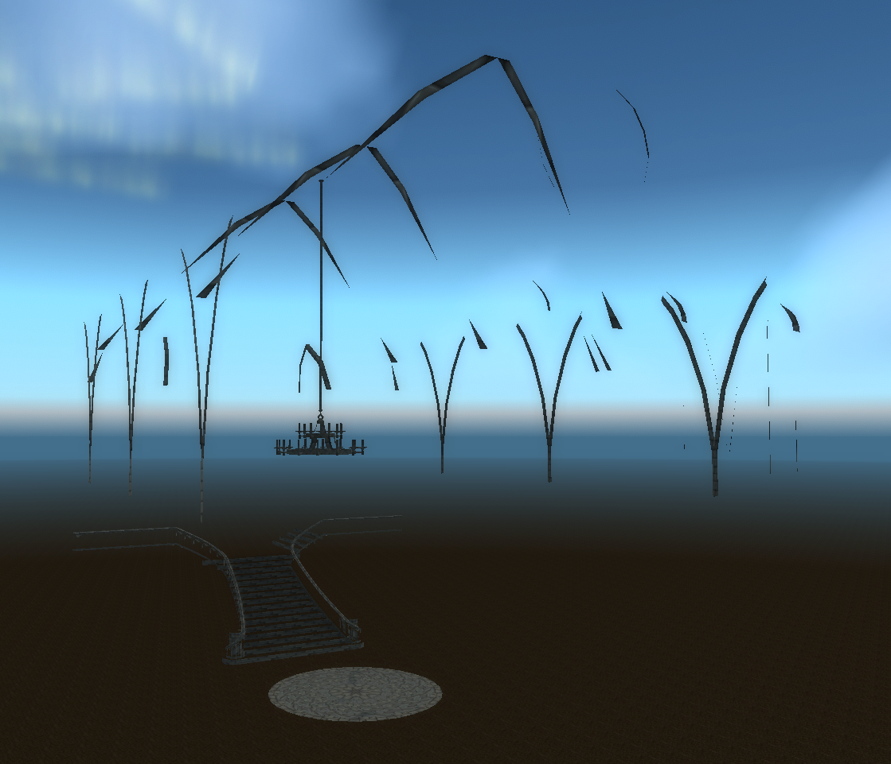
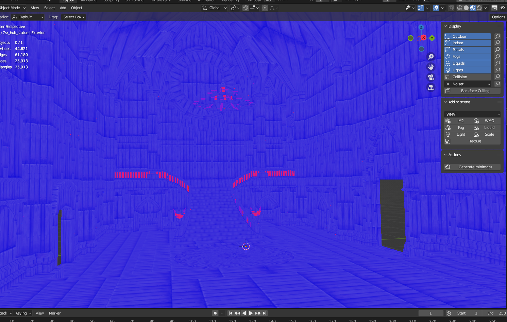

Un material también tiene un número máximo de vértices y caras que puede soportar, al igual que un subgrupo.

**Solución:** Dividir el WMO en varios materiales.

---

### Fallo en el convertidor


Una de las texturas tiene un espacio en su **path** — normalmente al final, detrás del `.blp`. Elimina cualquier espacio sobrante.

---

## Guia rapida con consejos

*Un añadido posterior para simplificar la tarea de crear un WMO. Para dudas más detalladas, consulta las secciones anteriores.*


### 1 — Activar y añadir el directorio del WMO

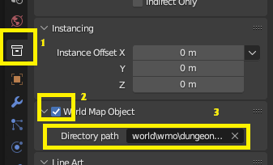

Si el WMO que sustituimos es `world/wmo/brokenisles/suramar/7sr_hub_statue.wmo`, el **directory path** es:

```
world/wmo/brokenisles/suramar
```

---

### 2 — Outdoor o Indoor

Mueve tus objetos a su casilla correspondiente.

:::warning[Limite por objeto]
Maximo **40.000 vertices** por objeto. *(Ver seccion WMO Complejo: Subgrupos para saber como comprobarlo.)*
:::

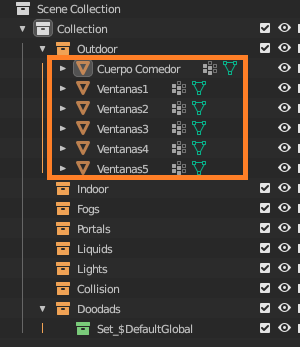

---

### 3 — Materiales

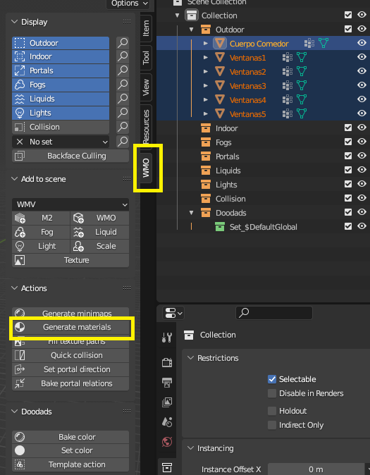

1. Selecciona tus objetos.
2. Haz click en **Generate Materials** en el panel del addon. *(Si no aparece, pulsa **N**.)*
3. Los materiales se volverán negros — es normal.

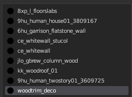

:::tip[Consejo]
Nombra tus materiales desde el principio con el nombre de su `.blp`. Te ahorrarás mucho trabajo más adelante.
:::

:::tip[Consejo]
Arrastra hacia arriba la pestaña **WMO Material** — la usarás muchas veces y es más cómodo tenerla visible. *(La flecha indica desde donde se arrastra.)*
:::

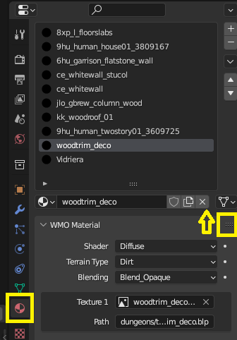

En cada material:

1. Pulsa **Texture 1** y asígnale el `.png` que está usando Blender *(solo para visualizarlo tú)*.

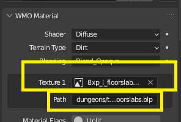

2. En **path**, escribe el blp completo. Por ejemplo:

```
dungeons/textures/pandaren/mogu/ce_whitewall.blp
```

:::tip[Consejo]
Copia el nombre del material, pégalo en [https://wago.tools/files](https://wago.tools/files) y desde ahí copia el directorio completo. Por eso conviene tener ya el nombre del blp asignado al material.
:::

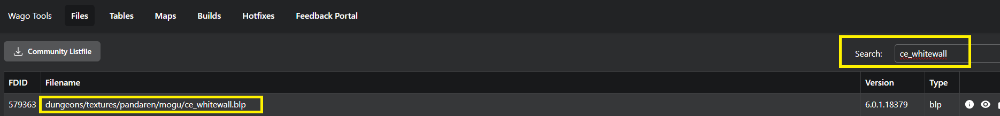

:::warning[Cuidado con los espacios]
Wago Tools siempre añade un espacio al final al copiar. Al pegarlo en Blender, **elimina el espacio del final** — lo último debe ser la `p`. Los espacios en el path darán error al exportar.
:::

Para asignar sonido de pisadas: consulta la sección **Materiales del WoW** para ver la opcion *Terrain Type*.

:::tip[Recomendación]
Usa el addon **WoW: Añadir Automáticamente Texturas de WMO** disponible en la guía: **Uso básico de Blender para crear un WMO**.
:::

---

### 4 — Colision

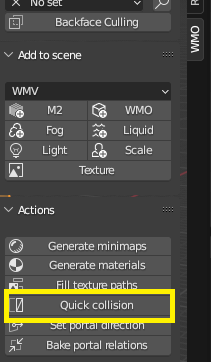

Con el objeto seleccionado, haz click en **Quick Collision**. Se crea automáticamente y no se ve en pantalla.

Si la colisión falla en algún punto ingame, ajusta el valor inferior izquierdo hasta que funcione correctamente:

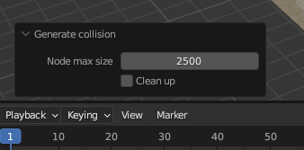

---

### 5 — Exportar

Con todo listo, exporta desde el panel del addon:

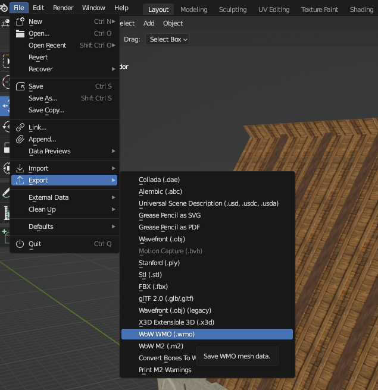

El objeto exportado será versión 3.3.5 (Lichking); conviértelo a Shadowlands con el convertidor.

Introduce los archivos en la carpeta `INPUT` **con el nombre del WMO original**:


Ejecuta el *MultiConverter.exe* y en `OUTPUT` aparecerán 3 archivos. Con los dos `.wmo` crea el parche del Epsilon. **¡Listo!**
