# Uso básico de Blender para crear un WMO

Guía por **NORTE.m2** · Versión 1.0

---

:::note[Aviso]
Esta guía describe exclusivamente mi método de trabajo en Blender para la creación de un WMO. Existen otras metodologías igualmente válidas para alcanzar el mismo resultado.

A lo largo del documento se comparten atajos, trucos y procedimientos que me han resultado útiles en la práctica.

Se desarrollará paso a paso la creación de un WMO sencillo hasta su finalización.

Para la exportación consultar: **Creación de un WMO Custom para Epsilon**
:::

---

## Atajos de teclado propios

Estos son los atajos que yo me he creado para usar Blender y, para mí, es la forma más cómoda. No son obligatorios pero sí muy recomendados.

Antes de crearlos tú ¡**espera**!, te los dejo ya creados al final con un par de clicks.

Primero vamos a ver:

### ¿Cómo crear un atajo de teclado?

Ve a **Edit → Preferences**

En este panel podemos editar cualquier atajo de teclado del programa.

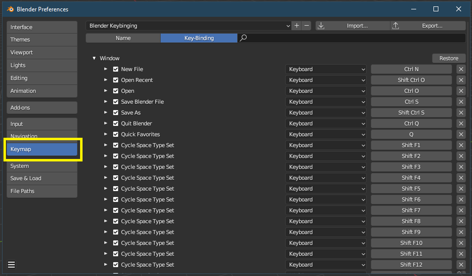

---

### ¿Cuáles recomiendo crear?

Para los controles principales yo uso:

- **S: SELECCIONAR** — para entrar en el modo de ejes de desplazar.
  *Por defecto Blender te hace desplazar libremente por la pantalla arrastrando el objeto, pero eso es muy poco exacto y nunca queda bien. Por eso lo tengo puesto con los ejes.*

- **R: ROTAR** — para entrar en el modo de ejes de rotar.

- **E: ESCALAR** — para entrar en el modo de ejes de escalar.

Recomiendo estas tres teclas, que están cerca, y que siempre te abran el modo con el gizmo (ejes) de edición, tal que así:

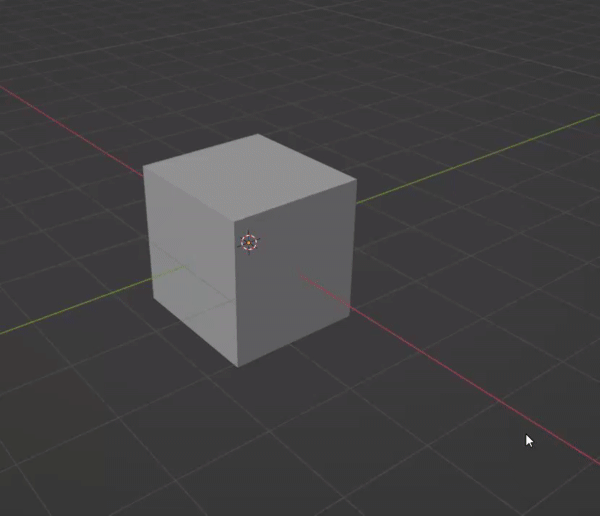

---

### ¿Otros útiles que puedo crear?

Recomiendo tener la **`i`** como tecla de añadir imagen en el modo de texturizar. Porque vamos a añadir muchísimas imágenes para ponerle textura a nuestros WMOs y nos ahorraremos muchos clicks.

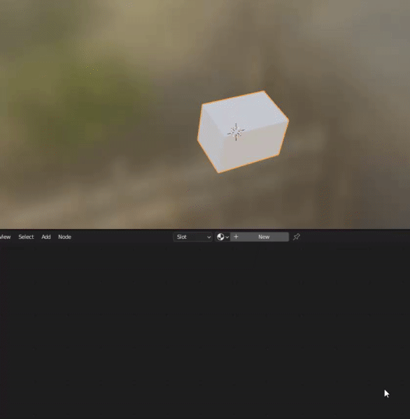

También tengo la tecla **`><`** *(al lado de la Z)* como el modo de entrar en el "modo videojuego" — donde controlas tú la cámara como si volases dentro de Blender, con los controles WASD, para verlo como si estuviéramos en el WoW.

---

### Teclado Numérico: `1` `2` `3`

**`1`** — Mover origen del objeto, o conjunto, a su centro exacto.
*Porque a veces necesitamos rotar desde el punto central, por ejemplo.*

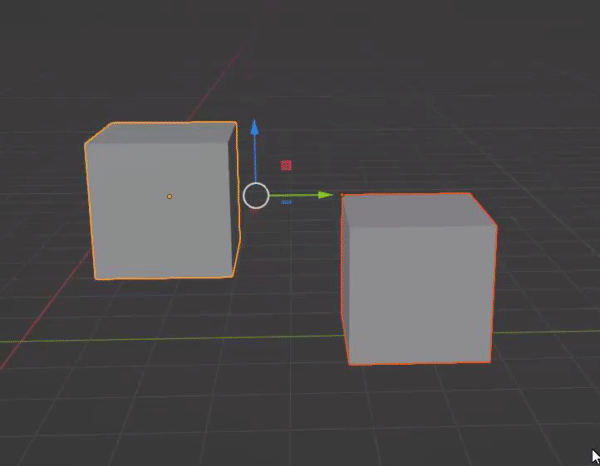

**`2`** — Mover la geometría a su gizmo.
*Imagina que tenemos el eje en el 0,0… Pues la movemos con un click de forma exacta.*

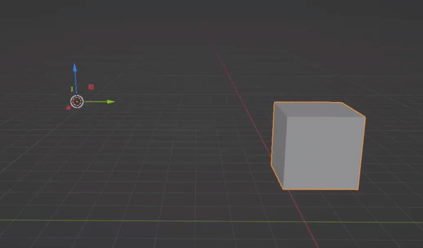

**`3`** — Mover el gizmo al cursor 3D.
*Luego se explicará cómo mover el cursor 3D… Pero combinando este con el 2 es muy útil.*

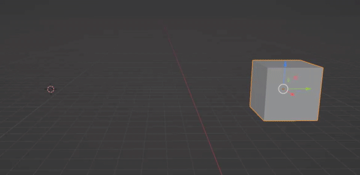

---

**`FIN`** *(La tecla de encima de las flechitas, entre el teclado y el teclado numérico)*: Eliminar una cara en el modo editar. *Lo cual, hacerlo con un solo botón, es algo que agradeceremos mucho en adelante.*

---

### ¿Cómo me añado estos atajos?

Si te gustan, te los dejo preparados con un click:
  [Atajos para wmo recomendados.py](https://drive.google.com/file/d/11Uwwvr1dN4LGdEEPyAjzp34we4XogzUR/view)

En google drive pulsa en descargar el archivo.

En Blender, en el menú de antes, de los keymap, le damos a **Import** y seleccionamos el archivo. A su izquierda puedes crear un perfil nuevo de teclas, para borrarlo o volver al de antes si no te gusta.

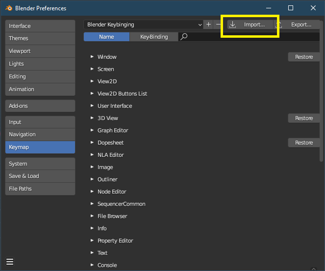

---

## Atajos de teclado básicos

Estos son los que ya vienen por defecto y deberías conocer.

### Movimiento

- **`Rueda del ratón`** (manteniendo pulsado): Rotamos la cámara.
- **`Rueda del ratón + Shift`** (manteniendo pulsado): Desplazamos la cámara.
- **`Rueda del ratón`** (girándola): Hacemos zoom.
- **`. SUPR`** *(la del teclado numérico, al lado del 0)*: Nos centra la vista en el objeto seleccionado. Y ahora nuestra cámara rota alrededor de él.

### Otros

**`TAB`** — Modo editar. Para editar un objeto.

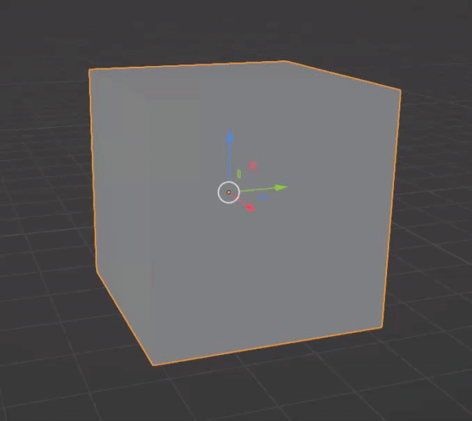

**`1, 2 y 3`** — Dentro del modo editar, para seleccionar un vertex (vértice), edge (borde) y face (cara) respectivamente.

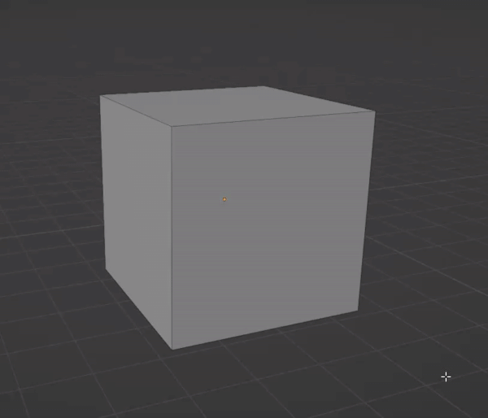

**`ALT + Z`** — Modo X-RAY. Ahora podemos ver a través de los objetos. *(Y por ejemplo seleccionar objetos enteros… Ya que sin esto solo seleccionaríamos lo que vemos, no lo de detrás.)*

**`SHIFT + A`** — Crear un objeto. *Para los WMO siempre usaremos Mesh > Plane y Cube, y quizás algún otro.*

**`CONTROL + D`** — Pulsamos la combinación y luego **click izquierdo** en cualquier parte de la pantalla. Para **duplicar** un objeto.

:::tip[Duplicar ≠ Copiar]
Duplicar no es lo mismo que crear una copia. Con `Ctrl+C` + `Ctrl+V` crearíamos una copia del objeto, pero también duplicaría su material, creando uno nuevo. En cambio, con duplicar, tenemos una copia exacta que comparte el mismo material.

Por ejemplo, si copiamos y pegamos una pared, su textura pasará de ser `madera1` a `madera2`. Duplicando, ambas serán `madera1`, usando la misma textura.
:::

**`/`** — Aisla un objeto en la vista. *(Desactiva temporalmente los demás.)* Al volver a darle, lo des-aisla. De esta forma podemos centrarnos en trabajar en un único objeto, ignorando temporalmente los demás.

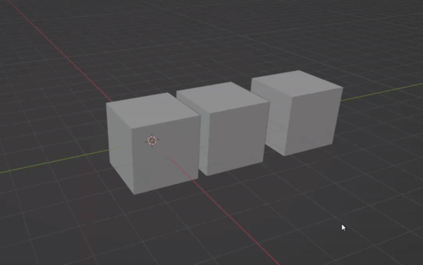

---

## El 3D Cursor

El Cursor 3D es el centro en nuestro mapa de 3 dimensiones de Blender. Se simboliza con esto:

Tiene muchas funciones, pero por ejemplo, es donde aparecen los nuevos objetos que creamos. Poder mover su posición resulta importante.

**`ALT + S`** — Abrimos el panel de posición del cursor 3D:

Las más útiles son:

- **Cursor to World Origin**: Envía el cursor al punto 0,0 del mapa. Con los atajos de antes podríamos llevar un objeto al origen con dos clicks.
- **Cursor to Selected**: Envía el cursor 3D a lo que tengamos seleccionado. Si tenemos seleccionado un vértice, enviará el cursor a ese punto exacto. Si es un objeto, a su centro.

Combinando con los atajos de antes podemos hacer cosas así:

---

## Addons recomendados

### ¿Cómo instalar un AddOn?

En **Edit > Preferences** *(el mismo lugar de los keymaps)*, en la pestaña **Add-ons**, en **Install** seleccionamos el archivo `.py` / `.zip` del addon, y luego lo activamos marcándolo.

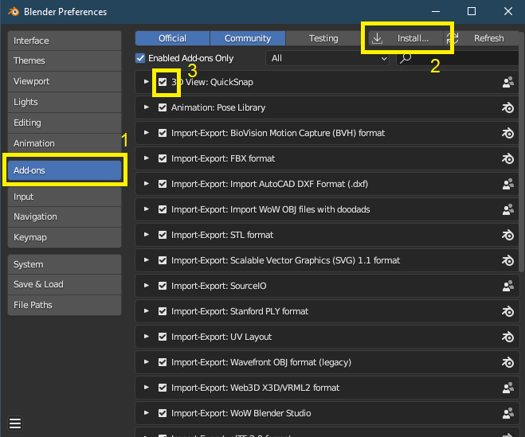

---

### QuickSnap

**Descarga:** https://github.com/JulienHeijmans/quicksnap/archive/refs/heads/main.zip

Nos permite mover objetos desde vértices a otros vértices, imantados. ¡Una maravilla! *(La tecla es la `V`)*

---

### WoW: Atajos Útiles
  [Descargar](https://github.com/nortedwg/WoW-Atajos-Utiles)
  
Este addon permite varias opciones útiles:

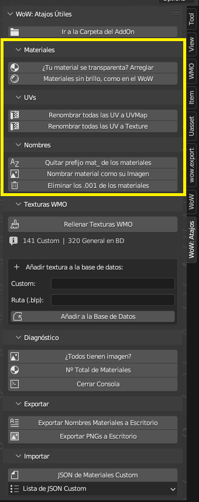

### Parte 1: Materiales y UVs

[*¿Tu material se transparenta? Arreglar*] Cuando exportamos un objeto del WoW, al volverlo a importar, muchas veces están invertidos los materiales y se ven transparentes — los arregla todos con un click.

[*Materiales sin brillo, como en el WoW*] Ajusta las propiedades de todos los materiales para verse como ingame.

[*UV*] Renombra todas las UV. 

[*Quitar prefijo _mat*] Si el material se llama `mat_textura`, quita el `mat_`. *(Todos los materiales importados de wow.export tienen ese nombre.)*

[*Nombrar material como su imagen*] Si la imagen se llama `6hu_wall.png`, renombrará el material a `6hu_wall`. Lo hace con todos.

[*Eliminar los .001 de los materiales*] Si has duplicado materiales, habrán aparecido algunos llamados .001 .002 etc, que serán exactamente igual al original. Al darle, todos se unifican en el material original y borra los demás.

Además, pulsando **`ALT + R`** giramos 90 grados nuestros objetos:

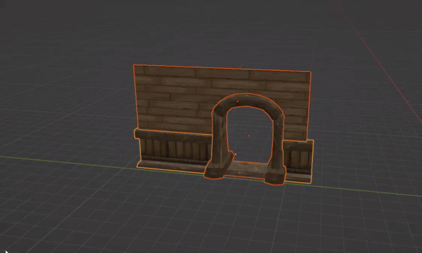

### Parte 2: Texturas WMO Automáticas y Diagnóstico

¿Harto de rellenar una por una la ruta de cada textura? Click en **Rellenar Texturas WMO** y adjudicará su ruta automáticamente.

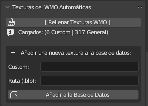

Cogerá el nombre de tu textura, por ejemplo `6hu_garrison_wall`, y le adjudicará su ruta completa `dungeons/wmo/expansion06/6hu_garrison_wall.blp` si existe en la base de datos.

¿No existe? No pasa nada, ¡añádela! Se guarda para siempre.

:::tip[¿Qué es una Custom?]
Si usas texturas propias sustituyendo antiguas — por ejemplo, has generado una textura HD llamada `Custom_Pared` — en **Custom** añades el nombre: `Custom_Pared`, y en **Ruta** añades la que reemplaza: `dungeons/wmo/remplazada.blp`.

Ahora, cada vez que Blender detecte `Custom_Pared`, aplicará esa ruta.
:::

En [*Diagnóstico*] encontrarás un par de botones. El primero abrirá la consola y te dirá si todos tus materiales tienen una textura adjudicada, el segundo nos dirá cuantos tenemos en total.

En [*Exportar*] podrás sacar un listado de las texturas del proyecto, en un .txt en el escritorio. También exportar todas las texturas en .png a una carpeta del escritorio.

En [*Importar*] podrás manejar tus propias listas de materiales custom y activarlas y desactivarlas a conveniencia. Si manejas proyectos con grandes listas que no quieres utilizar siempre, separa estas en un nuevo json e impórtalo con el botón.
Cuando esté activado, el addOn las reconocerá como material custom.

---

## Creación de un pequeño WMO, paso a paso

### Extraer piezas

En esta sección vamos a crear un pequeño WMO a partir de piezas de la **mansión Waycrest**. Con `wow.export` exportamos el modelo como OBJ, lo importamos en Blender y colocamos texturas.

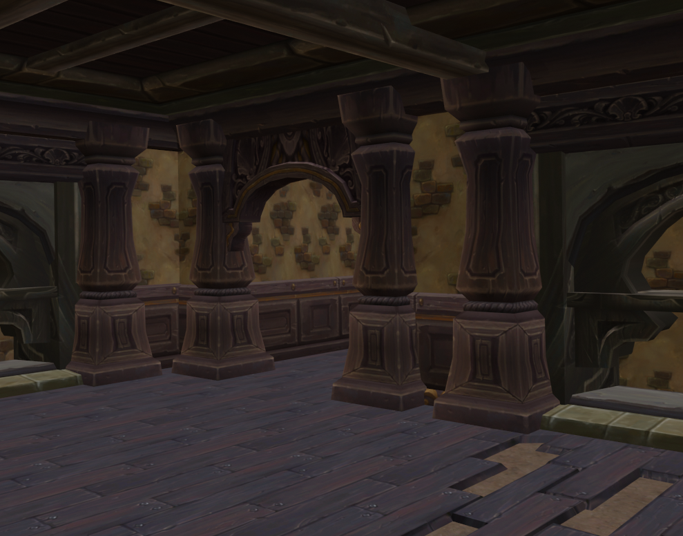

Vamos a extraer uno de los pilares. Entramos en el modo editar `TAB` y seleccionamos una cara del pilar. Al hacerle click, en la pestaña de materiales a la derecha, se nos selecciona qué material tiene esa cara:

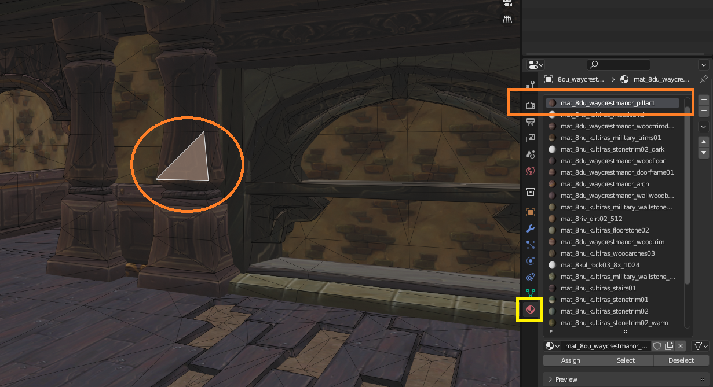

Con el material seleccionado, pulso **`Select`** y me selecciona, de todo el modelo, todas las caras que tienen adjudicadas ese material:

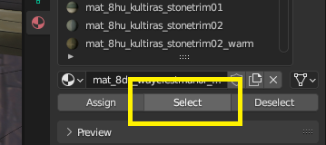

Pulso la tecla **`P`** para separar ese material en otro objeto.

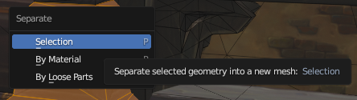

Salimos del modo edición pulsando `TAB` otra vez y clickamos en los pilares. Podemos ver que ahora forman un nuevo objeto (el `.001`).

Pulsando **`/`** aislamos el objeto. Ya que el objeto es muy grande y solo queremos un pilar, hago zoom, entro en el modo editar `TAB` y selecciono la cara de uno de los pilares que quiero. Marcamos **`. SUPR`** para centrar la vista en esa cara.

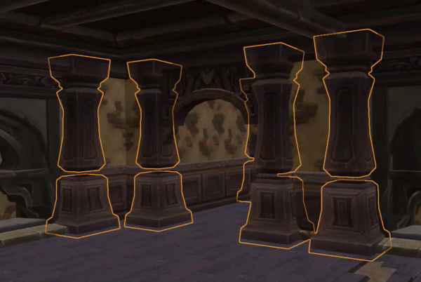

*De esta forma, puedo rotar y ver con detalle el pilar, sin que todo el objeto me moleste en cámara, con eje central esa cara.*

Voy a extraer un pilar. En orden hago lo siguiente:

1. Entro en el modo edición `TAB`.
2. Activo el modo X-Ray con `ALT + Z`.
3. Selecciono las caras del pilar al completo.
4. Pulso `P` para separar ese pilar en un nuevo modelo.
5. Selecciono fuera para desmarcar selección, y selecciono el nuevo pilar. *(Si no, seguía seleccionando el conjunto anterior, osea, el modelo antiguo + el nuevo pilar, en grupo.)*

Ahora puedo pulsar el `1` del teclado numérico, con nuestro atajo, para centrar su eje en el centro del nuevo pilar.

Aíslo el nuevo pilar y me doy cuenta de que tiene un hueco en el centro. *Es porque en ese lugar había otra textura.* Podría extraerla de la misma forma y, cuando la tenga aislada, unirla al pilar con `CONTROL + J`. Sin embargo, vamos a arreglarlo manualmente.

Entro en el modo editar `TAB` y en el modo vértices `1`. Arriba, activo el icono del imán y selecciono **Vertex**. Ahora puedo arrastrar hasta el vértice más cercano.

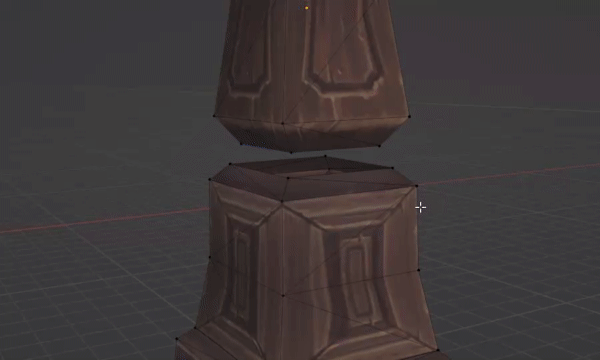

Recuerda borrar los materiales que el objeto ya no utiliza, que aún tiene linkeados todos los de la mansión (**Remove Unused Slots**).

Una vez aislado, lo selecciono y exporto como FBX:

Asegúrate de tener marcada la opción **Limit to → Selected Objects**, así exporta solo lo seleccionado y no todo el objeto.

¡Listo! Ya tenemos nuestro pilar.

---

## Crear nuestro WMO básico

En una nueva escena importo mi pilar — ¡y se ve transparente!

En la pestaña de materiales, con el addon de funcionalidades para el WoW, pulsamos **"¿Tu material se transparenta? Arreglar"**.

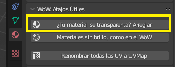

¡Arreglado! Vamos a crear una pared. Para ello pulso `SHIFT + A` y selecciono un **Plane**:

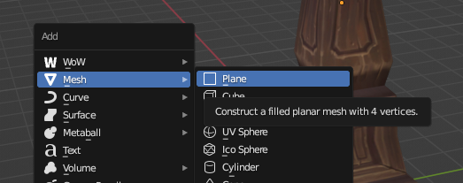

Luego escalo y roto 90 grados el plano para hacer una pared. Lo coloco en posición.

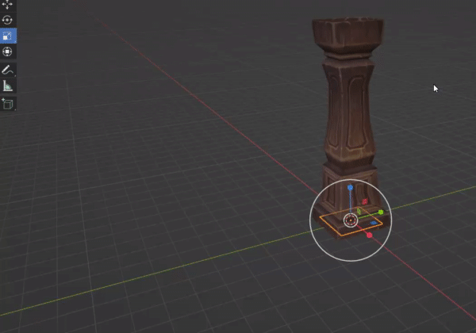

Ahora entro en modo edición `TAB` y en el modo de edges `2`, para desplazarlos y ajustarlos.

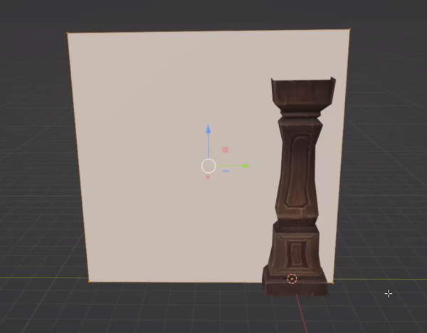

Con la pared seleccionada, en la pestaña material, le creamos un nuevo material:

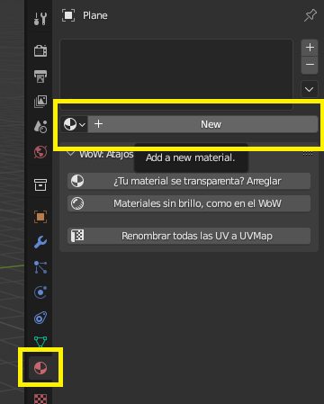

Entramos a **Shading** en el menú superior.

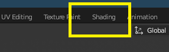

Con la **`i`** creamos una **Image Texture** y la unimos a **Base Color**. En ella seleccionamos **Open** y elegimos el png de nuestra textura.

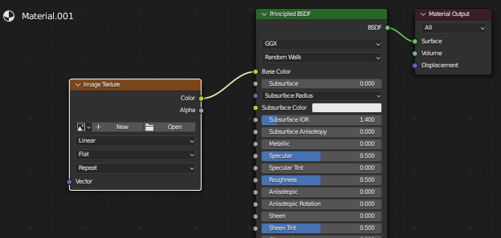

En este caso una textura de madera:

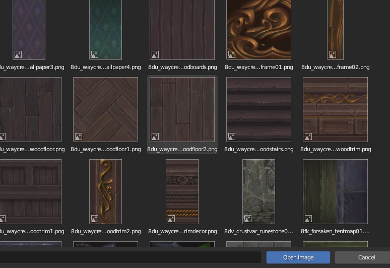

Luego, en el AddOn anterior, recuerda pulsar la segunda opción **"Materiales sin brillo, como en el WoW"** para verlo igual que dentro del juego:

:::tip[Consejo]
En el material, ponle el mismo nombre que la textura. Sé ordenado porque luego te hará falta. Lo puedes copiar y pegar.
:::

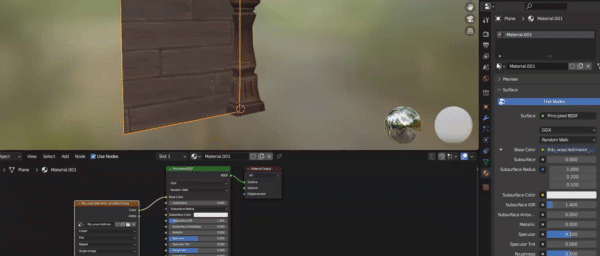

Vamos a la pestaña **UV Editing** para ajustar su UV:

---

## Ajustar UVs

A la izquierda vemos su UV. A la derecha el objeto. Como podemos ver, la UV no corresponde a la forma del objeto, así que vamos a creársela nueva.

Entramos en modo editar y seleccionamos las caras que van a formar la nueva UV. Podemos seleccionar todas con **`A`**.

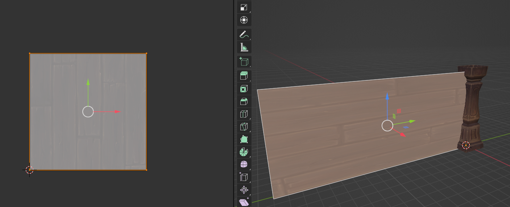

En el panel superior de UV seleccionamos una de las siguientes opciones:

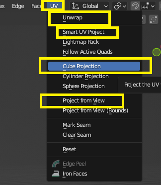

Cada una da un resultado diferente:

- **UNWRAP y SMART UV PROJECT**: Descomponen la figura como si fuera origami, desdoblando las caras. La segunda lo ajusta de mejor manera. *Recomendadas para modelos sin una forma geométrica.*
- **CUBE PROJECTION**: Proyecta las UVs como si alrededor del objeto hubiera un cubo, sacando una "foto" en cada una de las 6 direcciones posibles. *Recomendada para modelos con forma geométrica.*
- **PROJECT FROM VIEW**: Es como si sacara una "foto" desde la cámara del usuario, tal cual ves la textura. Es útil si nos colocamos desde uno de los extremos.

Por ejemplo, aquí he pulsado sobre los ejes del mundo para colocarme sobre el eje X, y desde ahí saqué una "foto" perfectamente perpendicular a nuestra pared. Como ves, la UV adopta de forma exacta su forma:

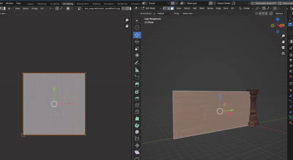

Ahora ajustaremos la UV. Recuerda que en la esquina superior izquierda puedes pulsar el botón para ver todas las caras de la UV aunque no estén seleccionadas.

En el modo editar, en el panel derecho, selecciono el objeto. Entonces, en el panel izquierdo, puedo seleccionar las caras de la UV a editar.

Puedo escalar, rotar, mover libremente con los atajos habituales hasta ajustar la UV a la textura. No hay límite de tamaño — puedo salirme de la textura y esta se duplicará infinitamente.

*Piensa que la UV es la representación de la cara sobre la textura, así que tal cual la edites la verás. Si la haces más estrecha, se verá más estrecha, etc.*

Finalmente me ha quedado así:

---

## Duplicar piezas y montaje

Vamos a cerrar la sala. Para ello usamos **`ALT + D`** y clickamos en la nada a continuación, para crear una copia exacta de nuestras piezas. Con ello las vamos colocando hasta crear una sala.

Recuerda que con **`ALT + R`** lo giramos 90 grados:

Como me resulta un poco incómodo, pulso el `1` del teclado numérico para que sus ejes estén en el centro y duplico:

Para la última parte, copio directamente la pared del fondo seleccionándola como grupo:

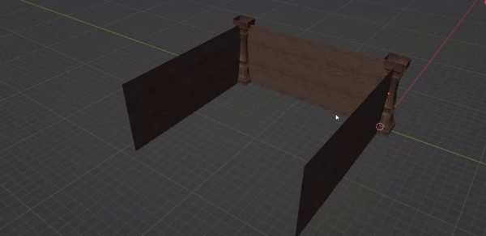

Y ya tengo las paredes de mi sala preparadas.

---

## Crear huecos

¿Y la puerta? Vamos a crear una. He importado el modelo de una puerta, extraído de la misma forma que las columnas. Nos falta el hueco en la pared.

Lo primero es colocar la puerta en su posición definitiva.

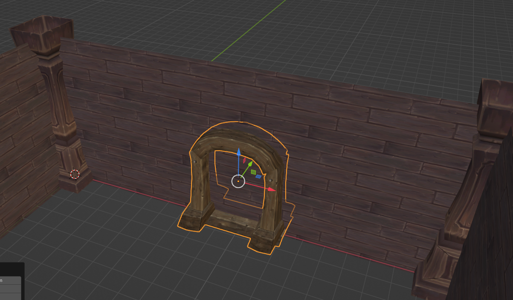

Selecciono la pared y entro en el modo edición con `TAB`. Voy a usar la herramienta **Loop Cut** del panel de la izquierda — nos permite cortar en 2 el modelo, creando un edge.

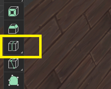

Tras hacer click en la herramienta, muevo el ratón a la pared, al borde que quiero cortar. Al colocarlo encima nos muestra una línea amarilla por donde se hará la división. Hacemos click.

Ahora si pulso la tecla **`N`**, o la herramienta **Edge Slide**, puedo desplazar el borde hasta colocarlo en el límite de la puerta.

:::tip[Consejo]
Puedes mover con Edge Slide cualquier borde, no necesitas haberlo creado con Loop Cut. ¡Y no distorsiona las caras! A diferencia de como lo haría si simplemente movieses el borde.
:::

La intención es que el corte quede tapado por el grosor del marco de la puerta. Realizo el mismo proceso al otro lado y arriba:

Ajustamos la posición y quedará así:

Ahora, entro en el modo caras `3`, selecciono la cara central y la borro pulsando el atajo `FIN`. ¡Ya tenemos hueco! Y sin deformar la textura.

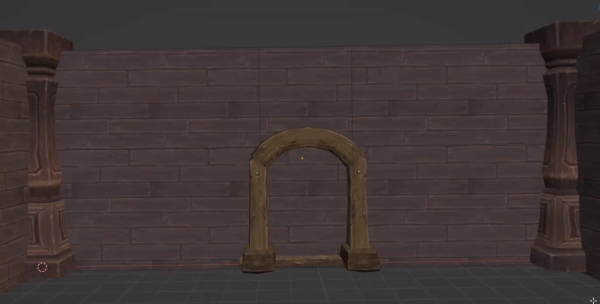

---

## Tapar huecos

¿Y si mi modelo viene roto? ¿Puedo tapar un agujero? Es bastante común que un modelo de Blizzard tenga errores.

*Imaginemos que este agujero venía de serie y yo necesito la pared lisa:*

Un método sencillo es entrar en el modo edición, seleccionar dos de los bordes enfrentados…

Y la siguiente opción: **Edge > Bridge Edge Loops**. Nos creará una cara entre los dos bordes.

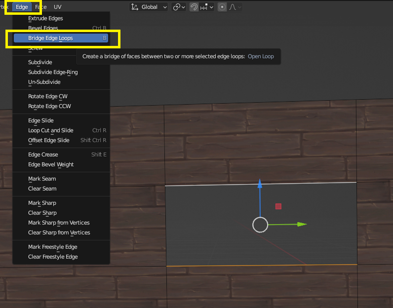

En muchas ocasiones aparecerá con la textura mal, ya que no tiene un correcto ajuste en la UV.

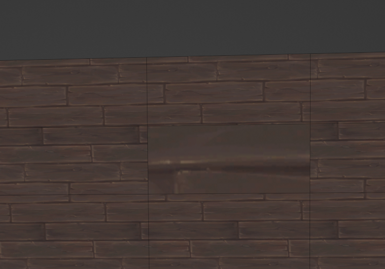

Para ello usamos uno de los métodos para crearle una nueva UV. En este caso, **Cube Projection**:

Ya tendríamos el hueco arreglado.

---

## Los Normal Maps

Las texturas solo pueden verse desde una dirección. Para verlo, activamos **Face Orientation** en el overlay de la viewport:

Lo **rojo** es la cara que **no** se ve. Lo **azul** la que **sí**.

Si estuviéramos haciendo una habitación, querríamos que únicamente se viese desde dentro. Ahora mismo, al estar dentro, veríamos transparente algunas paredes.

Vamos a arreglarlo. Seleccionamos todas las caras rojas y les aplicamos: **Mesh > Normals > Flip**

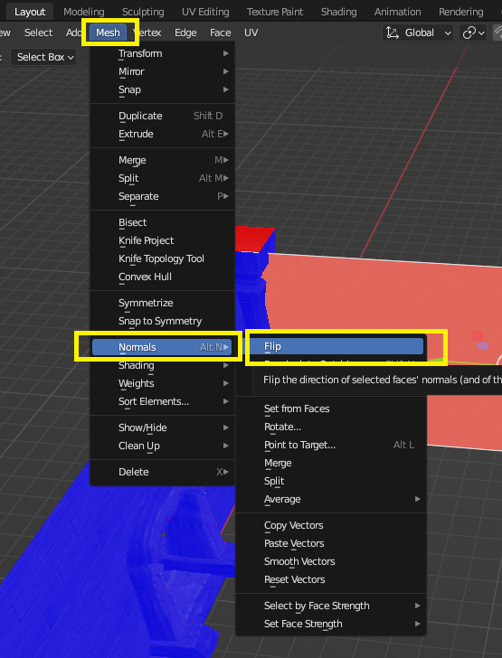

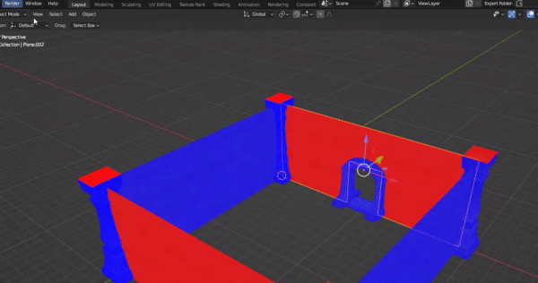

Nos aseguramos de que desde el interior siempre veamos el color azul:

**¿Y si queremos que se vea por las dos partes?**

Duplicaremos la pared con `ALT + D` y no la moveremos, dejándola exactamente superpuesta a la original. A una de las dos copias le invertiremos la normal, así habrá un plano hacia cada dirección. En consecuencia, deberá verse **morado**:

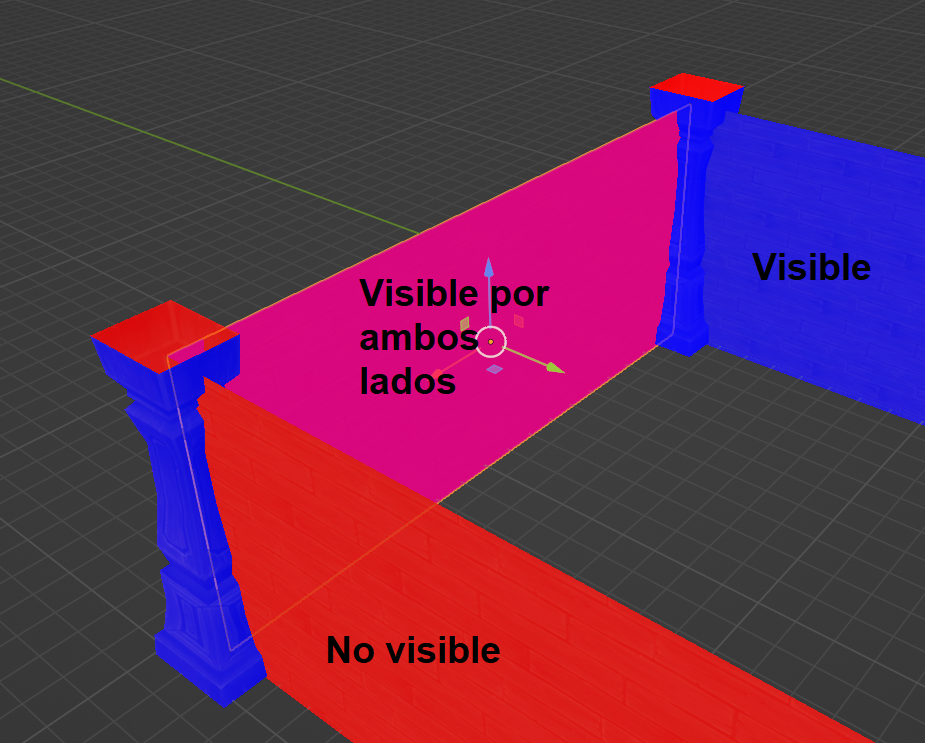

---

## El límite de polígonos

El WMO tiene un número de vértices y caras límite por subgrupo. *(Un WMO se divide en varios subgrupos.)* Cada uno puede tener:

| | Límite |
|---|---|
| Vértices por subgrupo | 65.535 |
| Caras por subgrupo | 65.535 |

:::warning[Recomendación]
**NO** superar los 40.000 por grupo.
:::

Los sub-grupos que tiene un WMO pueden verse aquí, por ejemplo, en WoW.Export:

**¿Cómo sé cuántas caras tiene mi modelo?**

Activo la opción **Statistics** en el overlay y en el lado izquierdo de la pantalla aparecerá la información:

**¿Y si mi modelo tiene más de 40.000?**

Deberás dividir el modelo en diferentes grupos de máximo 40.000 cada uno.

- Si es un modelo **exterior**, no deberás tener ninguna consideración especial.
- Si es un modelo **interior**, deberás crear portales entre cada uno de los grupos. *Esta técnica es más avanzada, explicada en la guía: **Creación de un WMO Custom para Epsilon** en la página 11.*

---

## El nombre de la UV

Las UVs de todos los grupos deben llamarse de la misma forma: **`UVMap`**

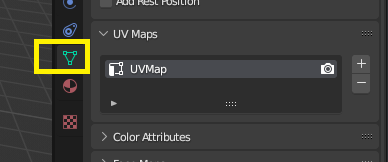

:::tip[Recordatorio]
El AddOn de utilidades permite renombrarlas todas con un solo click usando la opción **"Renombrar todas las UV a UVMap"**.
:::

---

## Exportarlo

A partir de aquí, puede seguirse la guía de cómo exportar un WMO: [Creación de un WMO Custom para Epsilon](https://nortedwg.github.io/compendio-del-modding/WMO/Crear-un-WMO-custom)
