# Importing Garry's Mod Maps into Epsilon

Guide by **NORTE.m2** · Version 1.0

---

In this guide we'll learn how to import maps from the Garry's Mod workshop into Epsilon.

This is an advanced **WMO** guide. We'll go step by step, but if you're new to this I recommend checking out these first:
- [Basic Blender Usage for WMO Creation](https://nortedwg.github.io/compendio-del-modding/WMO/Uso-basico-de-Blender-para-WMO)
- [Creating a Custom WMO for Epsilon](https://nortedwg.github.io/compendio-del-modding/WMO/Crear-un-WMO-custom)

*(I especially recommend making sure you're comfortable with the concepts and tools from the first one.)*

---

## Requirements

Garry's Mod side:

- [**Blender 4.3.2**](https://download.blender.org/release/Blender4.3/) — used to import the maps.
- [**Blender 3.6 LTS**](https://www.blender.org/download/lts/3-6/#versions) — used as a conversion step to bring files down to 3.4.
- [**GWTool**](https://www.moddb.com/mods/garrys-mod/downloads/gwtool-file-made-by-zombieslayer103)
- [**SourceIO**](https://github.com/REDxEYE/SourceIO) — Blender 4.3.2 addon (install it for that version). *[[Help]](https://nortedwg.github.io/compendio-del-modding/WMO/Uso-basico-de-Blender-para-WMO#c%C3%B3mo-instalar-un-addon)* *[[Video]](https://youtu.be/q1Nvbl8oNpQ?si=7elpRkRGVa6TXrWL)*

WMO side:
- [**Blender 3.4**](https://download.blender.org/release/Blender3.4/)
- [**WoW: Useful Shortcuts**](https://github.com/nortedwg/WoW-Atajos-Utiles) — Blender 3.4 addon (install it for that version). *[[Help]](https://nortedwg.github.io/compendio-del-modding/WMO/Uso-basico-de-Blender-para-WMO#c%C3%B3mo-instalar-un-addon)* *[[Video]](https://youtu.be/q1Nvbl8oNpQ?si=7elpRkRGVa6TXrWL)*

*(Yes — you'll need 3 different versions of Blender. It's the best approach I've found so far.)*

Optional: *(Can be done in other ways)*
- [**SteamCMD**](https://steamcdn-a.akamaihd.net/client/installer/steamcmd.zip)
- [**7ZIP**](https://www.7-zip.org/download.html)
- [**wow.export**](https://www.kruithne.net/wow.export)

---

## Downloading the Map

:::tip[Note]
If you own the game, you can extract the map directly from your workshop folder once you've subscribed to it. This section covers how to download it without owning the game.
:::

Go to the [**Garry's Mod workshop**](https://steamcommunity.com/workshop/browse/?appid=4000&requiredtags[]=Map) and enable the **MAP** filter.


Find the map you want and copy its **URL**.

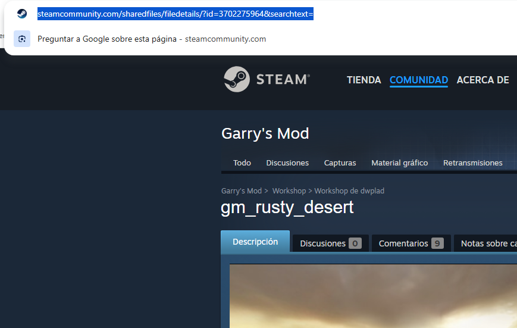

Go to a workshop download site. I use https://steamworkshopdownloader.io/

Paste the link, press Enter, and click **[YES]**.


Now copy the download command the site generates:


Open **SteamCMD**. Once it loads, type `login anonymous` and press Enter.


Paste the command from the website and press Enter.


:::note[Note]
This can take anywhere from a few seconds to a few minutes depending on the map's file size and your internet speed. **There is no progress bar**, so just wait until it finishes.
:::

When it's done it'll show a *Success* message, followed by the folder path where the map was downloaded.


:::tip[Tip]
I select the path, copy it, and paste it directly into File Explorer.
:::

The download is complete. You can close SteamCMD.


---

## Extracting

Run **GWTool.exe**.

A window will open. Drag the **.gma** file you downloaded into it.


After a few seconds, a folder will be generated with the extracted contents. You can close GWTool.

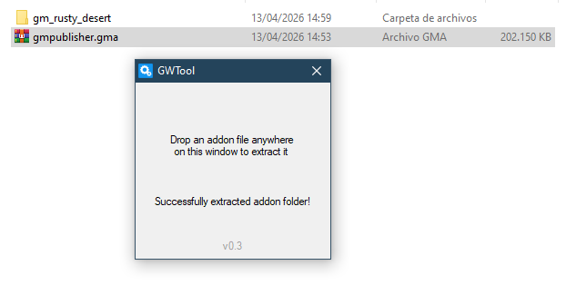

:::warning[I got a .7zip file instead!]
Some maps use double compression. If a `.7zip` file was extracted, open it with [**7ZIP**](https://www.7-zip.org/download.html), extract the **.gma** from inside it, and drag that onto the GWTool window again. This time you'll get the folder.
:::

---

## Importing into Blender

Open **Blender 4.3.2** with the **SourceIO** addon already installed. *[[Help]](https://nortedwg.github.io/compendio-del-modding/WMO/Uso-basico-de-Blender-para-WMO#c%C3%B3mo-instalar-un-addon)* *[[Video]](https://youtu.be/q1Nvbl8oNpQ?si=7elpRkRGVa6TXrWL)*

Import your **.bsp** map file.

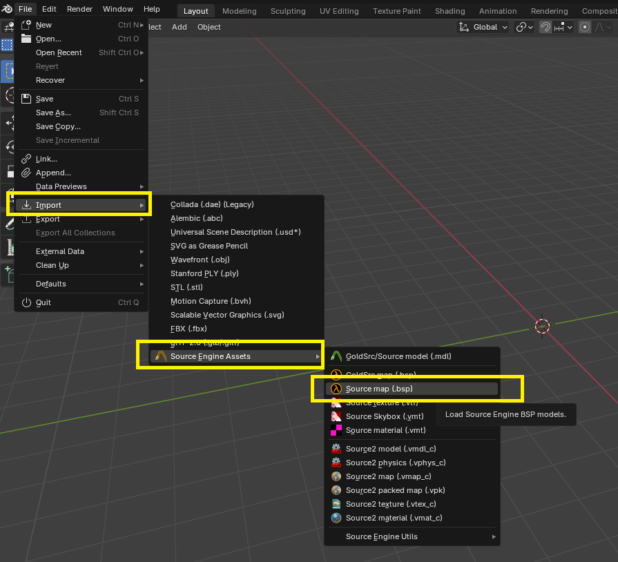

You'll find it inside the extracted folder at `/maps/filename.bsp`.

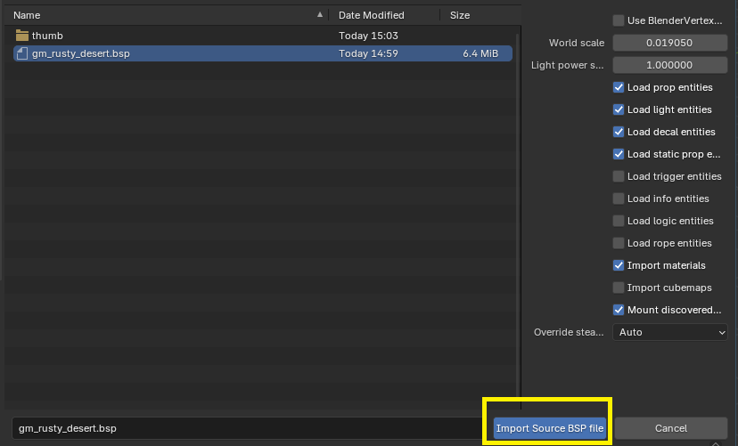

:::tip[Tip]
If the map is too large to see fully, you can extend the view distance by pressing N, then:

:::

Your map is now imported:

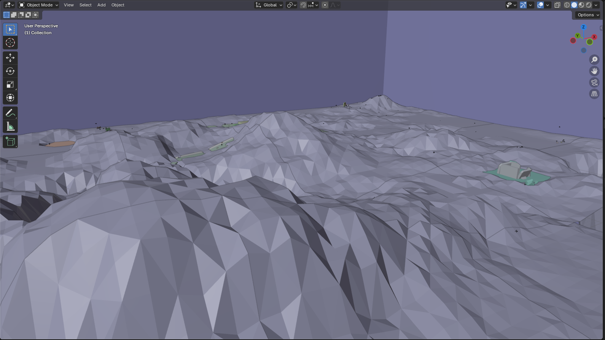
:::tip[Tip]
You can enable textures — they'll have been imported automatically.


:::
:::warning[I enabled textures but they're not showing!]
Some maps have their textures in other workshop packages. Make sure the map has no dependencies requiring additional downloads.
Some maps use base Garry's Mod textures. I'm not sure how to obtain those yet — if you manage to download them they should work fine.
This section will be updated once I figure out the exact process.
:::

---

## Loading Entities

First, let's collapse all the collections in the outliner to keep things tidy:


The ones we care about are:
- **world_geometry**: The map itself.
- **displacements**: Usually corresponds to the terrain.
- **static_props**: Solid objects.
- **props and brushes**: Special props with animations, like doors.

As you can see in the viewport, the **props** of any kind aren't visible yet.

---

## Enabling Props

Click on any of the props in the outliner list.


Then press **[A]** to select everything in the scene.

Press **[N]** to open the side panel and go to the **SourceIO** tab. Click **[Load Entity]**:


All the map's props will now be loaded.

---

## Converting Props to Objects

If you look at **static_props**, you'll notice they're not actual mesh objects — the icon looks like "a container" in Blender.
A real mesh object would show a downward-pointing triangle icon instead.


Select all the objects with the container icon. *(Objects with the triangle icon are already meshes — leave them alone.)*

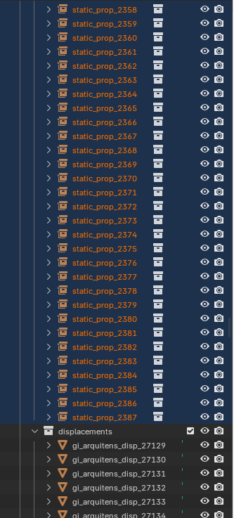

Then press **[CTRL] + [A]** *(make sure your mouse is over the main Blender viewport, not over the outliner)* and click **[Make Instances Real]**:

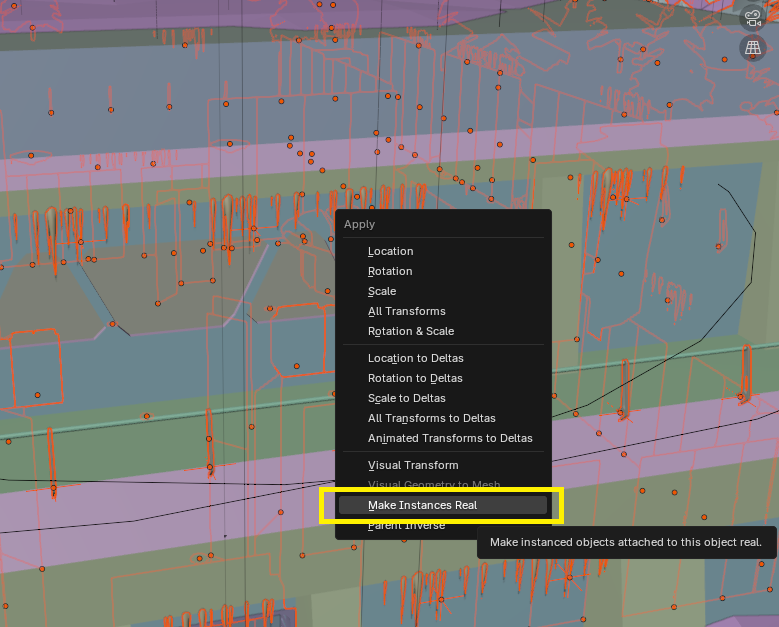

---

## Cleanup and Export Preparation

Let's delete everything we don't want to export.
:::tip[Tip]
I drag all the collections I want to delete into a single "trash" collection.

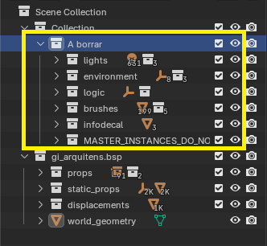

Then I just right-click and select **[Delete Hierarchy]**:


:::
:::warning[Note]
You don't have to delete the same things I do. It depends on the map and your own judgment. As a general rule, delete anything that isn't a prop or part of the actual map geometry.
:::

Continue cleaning up.

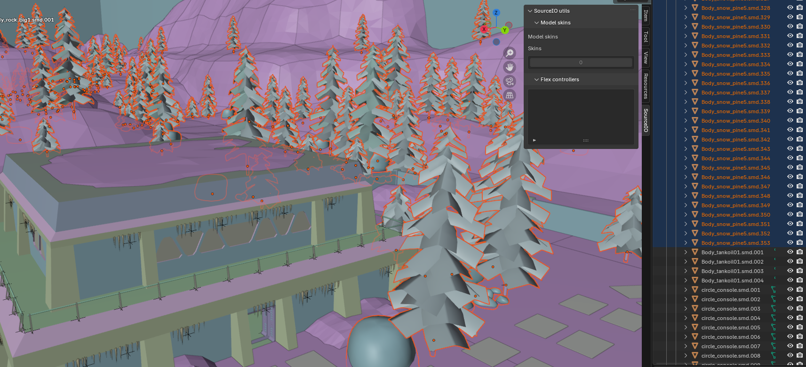

:::warning[Keep in mind...]
WoW has a polygon limit per WMO subgroup. Everything we can delete now means less work later and fewer textures to import.
:::

In my case, I've decided to delete all the trees and rocks — I'll place them inside WoW as game objects later.

:::tip[Remember...]
You can enable this option to see the total polygon count of the scene.


:::
:::note[Note]
Each WMO subgroup must not exceed 40,000 faces. A WMO can have roughly up to 20 subgroups — depending on the base WMO you choose. Models with more than 7 or 8 subgroups are less common.
:::

---

## From Blender 4.3 to Blender 3.4

Once everything is cleaned up, save the file as a regular Blender project.

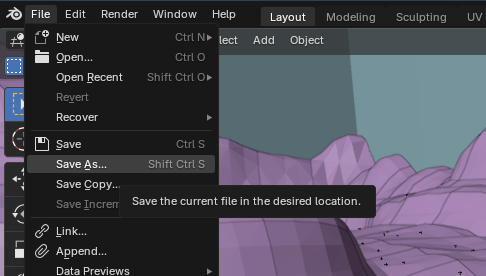

- Open the project in **Blender 3.6 LTS**. It'll act as an intermediate version. Save again in the same location, overwriting the previous file.

- Now you can open the project in your regular **Blender 3.4**.

:::warning[Watch out]
If you try to open a file saved in Blender 4 directly in Blender 3.4 without first resaving it in Blender 3.6, the program will crash.
:::

---

## Creating WMO Subgroups

:::note[Note]
Each WMO subgroup must not exceed 40,000 faces. A WMO can have roughly up to 20 subgroups depending on the base WMO. Models with more than 7 or 8 subgroups are harder to find.
:::

This step is fairly manual. The goal is to create several groups, each staying under 40,000 faces.

You can approach it a few ways:
- Merge everything into one mesh and then split it into sections.
- Combine objects one by one and keep adding until you approach the limit.

The method is up to you.

:::note[Note]
Separating interior and exterior WMO geometry is a lot of work. In most cases, treating everything as exterior looks fine — lighting issues can usually be fixed with cavelights. For simplicity, this guide uses exteriors only.
:::

**PROCESS:**

I'll keep this fairly rough for the purposes of the guide — you can put in as much polish as you want.

The first thing I did was check world_geometry on its own.

It has 27,000 faces, so I'll leave it as its own subgroup. I'll name it group-1 for organization.

Now for the terrain.

It has 47,000 faces, so I'll need to split it into two.
First I'll merge everything into a single group.

:::warning[Watch out]
Skipping this step will likely crash Blender when you try to merge.
Follow these steps with everything selected in Edit Mode and run Merge by Distance.
:::

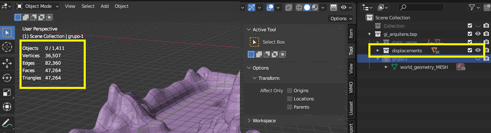

:::warning[I merged it and it still crashes!]
This is a known issue with some terrain meshes.
Try this: in Edit Mode, go to Mesh > Clean Up > Degenerate Dissolve.
:::


This can also happen with other groups, not just terrain.
:::note[Note]
Not strictly necessary, but if it keeps crashing, try the same approach with Edit Mode > Mesh > Clean Up > Fill Holes.
:::

I've merged all the terrain into one group.

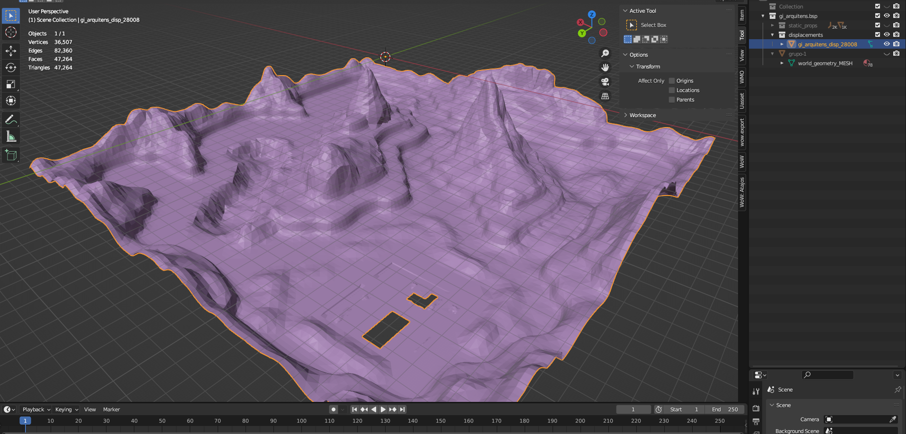

Now I'll split it into two parts. *(I went into Edit Mode > pressed 3 for face select > then P to separate.)*


For my own organization, I rename them as group-2 and group-3.

**I'd repeat this same process** for the rest of the props and objects.

Keep creating groups that stay under the limit until everything is covered. *(For brevity I've skipped the props in this tutorial — the process is exactly the same.)* The result looks like this:


---

## Materials and UVs

First I use the addon to rename all UVs correctly.

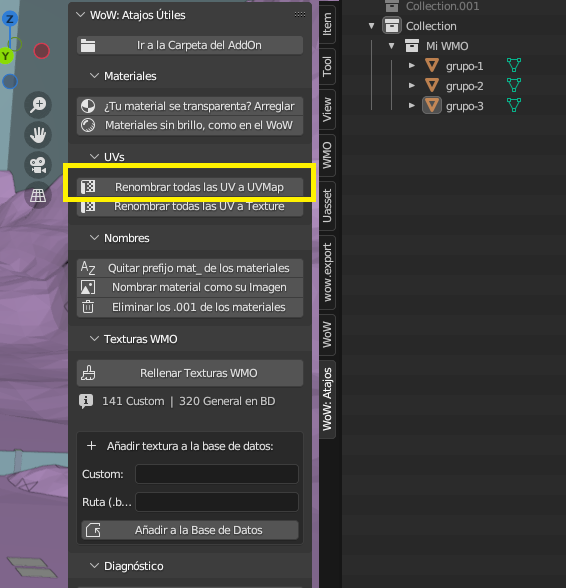

Then I check that all materials have an image assigned. I use the addon button.

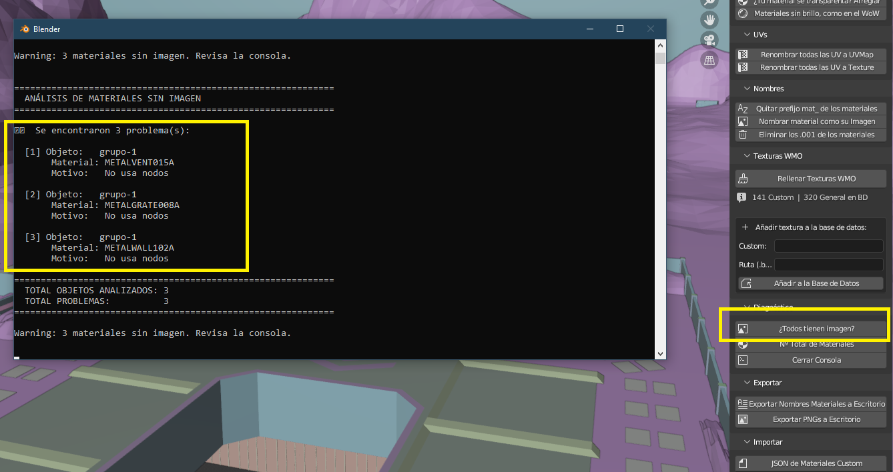

In this case it tells me that group-1 has 3 materials with no image assigned.

I can see it's a material with a white/blank texture, so I enter Edit Mode, select the faces using that material, and reassign them to a similar one.


:::note[Note]
There are other ways to fix this — creating a new material, adding an image, deleting those faces, etc. As long as no material ends up without an image assigned, the method doesn't matter.
:::
:::tip[What does "image assigned" mean?]
I mean that in the material's nodes, the Base Color input has an image texture connected — any image will do.
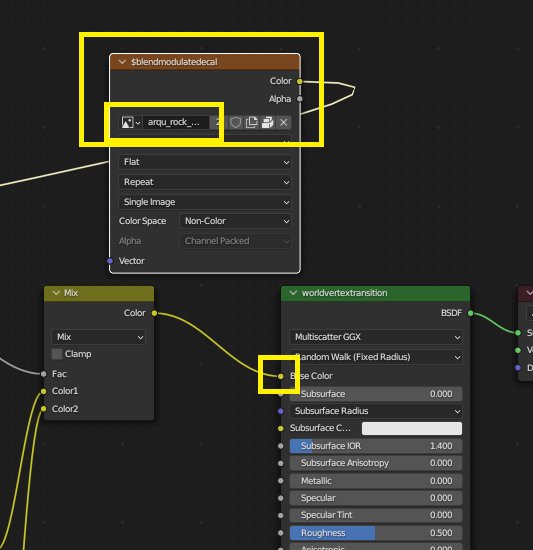
:::

Once I've fixed all the issues, I clean up unused materials from all my groups.


I double-check there are no materials without a texture:
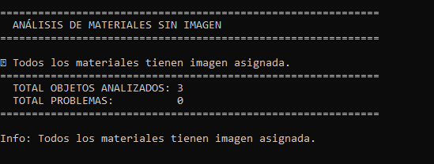

Finally, I rename all materials to match their image name. I use the addon button:
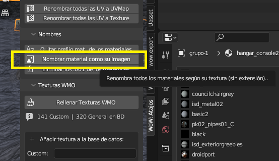

---

## Linking custom materials to WoW textures

Use the first button to export a list of your materials to the desktop.

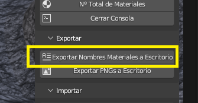

Click the button to view the total number of materials. Pay attention to the "with object" count.


Go to **wow.export** or a similar tool [(like wago.tools)](https://wago.tools/files) and search for that many textures.
:::note[In this case]
It says I need 77 textures. I go to wow.export and look for 77 BLPs I can easily swap in.

In this case I searched for 77 textures from a map to replace them.
:::


Right-click and copy the file paths. Use the second option.

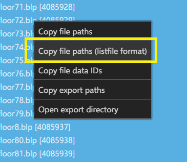

Paste them into a text editor or similar and save.

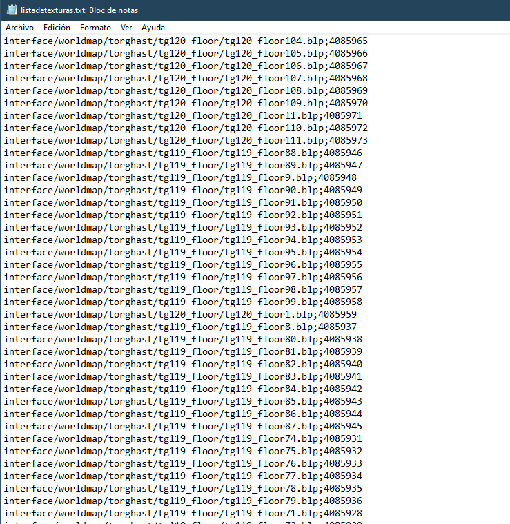

Use an AI to generate the JSON with the textures, since doing it by hand would be extremely tedious.

In this case I'm using **Claude** Sonnet Extended.
With this prompt:
```
Make me a JSON with this format:
"texture": "folder/folder/file.blp",
In "texture" put the textures from the materials.txt file.
For each texture, assign a path to the .blp — without the ID — from the texturelist.txt.
```

Attach both **.txt** files:
- `texturelist.txt` — the one we just created from wow.export paths.
- `materials.txt` — the one that was automatically exported by the addon to the desktop.


Name the resulting **.json** whatever you like — in this case I'll call it `tutorial.json`.

Go back to Blender and use the button to import a JSON with custom textures.


Select the file we created.


In the dropdown, confirm the **.json** is now active.

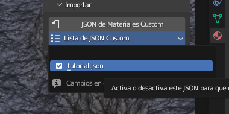

---

## Creating the WMO

Enable the following option to start the WMO creation process:


In the **directory path** field, enter the directory of the **original** WoW WMO you'll be replacing in the patch.

**Example:**

If the WMO you're replacing is `world/wmo/brokenisles/suramar/7sr_hub_statue.wmo`, the **directory path** should be `world/wmo/brokenisles/suramar`.

*(Just remove the filename: `/7sr_hub_statue.wmo`)*

Enabling the step above will have automatically created several groups.

Place all your objects into **outdoor** and delete the remaining empty collections.

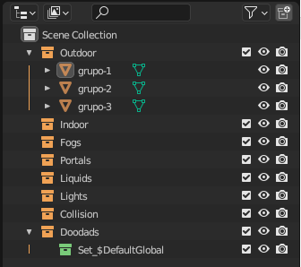

With one of the groups selected, go to WMO > Generate Materials. It will generate materials for all of them. They'll temporarily lose their textures.

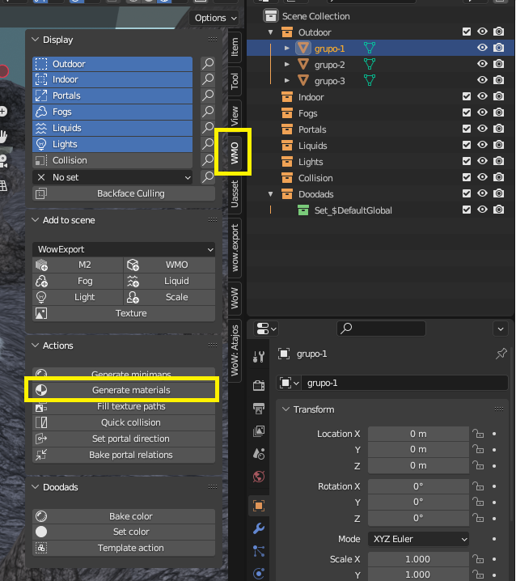

Go back to the Useful Shortcuts addon and click **[Fill WMO Textures]**.


Since we already assigned a **.blp** path to each material when we created the **.json**, they'll all be assigned automatically.

To add collision, click **QUICK COLLISION** in the WMO addon panel.

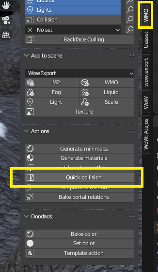

This generates basic collision based on the 3D object's shape.

:::tip[Tip]
Leave the default value for now. If the collision doesn't behave correctly in-game, try changing the number. A higher value usually gives better results, though sometimes values like 100 or 200 work better. Try 5000 first and keep adjusting until something works.
:::

---

## Exporting the WMO

Once everything is complete, export from the addon panel:


The exported file will be in version 3.3.5 (Lich King) format. You'll need to convert it to Shadowlands using the converter.

Place the files Blender exported into the `INPUT` folder, **using the original WMO's filename**:


Run `MultiConverter.exe` and the `OUTPUT` folder will contain 3 files. Use the two `.wmo` files to create your Epsilon patch. Done!

---

## Exporting Custom Textures

Since our project uses a large number of custom textures, we need to export them to Epsilon.

Go back to the Useful Shortcuts addon and click the export PNGs to desktop button.

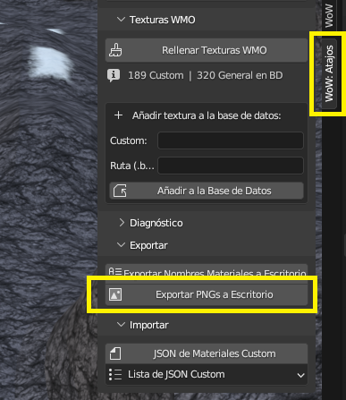

:::warning[Important]
Make sure to do this step **after** generating the WMO materials — otherwise the textures won't export correctly.
:::

A folder will be created on the desktop containing all textures as **.png** files.


:::tip[Converting .png to .blp]
To convert the files you'll need:
[https://www.wowinterface.com/downloads/landing.php?s=734452651e00d9554b435e4acbc95c05&fileid=22128](https://www.wowinterface.com/downloads/landing.php?s=734452651e00d9554b435e4acbc95c05&fileid=22128)

Just drag the `.png` files onto the `.exe` and it'll create a `.blp` in the same folder. If there are many or large files it may take a moment.
:::

Go back to the AI chat you used earlier — now ask it to generate the **.json** with the IDs for the Epsilon patch.

My prompt this time is:
```
Make me a json using the files from before, with this format:
{"name":null,"version":"1","url":null,"files":[{"file":"texture.blp","id":number}]}

In "texture" put the texture name from the last .json you generated, adding .blp to each one.
Then check what path you assigned to it, look it up in the previous .txt (the one with the paths),
find the ID, and replace "number" with the correct ID for each texture.
```
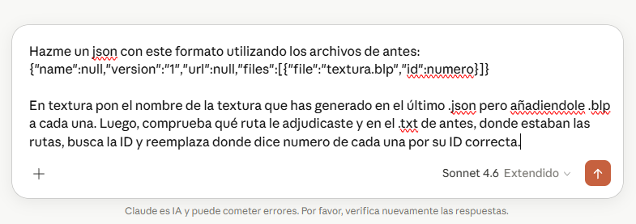

Rename the exported **.json** to **patch.json** and place it in the folder with the **.blp** files.

---

## Merging Patches

At this point you'll have one patch containing all the custom textures ready for WoW.

You can merge it with the WMO patch to have a single complete project file.
