# Editing an M2 for Epsilon (M2i Method)

Guide by **NORTE.m2** · Version 2.0

---

## Required programs

- **M2MOD** *(pre-configured version — includes an up-to-date listfile.csv)*
  [Download M2MOD](https://drive.google.com/file/d/1myLD8lj_pfrGMykKlWnP9eSKlyuO7c7i/view?usp=sharing)

---
You'll need to choose one of the following Blender versions to work with:

### Version 3.4
This is a modified version built to maximize compatibility with WMOs. I recommend using this one.
- **Blender M2i Import Addon**
  [Download Addon](https://github.com/nortedwg/m2i-blender-3.4)

- **Blender 3.4.0**
  [Download Blender 3.4.0](https://download.blender.org/release/Blender3.4/)
---
### Version 2.9
This is the **original** version of the addon. However, I recommend using 3.4 for better WMO compatibility.
- **Blender M2i Import Addon**
  [Download Addon](https://bitbucket.org/suncurio/blender-m2i-scripts/src/master/)

- **Blender 2.90.0**
  [Download Blender 2.90.0](https://download.blender.org/release/Blender2.90/)
---
:::note[Other useful links (not required)]
**M2MOD Original** *(no listfile)*: https://bitbucket.org/suncurio/m2mod/downloads/
:::

---

## 1. Setting up the programs

- Download **Blender** — just one of the two versions listed above.
- Download **M2MOD** — the pre-configured version is recommended since it already includes an updated `listfile.csv` in the `mappings` folder.
- Install the **Blender Addon** inside Blender.

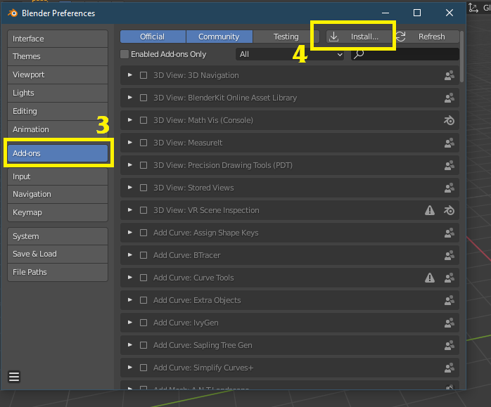

Click **[Install]** and select the addon's `.zip` file.

Enable the one called **"Import-Export: WoW Tools"**.

---

## 2 — Preparing the files

This method works by **replacement**. You'll need to choose a base armor piece to modify or replace.

In this example, we're going to work with these shoulder pads:

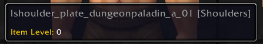

Go to a WoW file browser — in this case **wago.tools**. Search for your item — here it's `shoulder_plate_dungeonpaladin_a_01`:

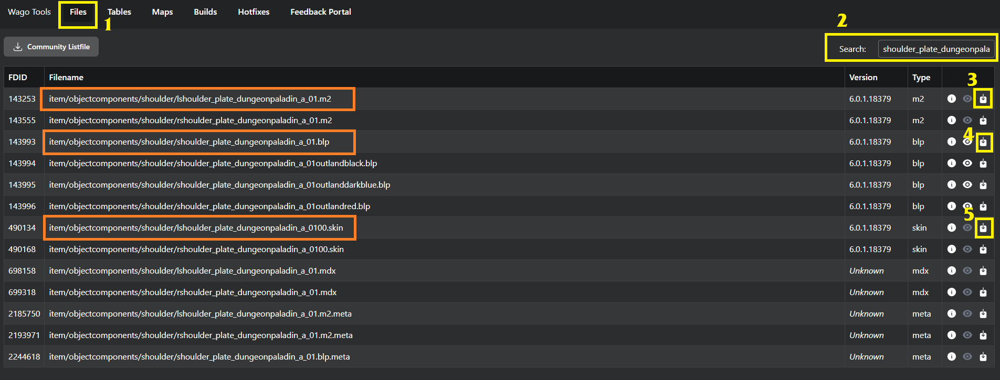

Download:

- The **`.m2`** file *(one per item; here two appear because "l" is the left shoulder and "r" is the right — we're only editing the left one)*.
- All **`.skin`** files *(only one in this case; if there were more, download them all)*.
- Any **`.blp`** textures you want to modify.

:::note[Note]
If you were modifying an **NPC** or **Player** model, you'd also need to download the `.skel` files.
:::

---

## 2.2 — Converting to M2I

Once the files are downloaded, put them all in a folder:

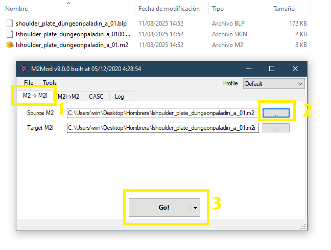

Open **M2MOD.exe**. Under **Source M2**, select the item's `.m2` file. The **Target M2I** path will be filled in automatically — that's where the intermediate **M2I** file for Blender will be created. *(You can change this path if you prefer.)*

Click **Go!** to generate it.

:::tip[Optional bonus]
If you want to see the texture in Blender, you'll need to convert the `.blp` to `.png` first:
[https://www.wowinterface.com/downloads/landing.php?s=734452651e00d9554b435e4acbc95c05&fileid=22128](https://www.wowinterface.com/downloads/landing.php?s=734452651e00d9554b435e4acbc95c05&fileid=22128)

Just drag the `.blp` onto the `.exe` and it'll create a `.png` in the same folder.
:::

---

## 2.3 — Importing into Blender

Import the `.m2i` file that was generated into Blender:

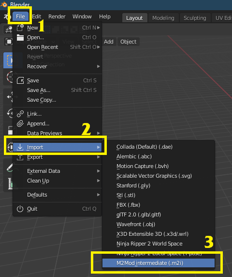

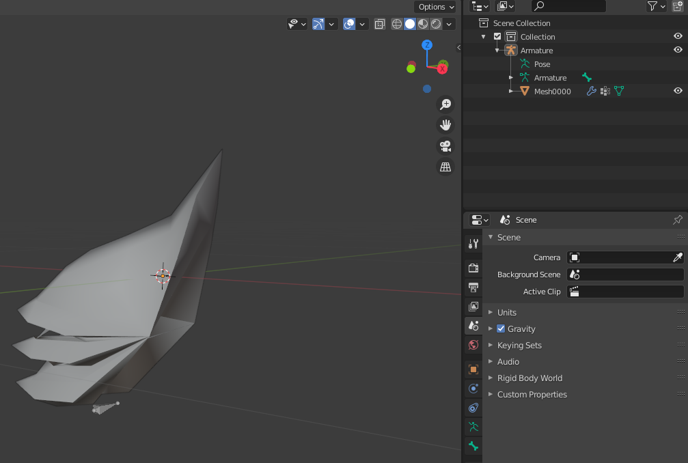

:::tip[Optional bonus — Adding a texture]
This only affects how you see the model in Blender — it won't change how it looks in-game.

Select the mesh and create a new material:

In the **Shading** tab, select the material:

Add an **Image Texture** node using the `.png` you converted from the `.blp`:

Connect the **Color** output to **Base Color** by dragging between the two dots. To make it look like it does in WoW: set **Specular** to 0 and **Roughness** to 1.

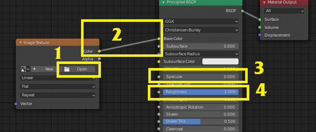

Remember to enable material preview in Blender:

:::

---

## 3 — Editing in Blender

In this example, we're replacing the shoulder pad with a custom model. You could also just edit the original model by deleting parts of it — the steps are the same, minus the part where you import a new model.

We're replacing the original shoulder pad with this one:

Export the new shoulder pad as **FBX** from its own Blender project:

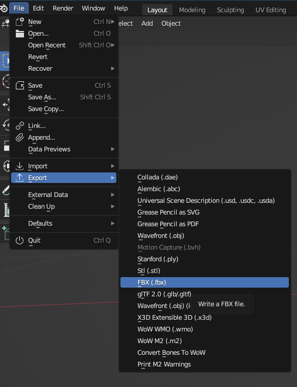

Go back to your shoulder pad project and import the new shoulder pad's **FBX**:

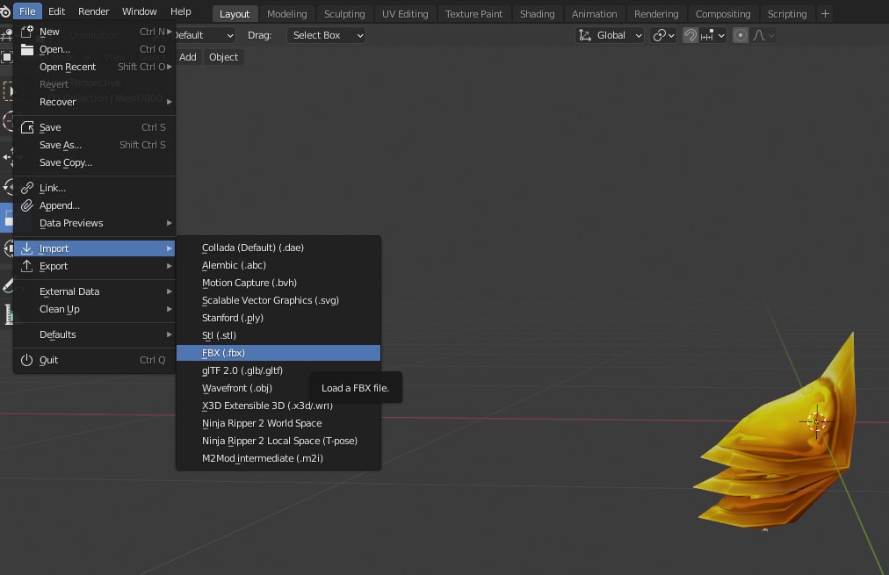

Adjust its position so it lines up as closely as possible with the original:

Make sure the new shoulder pad has a **UV Map** named `Texture`. If it doesn't, rename it:

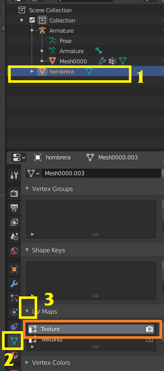

Scale the original shoulder pad down until it's very small, then hide it inside the new model:

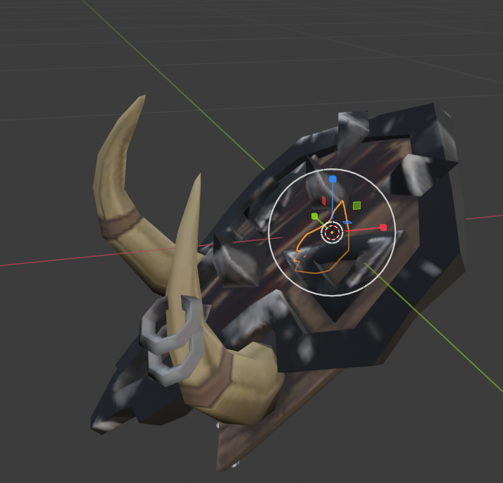

Once that's done, press **CTRL + A** and select **"All Transforms"**. Do this for both the new and original shoulder pads to apply any pending scale, position, and rotation:

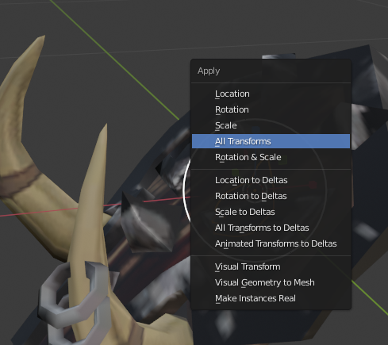

---

## 3.2 — Exporting the M2I from Blender

:::tip[Tip]
Before continuing, save a backup of your Blender project at this point. You'll almost always need to make adjustments later and it's very helpful to be able to return here.
:::

Select in this order: the new shoulder pad, then the old one, and press **CTRL + J**:

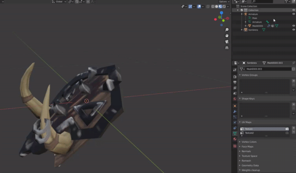

They'll now be merged into a single object, which should keep the name of the original WoW file — in this case `Mesh0000`:

:::warning[What if my file has more than one Mesh?]
Most modern models have multiple meshes: `0000`, `0001`, `0002`, etc.

The extra ones can be deleted without issue, as long as **at least one original remains**. It doesn't matter which one — `0001`, `0002`, `0004` — as long as one original is still there.

**It does not work** to delete the original mesh, rename your new shoulder pad, and place it in the same spot. That will cause errors. One original mesh must always be kept — hidden inside the model.
:::

Export your model as **M2I** again. You can overwrite the original M2I or give it a new name — it doesn't matter:

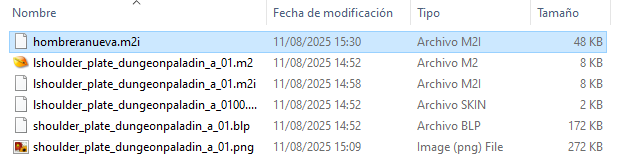

---

## 4 — Converting to M2 for Epsilon

Go back to **M2MOD.exe** and open the second tab.

- **Source M2** will already have the original `.m2` selected by default.
- Under **Source M2i**, select your newly exported `.m2i` file.

Click **Preload** and then **Go!**:

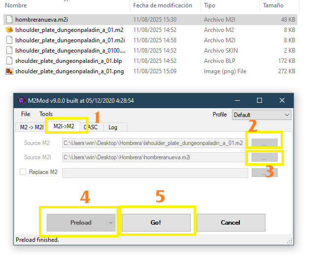

You'll see this error — don't worry, it always appears. Click **OK**:

Your files are now ready. An `Export` folder will have been created inside the folder where your `.m2` was:

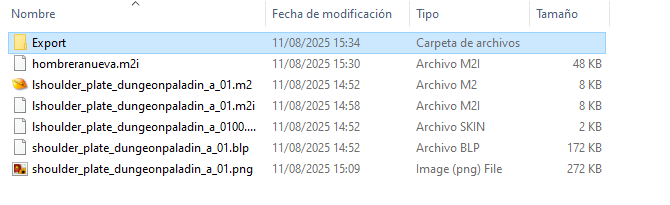

Use the files inside to create your Epsilon patch.

:::note[Reminder]
Include the `.blp` texture of the new shoulder pad in the patch, **renamed to match the original shoulder pad's texture filename**.
:::

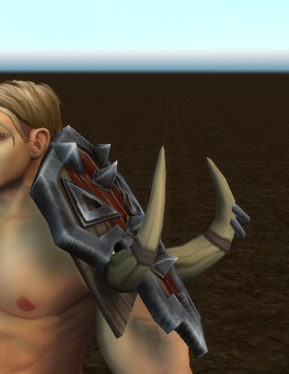

---

## 4.2 — Fixing issues after converting

It's common to load your item in-game and find something looks off. Here's the workflow to fix it:

1. Open the backup you saved before merging the two meshes.
   *(Or in Blender, press Ctrl+Z until you're back to the step before merging.)*
2. Adjust the position again.
3. **Ctrl+A** → All Transforms.
4. Merge the two meshes.
5. Export the M2I.
6. In M2MOD: Preload → Go!
7. Take the files from the `Export` folder and manually place them inside the Epsilon patch folder, confirming any replacements.

Disconnect your character in Epsilon and reconnect — the model will update to the new version.

:::tip[TIP]
I do this whole process without closing any of the 3 programs at any point, making small tweaks and reconnecting my character in Epsilon to preview the model until I get the result I want.
:::

---

## Bonus — Collections

The process for a **collection** is the same, with one addition: it has multiple pieces, each one bound to a different bone.

### The files

A collection's files involve parts that cover the entire body. Example after converting:

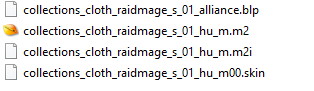

### How it looks in Blender

Unlike a helmet or shoulder pad, you'll see many more meshes and bones *(attaches)*. This is normal:

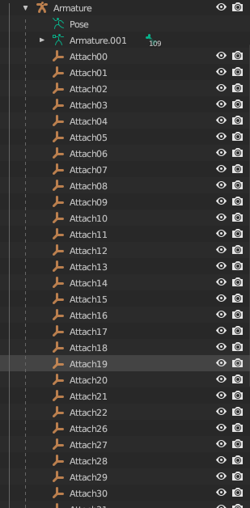

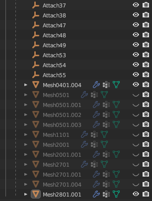

### How to edit it

Follow the same steps as in the guide above. You can attach your new model to any of the existing meshes and delete the rest.

*(Everything can go in one single piece, or different parts can go in different meshes. If a single mesh has too many faces it will cause errors, so you may need to split the model across multiple meshes.)*

The key difference is that you'll need to specify **which bone** your new model is attached to.

### The bones

Click on any bone and press **TAB** to see the skeleton and its connections. The bone's name is displayed in the top-left corner:

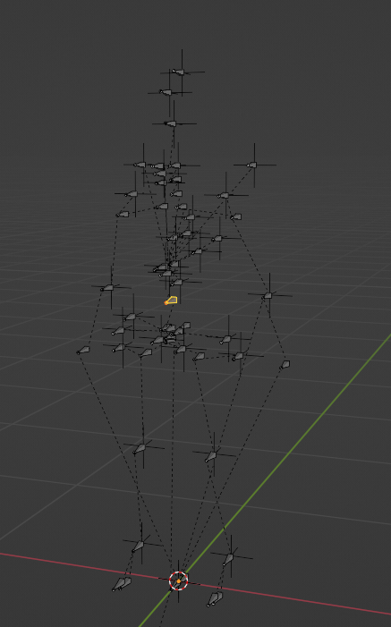

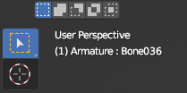

### Attaching the model to a bone

As an example, we're attaching a 3D chest piece. We've identified that the chest bone is number 10:

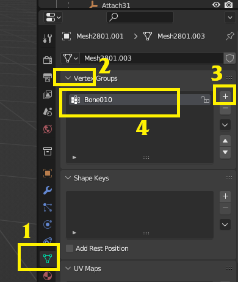

Go to the **Vertex Groups** panel and add a new group named after the bone you want to attach to. You can have multiple bones — the order doesn't matter.

Once you've added it, switch the viewport to **Weight Paint** mode:

Paint the weights onto the bone:

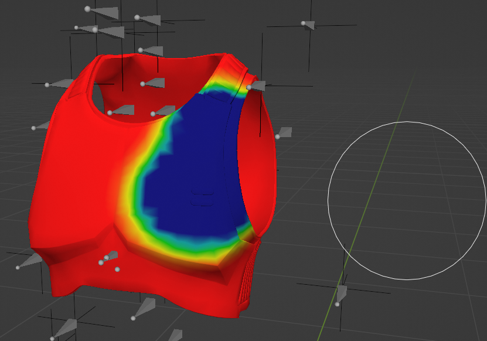

- **Red** → the area is strongly influenced by that bone.
- **Blue** → weakly influenced.

Since this is a piece that only attaches to a single bone, paint the entire thing red. You can adjust the brush settings in the top panel:

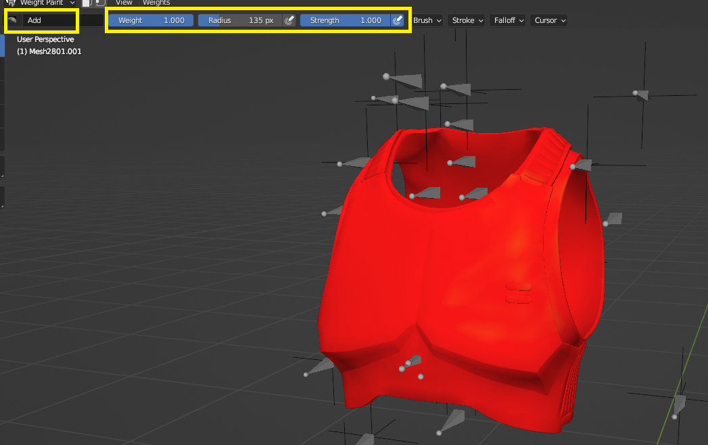

---

Some models attach to **more than one bone**. For example, a skirt would attach to each leg on its respective side, while the top part attaches to the hip bone.

For example, on Zekhan you can see his skirt has the following:

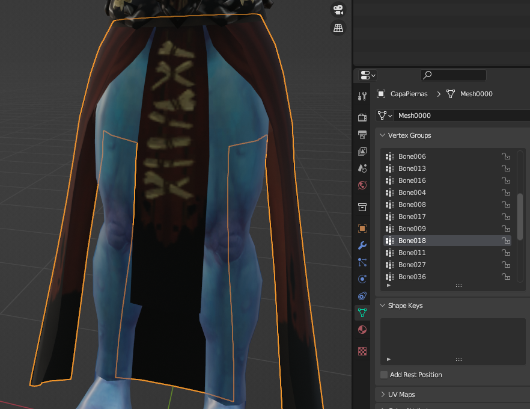

Once the weights for each bone are set, the model gets merged with the corresponding **MESH** and exported normally.
