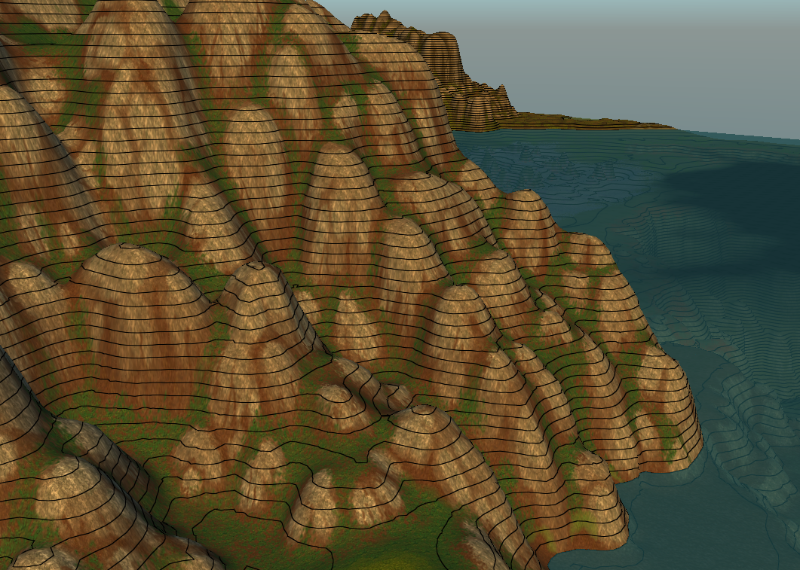
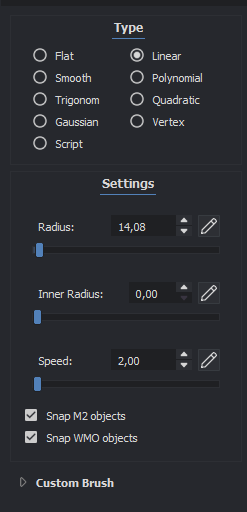
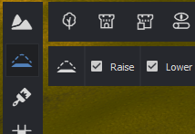
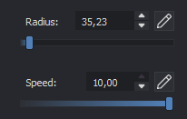
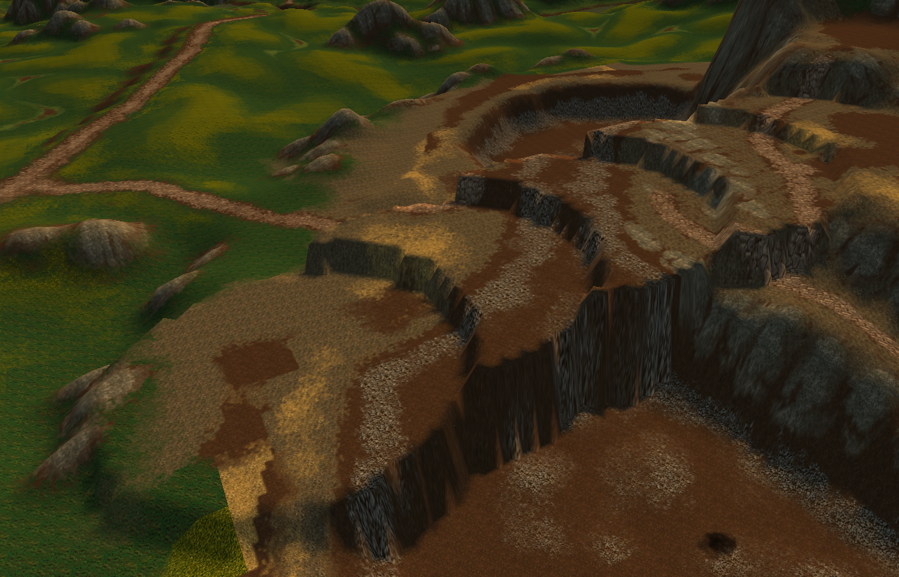
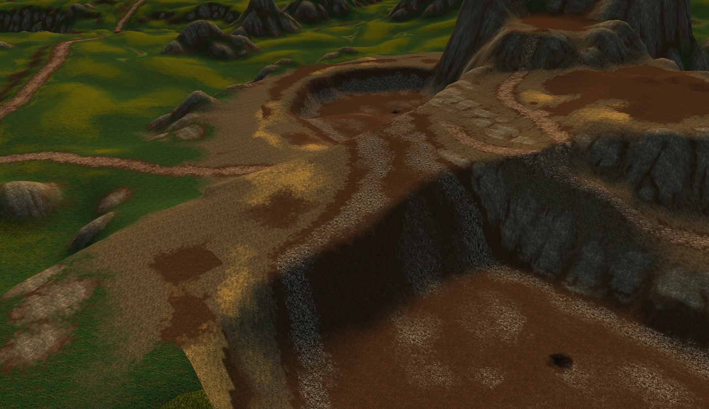
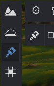
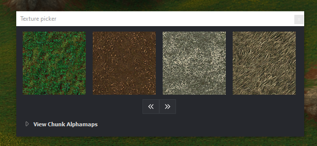

# Noggit Basic Controls & Introduction

Guide by **NORTE.m2** · Version 1.0

---

This guide covers the most essential controls and some general recommendations for using the program.

**Previous guides:**

- **Installation:** Installing Noggit for Epsilon SL
- **Custom Maps:** Custom Maps in Epsilon with Noggit SL

---

:::tip[TIP]
**Help > Key Bindings** contains a full list of every shortcut in the program.
:::

---

## Viewport display modes

At the top of the screen you'll find this panel:

Each button toggles the visibility of the following:

1. M2s
2. WMOs
3. WMO Doodads (base terrain objects)
4. WMO Terrain
5. Terrain
6. Water
7. ADT and chunk grid lines
8. Terrain hole boundary lines
9. Terrain mesh
10. Terrain height lines
11. Walkable / Non-walkable areas
12. Vertex painting
13. Shadows

*Button 14 onwards has nothing useful.*

:::tip[Tip]
Disable everything except terrain. Since we already cleared the ADTs with the ph shift in Epsilon, there's no need to remove them in Noggit — just turn off all objects and edit the terrain as-is.
:::

Recommended configuration:

In some cases, enabling height lines is also useful:

---

## Raising and lowering terrain

First button in the vertical menu:

- **SHIFT + Left Click** → terrain **RISES**
- **CTRL + Left Click** → terrain **LOWERS**

:::tip[TIP]
**ALT + Right Click** changes the brush **radius** directly in the viewport.
:::

In the right panel:

- **Radius** — changes the brush size.
- **Inner radius** — controls the brush feathering/falloff.
- **Speed** — the raise/lower speed. Use 1–2 for fine detail, 10–15 for hills and mountains, 30 for large-scale terrain.

---

## Smoothing terrain

Second button in the vertical menu:

Only two modes are worth using: **Linear** and **Origin**.

### Linear — General smoothing

Creates a ramp between where you first click and where you drag. If you hold still, it smooths between the center and the edge of the brush. At a large radius it evens out entire areas.

- **SHIFT + Left Click** → terrain **SMOOTHS OUT**
- **CTRL + Left Click** → terrain **LOWERS while smoothing**

:::tip[TIP]
Keep **Speed** at 10. Use **ALT + Right Click** to change the brush radius.
:::

### Origin — Flatten

Flattens an area by extending the height of the point where you first clicked.

:::tip[Tip]
Use it to create flat surfaces, then refine with Linear. It's also great for quickly blocking out ramps, paths, or future mountains:

1. Shape with **ORIGIN**
2. Smooth with **LINEAR**
:::

---

## Painting terrain textures

Third button in the vertical menu:

- **SHIFT + Left Click** → **paints** the terrain
- **CTRL + Left Click** → **picks** a texture from the terrain

:::warning[Important]
A single chunk can only hold **4 textures**. Choose carefully.
:::

To **reset** all textures on a chunk: **ALT + CTRL + SHIFT + Left Click**

:::tip[TIP]
In the side panel, you usually only need to adjust **Radius** and **Pressure**.
:::

- **Pressure 0.5–0.7** for a clearly visible texture.
- **Pressure 0.1–0.3** for a very subtle blend.

In the **SWAP** tab you can swap one texture for another across the chunk without having to erase it first:

---

## Water

Seventh button in the vertical menu:

- **SHIFT + Left Click** → **adds** water
- **CTRL + Left Click** → **removes** water

:::warning[TIP]
Never use the water placement tool — it shows up broken. It's much better to place a laketile directly in Epsilon.
:::

---

## Holes

Fourth button in the vertical menu:

- **SHIFT + Left Click** → **fills** a hole in the terrain
- **CTRL + Left Click** → **creates** a hole

---

*The remaining buttons in the vertical menu have no practical use.*
