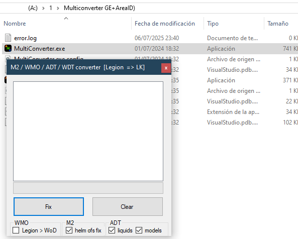
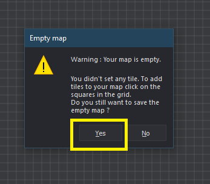
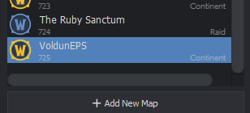
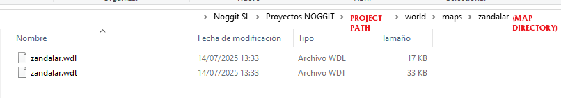
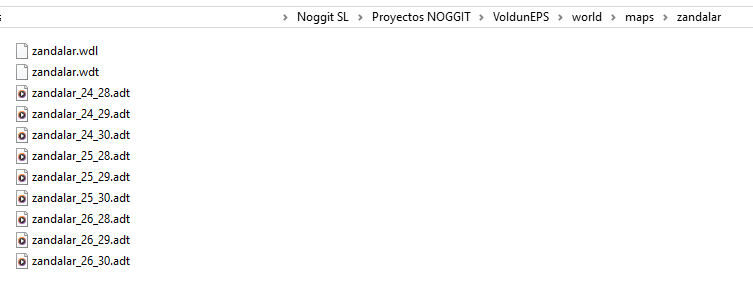
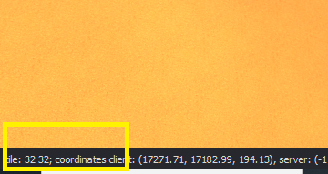
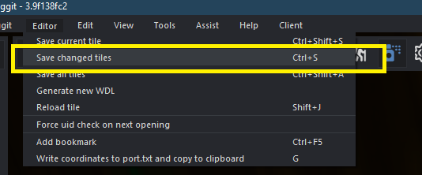
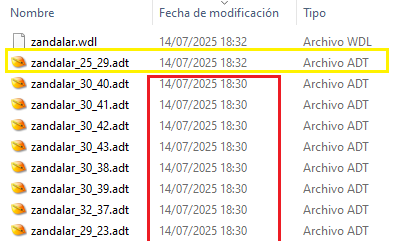
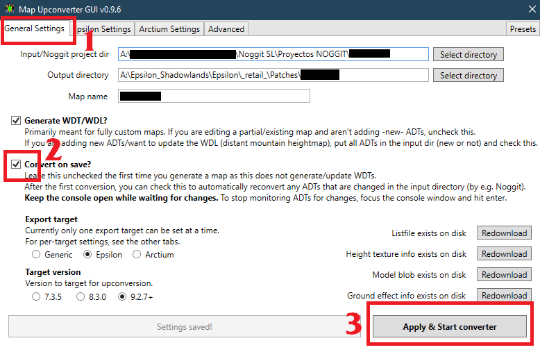

# Custom / Modern Maps in Epsilon with Noggit SL

Guide by **NORTE.m2** · Version 1.0

---

:::note[Notice]
This guide does not cover Noggit installation — it assumes the program is already installed and ready to use.

- **Noggit Installation:** [https://marlamin.github.io/modern-map-making/](https://marlamin.github.io/modern-map-making/)
- **Video Tutorial:** [https://www.youtube.com/watch?v=TP8YpgiGOPs](https://www.youtube.com/watch?v=TP8YpgiGOPs)
:::

---

## Requirements

**Pre-configured converter:**

- [https://drive.google.com/file/d/1u1T_OJgSUUAyU_Tffo4kxeqeMWnrT_vk/view?usp=sharing](https://drive.google.com/file/d/1u1T_OJgSUUAyU_Tffo4kxeqeMWnrT_vk/view?usp=sharing)
- **Alternative link (same file):** [https://www.mediafire.com/file/47ckt1it8f6dz0y/Conversor_de_ADT_para_NOGGIT_Moderno.zip/file](https://www.mediafire.com/file/47ckt1it8f6dz0y/Conversor_de_ADT_para_NOGGIT_Moderno.zip/file)

:::note[Note]
This file was already mentioned in the installation guide, but this version comes pre-configured with the correct format and files, saving you several steps.
:::

### Other useful links *(not required)*

- **Wow.Export:** [https://www.kruithne.net/wow.export/](https://www.kruithne.net/wow.export/)
- **Modern Map Making Discord:** [https://discord.gg/C85673kkWd](https://discord.gg/C85673kkWd)

---

:::note[Note about screenshots]
The screenshots in this guide mix two different projects: "zandalar" and "crestfall". Ignore the file names — the process is the same either way.
:::

Noggit only natively includes maps from **Classic WoW**. To edit maps from later expansions, you'll need to follow these steps first.

---

## Part 1 — Importing a modern map into Noggit

### 1 — Download the map files

Open **wow.export** and go to the **MAPS** section, then search for the map you want.

Select the **ADTs** (Ctrl+A to select all). Under export options, check only: **Export RAW**. Then click **[Export Tiles]**.


---

### 2 — Move the files into the converter

Select all the `.adt` files and the main `.wdt` file *(e.g. `crestfall.wdt` if you exported Crestfall)* and move them into the **[1]** folder of the converter.

:::warning[Important]
The converter uses two folders: **[1]** and **[2]**. They must be placed at the root of your hard drive. If your drive is C:, the paths should be `C:/1` and `C:/2`.
:::


---

### 3 — Run the converter

*(The `How to use it.txt` file inside the package contains the instructions.)*

Open **CMD** (press Windows+R and type `cmd`) and run the following command. In this example the drive letter is `A:` — replace it with yours:

```
A:/1/down.exe A:/1/listfile.csv A:/2 A:/1/*adt
```


---

### 4 — Prepare folder 2

Open folder **[1]** and find the `.WDT` file. Move it into folder **[2]**.

---

### 5 — Convert the files

Run `multiconverter.exe` *(found in the `1/Multiconverter` subfolder)*.



Drag all the files from folder **[2]** into the white box in the program and click **FIX**.


---

### 6 — Set up the project in Noggit

Inside the Noggit projects folder, create a new folder for your project *(the program won't create it automatically)*.

Then create a new project when you open the program. The name doesn't matter. Open it with a double-click.


Create a new map:


- **Map Directory:** Should match the name used in the `.adt` files *(e.g. `zandalar` if the files are named `zandalar_01.adt`, etc.)*.
- **Map name:** You can choose any name you like.

Click **[SAVE]**. A warning will pop up — accept it.



A new empty map will be created:



Once it's ready, **close** Noggit.

---

### 7 — Place the custom map into Noggit

Navigate to the Noggit project folder, then to `world/maps/your-map-name` — it will be nearly empty.



Copy the files from export folder **[2]** and place them there.



Open **Noggit again**. Now that the files are in place, the map is no longer empty — you can select an ADT tile and start editing.


---

## Part 2 — Exporting the map to Epsilon

Once you've finished editing the map, save your work and open **MapUpconverterGUI.exe** from inside the Noggit folder.


- **Noggit Project dir:** Should point to your project folder.
- **Output:** Should point to your Epsilon patch folder.
- **Map name:** Must match the name used in the `.adt` files *(e.g. `zandalar`, `crestfall`, etc.)*.


Also fill in the **Epsilon Settings** section.

After clicking **Apply & Start Converter**, the program will automatically build the patch in Epsilon. Enable it and you're done!

---

## Part 3 — Extra information and tips

### Editing a continent

*(For example: Eastern Kingdoms, Zandalar)*

WoW zones are grouped into full continent maps. There's no boundary between regions — Elwynn Forest, Westfall, and Tirisfal all belong to the same map: the Eastern Kingdoms.

You can edit a continent, but since Noggit works with Lich King data (3.3.5), **you'll need to split your patch** so it doesn't affect unedited zones — especially if you downported the map from a newer expansion.


In this example we edited Voldun, which means we worked on all of Zandalar. You'll need to find out which specific **ADT tiles** you actually edited.

**There are two ways to find out:**

- In the bottom-left corner, Noggit shows the tile coordinates you're standing on. Note those numbers.



- In Noggit, when saving, click **"Save changed tiles"**.



Inside the project folder, sorting files by **date modified** will show you which ones were actually saved:



As you can see here, `25_29` was modified most recently.

---

### How to create a partial patch

Convert the entire continent to Epsilon as normal *(all ADTs)* — this creates a full patch.

Go into that patch folder and **extract only the ADT tiles you actually modified**. Also extract the `.wdt` and `.wdl` files from the patch.

In this case, only `25_29` was modified:


Then **build the patch manually** from those files, removing the one the program generated automatically.

Done! The rest of the continent's ADTs will load from the base game.

---

## Part 4 — Live preview in Epsilon ("see changes instantly" mode)

Once you've exported the first version and the patch is active in Epsilon, you can enable this mode.

While active, every time you save in Noggit, the changes will update instantly in Epsilon **without needing to reload the game**.

### Step 1 — Advanced tab

In **Map Upconverter GUI**, go to the **[Advanced]** tab:


Enable **[Enable client refreshing]** and enter the **MapID**:


:::tip[Extra]
You can get the MapID in Epsilon using the `.gps` command.
:::


### Step 2 — Convert on Save

Go back to **[General Settings]**, check **[Convert on Save]**, and click **[Apply & Start Converter]**:



The program will start running. While it's active, every time you press **Ctrl+S** in Noggit, changes will update in Epsilon in real time.

:::tip[Tip]
Next time you want to continue editing, just launch the program and click the button. All settings are saved from last time — you don't need to fill everything in again.
:::

:::warning[Remember]
When starting a fresh patch from scratch, **make sure to disable these options** first.
:::
