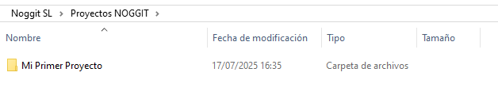
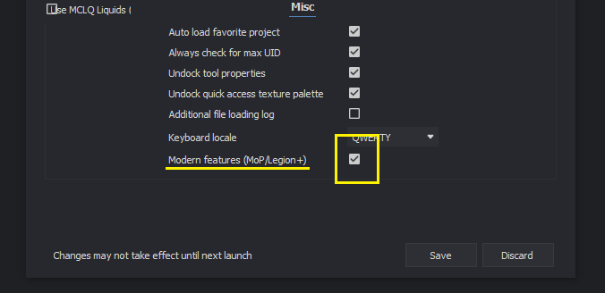

# Installing Noggit for Epsilon SL

Guide by **NORTE.m2** · Version 1.0

---

:::note[Notice]
This is an adaptation of the following guides with additional information:

- **Noggit Installation:** [https://marlamin.github.io/modern-map-making/](https://marlamin.github.io/modern-map-making/)
- **Video Tutorial:** [https://www.youtube.com/watch?v=TP8YpgiGOPs](https://www.youtube.com/watch?v=TP8YpgiGOPs)
:::

### Other useful links *(not required)*

- **Modern Map Making Discord:** [https://discord.gg/C85673kkWd](https://discord.gg/C85673kkWd)

---

## 1 — Download the required programs

### A WoW 3.3.5 client

Noggit can only run on this specific version. You'll need a 3.3.5 client.

:::tip[TIP]
I downloaded mine from [https://www.chromiecraft.com/en/downloads/](https://www.chromiecraft.com/en/downloads/), but there are many other sources online. Any clean 3.3.5 client will work.
:::

### Noggit

The main program.

You can grab the latest version in their Discord channel: [https://ptb.discord.com/channels/1264317233190928385/1264319052583801059](https://ptb.discord.com/channels/1264317233190928385/1264319052583801059)

:::tip[TIP]
At the time of writing, the version I'm using is: [https://marlam.in/u/FrankenNoggit12092024.7z](https://marlam.in/u/FrankenNoggit12092024.7z)
:::

### Map Upconverter GUI

This tool converts maps from Noggit's format *(Lich King)* to Epsilon's format *(Shadowlands)*.

Latest version available in the same Discord channel above.

:::tip[TIP]
At the time of writing, the version I'm using is: [https://github.com/ModernWoWTools/MapUpconverter/releases/download/0.9.7/Release-win-x64.zip](https://github.com/ModernWoWTools/MapUpconverter/releases/download/0.9.7/Release-win-x64.zip)
:::

### The `global.cfg` file

Also available in the Discord channel mentioned above.

:::tip[TIP]
At the time of writing, the version I'm using is: [https://cdn.discordapp.com/attachments/1264319052583801059/1264346842976489653/global.cfg](https://cdn.discordapp.com/attachments/1264319052583801059/1264346842976489653/global.cfg)
:::

---

## 2 — Download the modern assets

We need to download assets from newer expansions *(textures, WMOs, etc.)* so they're available inside Noggit.

There are two patches:

**Patch N** *(15 GB)*:
[https://drive.google.com/file/d/1i0KWP8fmiEGjFi5tIP-Lo-POpxyHwPzU/view](https://drive.google.com/file/d/1i0KWP8fmiEGjFi5tIP-Lo-POpxyHwPzU/view)

**Patch Y** *(10 GB)*:
[https://drive.google.com/file/d/1nUzJ7oSf87WaN_OMCx90lzHaZXSofPj5/view](https://drive.google.com/file/d/1nUzJ7oSf87WaN_OMCx90lzHaZXSofPj5/view)

Once downloaded, place both patches inside the **Data** folder of your WoW 3.3.5 client.

---

## 3 — Set up the Noggit folder

Inside the Noggit folder, create a folder where you'll store your future projects.

*You can name it anything: "Projects", "Noggit Projects", etc.*

:::warning[Notice]
You must create a folder for each project before creating the project in Noggit — the program won't create it for you. For this setup, our test project will be called "My First Project".
:::

You'll need to create a test project first so that Noggit generates all the necessary internal files.

### Step 1 — Launch Noggit

Create a new project. *This is just a TEST — you can delete it later.*

- The **project path** is the folder for this project. Each project gets its own folder.
- The **client path** is the folder where your WoW 3.3.5 client is installed.

Click **OK**, then double-click the project to open it.

### Step 2 — Enable Modern Features

*This only needs to be done once. You won't have to repeat it for future projects.*

Open the **[Settings]** panel:

In the settings, enable the **[Modern features]** option:

Click **[Save]** and **close** Noggit.

### Step 3 — extraData folder and global.cfg

Inside your projects folder, create a folder called `extraData` and place the `global.cfg` file you downloaded earlier inside it.

Next, go to the **Map Upconverter GUI** folder you downloaded in step 1. Create a folder called `meta` inside it, then place a copy of `global.cfg` there — renamed to `TextureInfoByFilePath.json`.

:::tip[TIP]
If you'd prefer to skip the renaming, you can download the file already renamed here: [https://drive.google.com/file/d/1NyvlFa3Pj-pQV46bADC7jQ0cBY0Cyuew/view?usp=sharing](https://drive.google.com/file/d/1NyvlFa3Pj-pQV46bADC7jQ0cBY0Cyuew/view?usp=sharing)
:::

---

## 4 — Your first project

For every new project, create a new folder inside your projects directory.

In Noggit, create a new project and set the paths again:

Select whichever map you want to edit — and you're ready to go!

Once you're done editing, save your work and export it to Epsilon.

---

**Next steps:**

To edit a modern map, see:
[https://docs.google.com/document/d/1JwAfvu1efA288rXxWgAZZLIFQweJ75q9rApANx3Owa8/edit?usp=sharing](https://docs.google.com/document/d/1JwAfvu1efA288rXxWgAZZLIFQweJ75q9rApANx3Owa8/edit?usp=sharing)
*"PART 1: IMPORTING A MODERN MAP"*

To export your map to Epsilon, see:
[https://docs.google.com/document/d/1JwAfvu1efA288rXxWgAZZLIFQweJ75q9rApANx3Owa8/edit?tab=t.0](https://docs.google.com/document/d/1JwAfvu1efA288rXxWgAZZLIFQweJ75q9rApANx3Owa8/edit?tab=t.0)
*"PART 2: EXPORTING A MAP TO EPSILON"*
