# Creating a Custom WMO for Epsilon

Guide by **NORTE.m2** · Version 5.0

---

:::note[Notice]
This guide starts from the point where you already have a 3D model built in Blender.
You can learn how to create one here: [**Blender Basics for WMO Creation**](https://nortedwg.github.io/compendio-del-modding/WMO/Uso-basico-de-Blender-para-WMO)

If you don't have much experience with Blender, I recommend reading that guide first before diving into this one.
:::

---

## Requirements

- [**3.3.5 → Shadowlands Converter**](https://mega.nz/file/EM1AzChB#HnGe6m8LoJRTq6vjJuQ6-z4_w6ziCW7zBe5ddWdCsAk)
- [**Blender 3.4**](https://download.blender.org/release/Blender3.4/)
- [**WBS – Wow Blender Studio**](https://drive.google.com/file/d/11RFIqoz6zncmGiFw6dUGgpMvZR0iKJQ6/view)
- [**WoW: Useful Shortcuts**](https://github.com/nortedwg/WoW-Atajos-Utiles) (not required but highly recommended)

Install both WBS and Useful Shortcuts in Blender as normal addons. *[[Help]](https://nortedwg.github.io/compendio-del-modding/WMO/Uso-basico-de-Blender-para-WMO#c%C3%B3mo-instalar-un-addon)* *[[Video]](https://youtu.be/q1Nvbl8oNpQ?si=7elpRkRGVa6TXrWL)*

### Other useful links *(not required)*

- **Wow.Export:** [https://www.kruithne.net/wow.export/](https://www.kruithne.net/wow.export/)
- **Modern Map Making Discord:** [https://discord.gg/C85673kkWd](https://discord.gg/C85673kkWd)
- **WoW Modding Discord:** [https://discord.gg/Dnrztg7dCZ](https://discord.gg/Dnrztg7dCZ)
- **WowBlenderStudio Discord (legacy):** [https://discord.gg/SBEDRXrSnd](https://discord.gg/SBEDRXrSnd)
- **WBS Video Tutorial:** [https://youtu.be/RYQT0J8LuY4?si=L8UvGkpCOBWszQ0j](https://youtu.be/RYQT0J8LuY4?si=L8UvGkpCOBWszQ0j)

---

## WMO Directory

Once your model is ready in Blender, enable the following option to activate WMO creation mode:


In the **directory path** field, enter the directory of the **original** WoW WMO you're going to replace when creating the patch.

**Example:**

If the WMO you're replacing is `world/wmo/brokenisles/suramar/7sr_hub_statue.wmo`, the **directory path** should be:

```
world/wmo/brokenisles/suramar
```

*(In other words, just remove the filename: `/7sr_hub_statue.wmo`)*

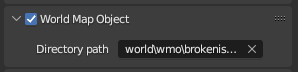

---

## WMO Type

Once you've enabled the step above, several groups will be automatically created:


Place your 3D model in the appropriate category. *Each category represents a WMO type.*

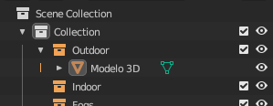

*(In this case **outdoor** since it's an exterior-only WMO.)*

- **INTERIOR WMOs** require portals to work correctly *[(see WMO with Interior section)](https://nortedwg.github.io/compendio-del-modding/WMO/Crear-un-WMO-custom#wmo-con-interior)*. They have their own lighting that can be customized.
- **EXTERIOR WMOs** don't require portals; their lighting comes from the world environment.

---

## In-game rendering

This tab shows the available flags for how the model renders.

They're **not required**, but can be useful in specific situations.


---

## Generating materials

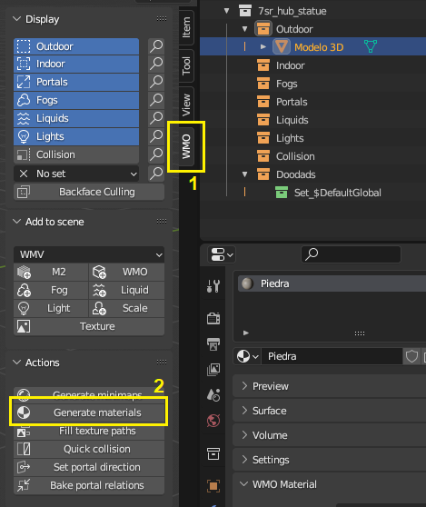

In the WMO addon panel **(1)**, click **Generate Materials (2)**.

:::tip[Can't see the panel?]
If the panel isn't visible, open it by pressing **N** or clicking the small arrow at the top.
:::

After this step, all your materials will have disappeared from the object. That's normal!

## Assigning in-game materials

:::tip[Notice]
There are 2 approaches for this. The manual one, and the automatic one using WoW: Useful Shortcuts. I recommend [jumping to the second one](https://nortedwg.github.io/compendio-del-modding/WMO/Crear-un-WMO-custom#metodolog%C3%ADa-2-forma-autom%C3%A1tica).
:::

### METHOD 1: Manual

I recommend reading this section to understand how it works, but **not using it in practice**. It's slow, tedious, error-prone, and inefficient. Use [the second method](https://nortedwg.github.io/compendio-del-modding/WMO/Crear-un-WMO-custom#metodolog%C3%ADa-2-forma-autom%C3%A1tica) instead.

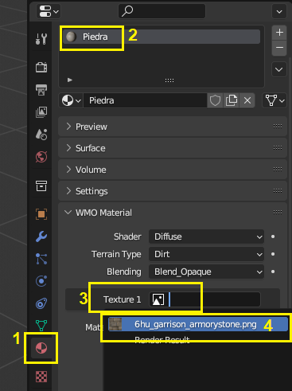

To get them visible again: in the materials tab **(1)**, select your material **(2)**, and under Texture **(3)** choose the original texture it had before **(4)**.

Repeat for each material one by one.

:::tip[Tip]
Do this step and the next one in parallel to go faster.
:::

**WoW materials**

Each material needs to be linked to the `.blp` file from WoW that it will use.

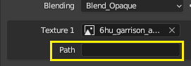

In the **path** field, enter the BLP path. For example:

```
dungeons/textures/6hu_garrison/6hu_garrison_armorystone.blp
```

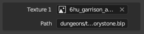

Repeat for every material, assigning each one its target file inside WoW.

---

### METHOD 2: Automatic

This method uses the [**WoW: Useful Shortcuts**](https://github.com/nortedwg/WoW-Atajos-Utiles) Blender addon. It will save you an enormous amount of work.

At this point, all materials will be showing as black in the viewport.
Open the addon panel *(press N if it's not visible)* and click **[Fill WMO Textures]**.

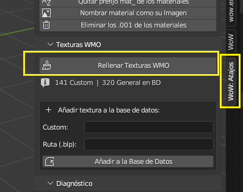

The addon will automatically fill in the paths for **all** textures in the project, as long as two conditions are met:

---
1. **The material name matches its image name.**

You can use the **[Name material after its Image]** button and it will do this automatically for every material in the project.
:::tip[Note]
We're working with textures extracted from WoW, so they'll already be named after their in-game texture. For example: "6hu_stone.png" will be "6hu_stone" in Blender. (The addon ignores the file extension when renaming, so it'll match correctly.) Just make sure the names are consistent.
:::

---
2. **The texture is in the database.**

The addon's built-in database doesn't include every WoW texture — only around 300.
You can add your own entries in this field:

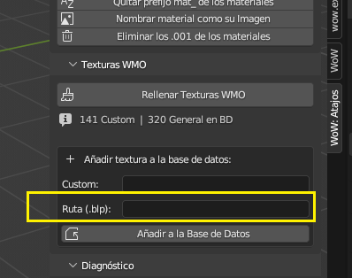

Just enter the full path and click the button. It saves permanently. For example: ```dungeons/textures/dalaran/eb_dalaran_archstone1.blp```

Next time it will be available automatically.

You can also add your own custom textures.
:::tip[What's a Custom texture?]
If you're using your own textures to replace existing WoW ones — for example, a high-res texture called `Custom_Wall` — in the **Custom** field enter the name: `Custom_Wall`, and in **Path** enter the one it replaces: `dungeons/wmo/replaced.blp`.

From then on, whenever Blender detects a material named `Custom_Wall`, it will apply that path.
:::

---

### Help! I clicked the button but my textures are still black.
That's normal. A quick trick to force them to reload is to add collision to the object — it refreshes all textures. In any case, textures appearing black in Blender has no effect on how they look in-game.

---

### Verification
All textures must have a path assigned. If any are missing one, the exporter will throw an error telling you which ones are affected.

In the materials tab, you can click through each material to check that all of them have a path:
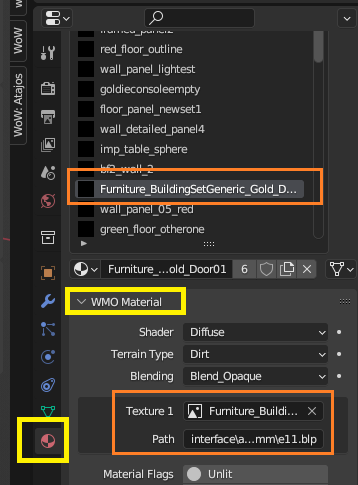
You should see *(in the orange area)* a valid path.

**What if one doesn't have a path?**
Most likely the material name doesn't match any texture in the database.
Either rename the material to one that does, or add it to the database as explained above.
Clicking the addon button again will regenerate all paths automatically.

---

**Other options** *(not required)*:


**Terrain Type** defines the footstep sound your character makes when walking on the WMO inside the game.

---

## WMO Collision

To add collision, click **QUICK COLLISION** in the addon panel.


This generates basic collision based on the shape of the 3D object.

:::tip[Tip]
Leave the default value for now. If the collision doesn't behave correctly in-game, try changing the number. A higher value usually gives better results, though sometimes values like 100 or 200 work better. I'd recommend trying 5000 first, then keep adjusting until something works.
:::

---

## Possible errors

:::warning[Watch out!]
The UV on the object must be named **UVMap**, otherwise the exporter will throw an error. You can rename it using the Useful Shortcuts addon button.
:::

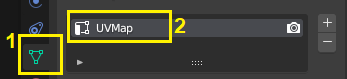

:::warning[You need a project!]
Only required the first time.
:::
Before you can export, you also need to have created a **project** in the addon. You only need to do this once — the same project works for everything you create going forward. It can be created at any point.

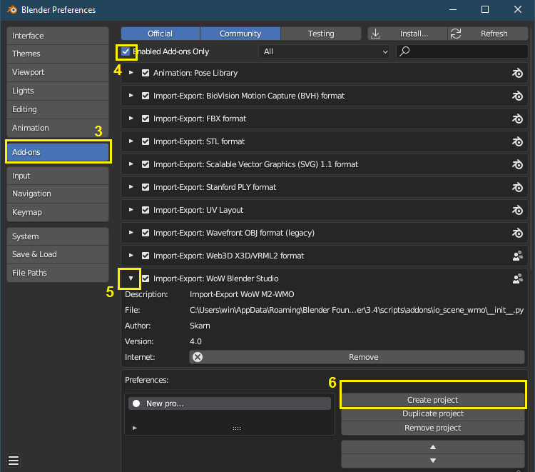


---

## Exporting

Once everything is done, export from the addon panel:


The exported file will be in version 3.3.5 (Lich King). You'll need to convert it to Shadowlands using the converter.

Place the files Blender exported into the `INPUT` folder, **using the original WMO's filename**:


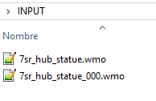

Run `MultiConverter.exe` and the `OUTPUT` folder will contain 3 files. Use the two `.wmo` files to create your Epsilon patch. Done!

---

## WMO with Interior

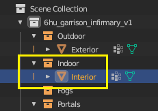

### Interior and Exterior

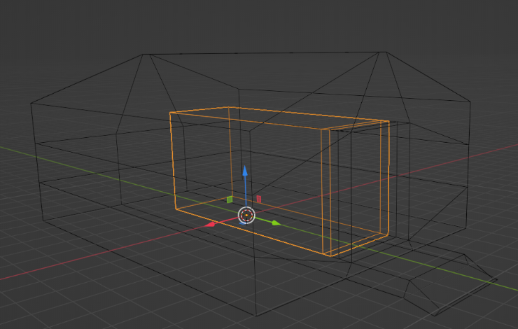

Interiors work differently from exteriors. They need to be added as a separate model.

You'll have an interior model sitting inside the exterior model. Place it in the corresponding category: **Indoor**.

:::note[Note]
The interior must connect to the exterior — there can't be a gap between the two models.
:::

:::warning[Watch out]
Interior and exterior lighting are treated separately: there will be a visible seam between them.
:::

### Portals

To connect the interior and exterior, you need to place a **portal** between them.

:::note[Note]
Without a portal, the interior won't be visible from the outside and vice versa — though the character can still pass between them.
:::

Create a plane at the transition point:


Place that plane in the **"portals"** category and configure it:

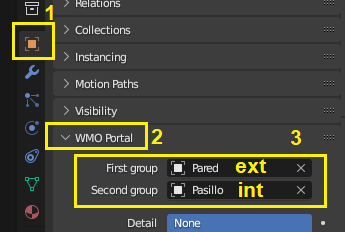

With the portal selected, in the *WMO Portal* section, set *First Group* to the exterior object and *Second Group* to the interior one.

:::note[Notes]
- Portals don't need textures. Just assign them a blank material.
- You can place as many portals as you want (doors, windows, etc.).
:::


---

## Lighting in WMOs

### Step 1 — Enable Vertex Color

Enable **Vertex Color** in the addon panel.

:::warning[Watch out]
Make sure you have the correct object selected in the top menu before doing this — in this case the interior model.
:::

### Step 2 — The Col vertex

In the **Color Attributes** tab you'll find a vertex layer called **"Col"**. This is the channel where WMO lighting is painted.


:::note[Note]
It should exist by default. If not, click **+** and create it with these settings: *Face corner, Byte color*.
:::

### Step 3 — Enter Vertex Paint

Switch to **Vertex Paint** mode:

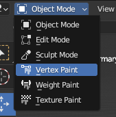

Set up flat lighting like this:


### Step 4 — Painting the lights


- **(1)** Set the brush to **Add** mode.
- **(2)** Choose the color to paint — this will be the light color.
- **(3)** Adjust the brush radius.
- Paint the object to define where the lights will appear.

:::note[Notes]
- **White** = white light.
- **Black** = the area will be lit naturally by the day/night cycle or by in-game light objects. *(Black doesn't mean darkness — it's the default value.)*
- I recommend painting everything black first, then adding light only where you want it.
:::


:::note[Note]
The lighting will appear much softer in-game than it does in Blender.
:::

### Step 5 — Enable Unified Rendering

For the lighting to apply in-game, enable **only** the **"Unified Rendering"** option — regardless of what you had enabled before:


The lighting will now work in-game!

---

## Exterior / Interior light transition

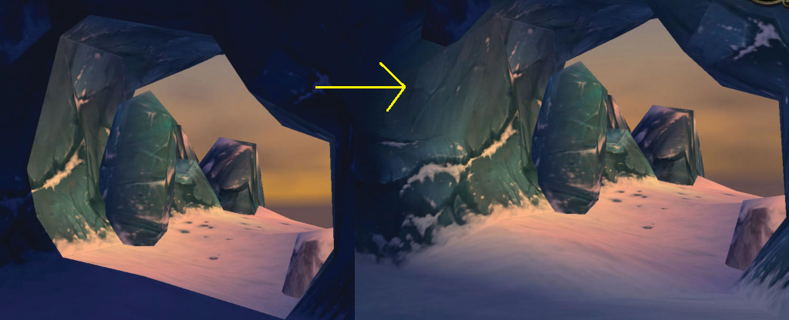

In the **Color Attributes** tab, create **two** vertex layers with the following configuration:

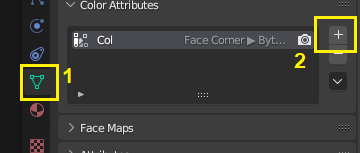

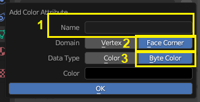

- The first one should be named: **`BatchmapTrans`**
- The second one: **`BatchmapInt`**

So it looks like this:

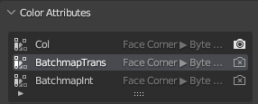

Switch to **Vertex Paint** mode (same as steps 3 and 4 above):

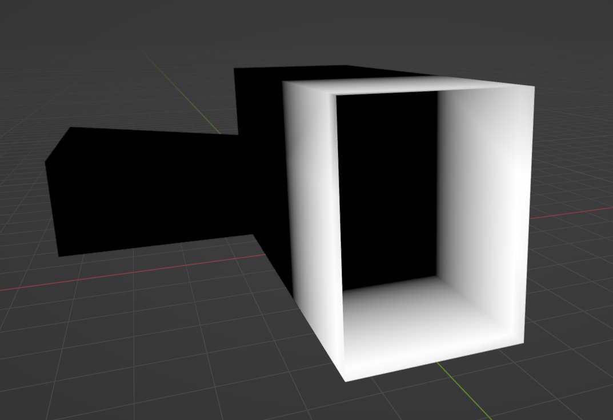

Paint the object so that the area around the doorway is **white** and the interior area is **black**.

:::note[Important]
Apply the same painting to both layers: both `BatchmapTrans` and `BatchmapInt`.
:::

- **White** area → light transition zone.
- **Black** area → WMO uses the lighting we painted ourselves.

Done!

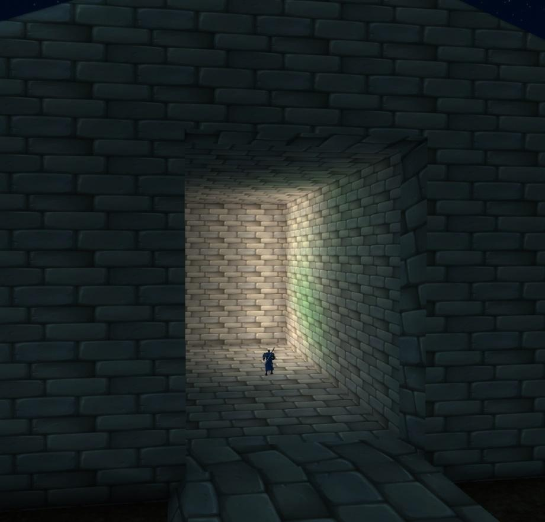

---

## Complex WMOs: Subgroups

WMOs have a face and vertex limit per subgroup:

| | Limit |
|---|---|
| **Vertices** per subgroup | 65,535 |
| **Faces** per subgroup | 65,535 |

*(Edges and triangles don't count toward the limit)*

:::warning[Recommendation]
**NEVER** exceed 50,000 per subgroup. Beyond that, errors will start appearing.
:::

You can check your model's stats here:

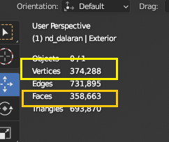

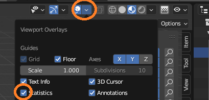

To go beyond the total limit, WMOs can be split into **subgroups**. Using [wow.export](https://www.kruithne.net/wow.export/) you can find a WMO that already has multiple parts and use it as the base for replacement:


In Blender, each part of the original WMO becomes its own subgroup. *The name of each subgroup doesn't matter; these are just named as an example:*

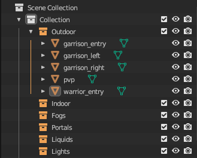

With 5 subgroups you could have up to 325,000 faces — well beyond the single-group limit.

---

## Appendix: Other documented errors

:::note[Notice]
This section is **theoretical**. The information here may not be fully accurate — it's a collection of findings from experimentation and research.
:::

### Faces are sticking through the model incorrectly

The vertex or face limit for a subgroup has been exceeded.

| | Limit |
|---|---|
| Vertices per subgroup | 65,535 |
| Faces per subgroup | 65,535 |

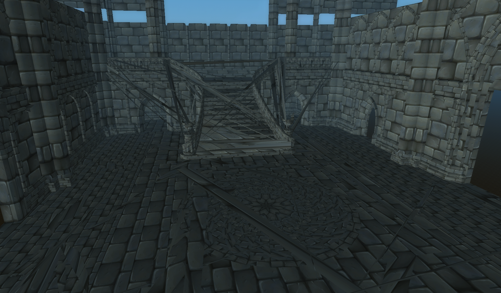

**Fix:** Split the model into parts that each stay under the limit.

---

### Faces are invisible even though the normals are correct


A material also has a maximum number of vertices and faces it can handle, just like a subgroup.

**Fix:** Split the WMO across multiple materials.

---

### Converter crashes

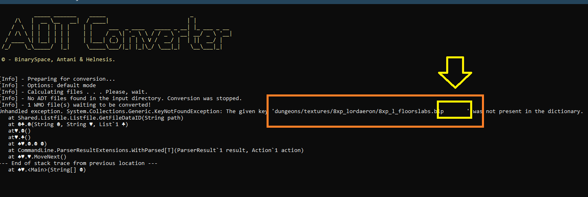

One of the textures has a space in its **path** — usually a trailing space after `.blp`. Remove any extra spaces.
