# Blender Basics for WMO Creation

Guide by **NORTE.m2** · Version 1.0

---

:::note[Notice]
This guide covers my personal workflow in Blender for creating WMOs. There are other valid approaches that lead to the same result.

Throughout the document I share shortcuts, tips, and techniques that I've found useful in practice.

We'll go step by step through the creation of a simple WMO from start to finish.

For exporting, see: **Creating a Custom WMO for Epsilon**
:::

---

## Custom keyboard shortcuts

These are the shortcuts I've set up for myself — the way I find most comfortable to work. They're not required but are highly recommended.

Before setting them up yourself — **hold on!** I've already packaged them so you can import them in just a couple of clicks. Let's look at them first.

### How do I create a keyboard shortcut?

Go to **Edit → Preferences**

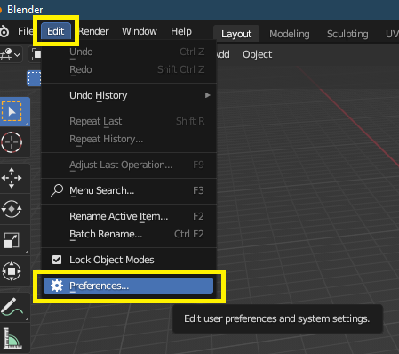

This panel lets you edit any keyboard shortcut in the program.

---

### Which ones do I recommend?

For the main controls I use:

- **S: SELECT** — enters the transform axis mode for moving objects.
  *By default Blender lets you drag objects freely around the screen, which is imprecise. Using axes makes positioning much more accurate.*

- **R: ROTATE** — enters the axis mode for rotating.

- **E: SCALE** — enters the axis mode for scaling.

I recommend mapping these three nearby keys so they always open the edit mode with the gizmo (axes) active, like this:

---

### Other useful shortcuts

I recommend mapping **`i`** to add an image texture in shading mode. Since we'll be adding textures constantly for WMOs, this saves a lot of clicks.

I also have the **`><`** key *(next to Z)* mapped to "fly mode" — where you take control of the camera like a first-person game, flying through Blender with WASD, as if you were inside WoW.

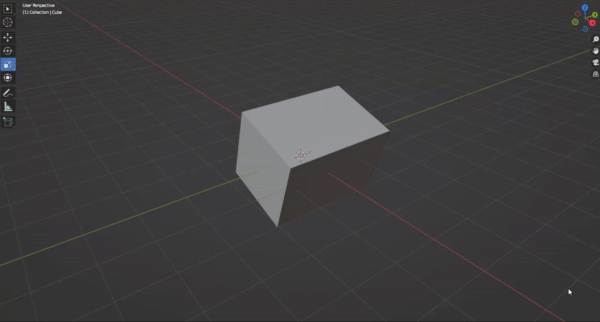

---

### Number Pad: `1` `2` `3`

**`1`** — Move the object's origin to its exact center.
*Useful when you need to rotate from the center point, for example.*

**`2`** — Move the geometry to the gizmo.
*If the origin is at 0,0, this snaps the geometry to it precisely.*

**`3`** — Move the gizmo to the 3D cursor.
*More on the 3D cursor later — but combining this with key 2 is extremely useful.*

---

**`END`** *(the key above the arrow keys, between the main keyboard and the numpad)*: Delete a face in Edit Mode. *Having this on a single key will save you a lot of time going forward.*

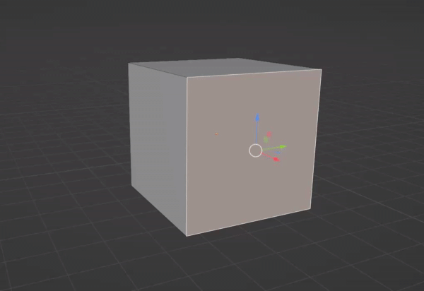

---

### How do I import these shortcuts?

If you like them, I've packaged them all for you:
  [Recommended WMO Shortcuts.py](https://drive.google.com/file/d/11Uwwvr1dN4LGdEEPyAjzp34we4XogzUR/view)

In Google Drive, click to download the file.

In Blender, in the same Preferences → Keymap panel from before, click **Import** and select the file. On the left you can also create a new keymap profile so you can delete these or revert to the defaults if they're not for you.

---

## Default keyboard shortcuts

These come with Blender by default. You should know them.

### Navigation

- **`Middle Mouse Button`** (held down): Rotate the camera.
- **`Middle Mouse Button + Shift`** (held down): Pan the camera.
- **`Scroll Wheel`**: Zoom in and out.
- **`. DEL`** *(numpad, next to 0)*: Centers the view on the selected object and orbits around it.

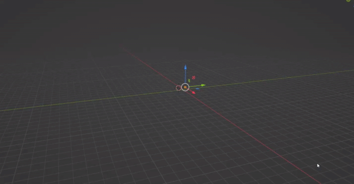

### Others

**`TAB`** — Edit Mode. Enter this to edit an object's geometry.

**`1, 2 and 3`** — Inside Edit Mode, switch between vertex, edge, and face selection respectively.

**`ALT + Z`** — X-Ray mode. Makes objects see-through, so you can select geometry behind other geometry.

**`SHIFT + A`** — Add an object. *For WMOs we almost always use Mesh > Plane and Cube.*

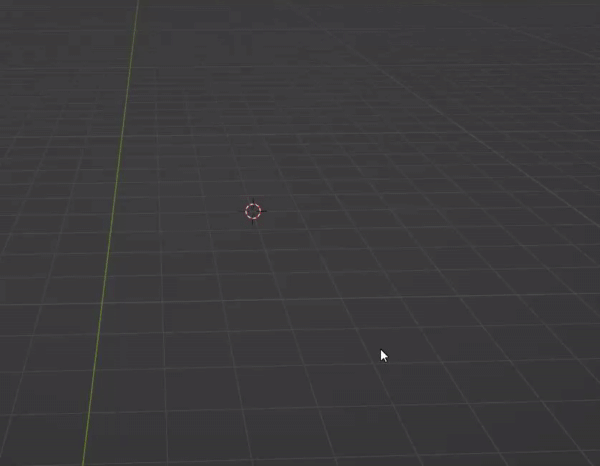

**`CTRL + D`** — Press the combo, then **left-click** anywhere in the viewport to **duplicate** an object.

:::tip[Duplicate ≠ Copy]
Duplicating is not the same as copying. `Ctrl+C` + `Ctrl+V` creates a copy of the object but also duplicates its material, creating a new one. Duplicating creates an exact copy that shares the same material.

For example, if you copy-paste a wall, its texture might go from `wood1` to `wood2`. With duplicate, both walls share `wood1`.
:::

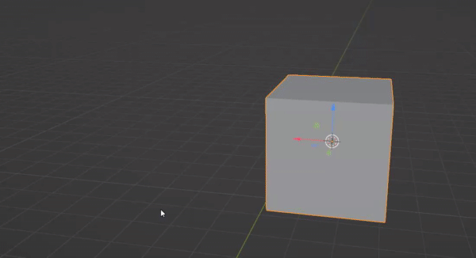

**`/`** — Isolate an object in the viewport. *(Temporarily hides everything else.)* Press again to restore. Great for focusing on a single object without distraction.

---

## The 3D Cursor

The 3D Cursor is the reference point in Blender's 3D space. It looks like this:

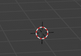

It has many uses — for example, new objects are created at its location. Being able to move it around is important.

**`ALT + S`** — Opens the 3D cursor position panel:

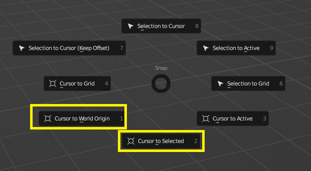

The most useful options are:

- **Cursor to World Origin**: Sends the cursor to the 0,0,0 point. Combined with the earlier shortcuts, you can snap an object to the origin in two clicks.
- **Cursor to Selected**: Moves the 3D cursor to whatever is selected. If you have a vertex selected, it goes to that exact point. If it's an object, it goes to its center.

Combined with the custom shortcuts, you can do things like this:

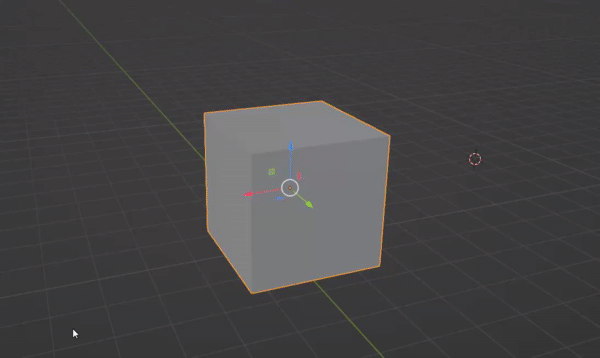

---

## Recommended Addons

### How do I install an addon?

In **Edit > Preferences** *(same place as the keymaps)*, go to the **Add-ons** tab. Click **Install**, select the `.py` or `.zip` file, then activate it by checking the box.

---

### QuickSnap

**Download:** https://github.com/JulienHeijmans/quicksnap/archive/refs/heads/main.zip

Lets you snap objects from vertex to vertex, with magnetic precision. Absolutely fantastic. *(Default key is `V`)*

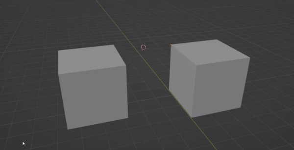

---

### WoW: Useful Shortcuts
  [Download](https://github.com/nortedwg/WoW-Atajos-Utiles)

This addon provides several useful options:

### Part 1: Materials and UVs

[*Material appears transparent? Fix it*] When you export an object from WoW and reimport it, materials are often flipped and appear transparent — this fixes them all in one click.

[*Flat materials, like in WoW*] Adjusts all material properties so they look the same as they do in-game.

[*UV*] Renames all UVs.

[*Remove \_mat prefix*] If a material is called `mat_texture`, this strips the `mat_` prefix. *(All materials imported from wow.export have that prefix.)*

[*Name material after its image*] If the image is called `6hu_wall.png`, this renames the material to `6hu_wall`. Works on all materials at once.

[*Remove .001 duplicates from materials*] When you duplicate materials, copies appear named .001, .002, etc. This merges them all back into the original and deletes the duplicates.

Also, pressing **`ALT + R`** rotates objects 90 degrees:

### Part 2: Automatic WMO Textures & Diagnostics

Tired of filling in every texture path one by one? Click **Fill WMO Textures** and the addon will assign the correct path to each texture automatically.

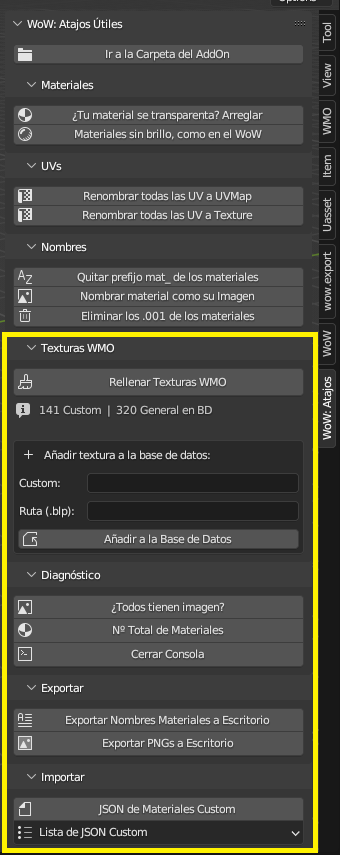

It takes your material name — for example `6hu_garrison_wall` — and assigns the full path `dungeons/wmo/expansion06/6hu_garrison_wall.blp` if it exists in the database.

Not in the database? No problem — just add it! It saves permanently.

:::tip[What's a Custom texture?]
If you're using your own textures to replace existing WoW ones — for example, a high-res texture called `Custom_Wall` — in the **Custom** field enter the name: `Custom_Wall`, and in **Path** enter the one it replaces: `dungeons/wmo/replaced.blp`.

From then on, whenever Blender detects a material called `Custom_Wall`, it will apply that path.
:::

Under **[Diagnostics]** you'll find a couple of buttons. The first opens the console and tells you whether all your materials have a texture assigned. The second shows you the total number of materials.

Under **[Export]** you can output a list of your project's textures to a `.txt` file on the desktop, or export all textures as `.png` files to a desktop folder.

Under **[Import]** you can manage your own custom material lists — activating and deactivating them as needed. If you work on large projects with long material lists you don't always need, you can keep them in a separate JSON and import it with the button. Once active, the addon will recognize them as custom materials.

---

## Building a simple WMO, step by step

### Extracting pieces

In this section we'll build a small WMO using pieces from **Waycrest Manor**. We export the model as OBJ with `wow.export`, import it into Blender, and add textures.

Let's extract one of the pillars. Enter Edit Mode with `TAB` and click on a face of the pillar. The material for that face will be highlighted in the materials panel on the right:

With the material selected, click **`Select`** to select every face in the model that uses that material:

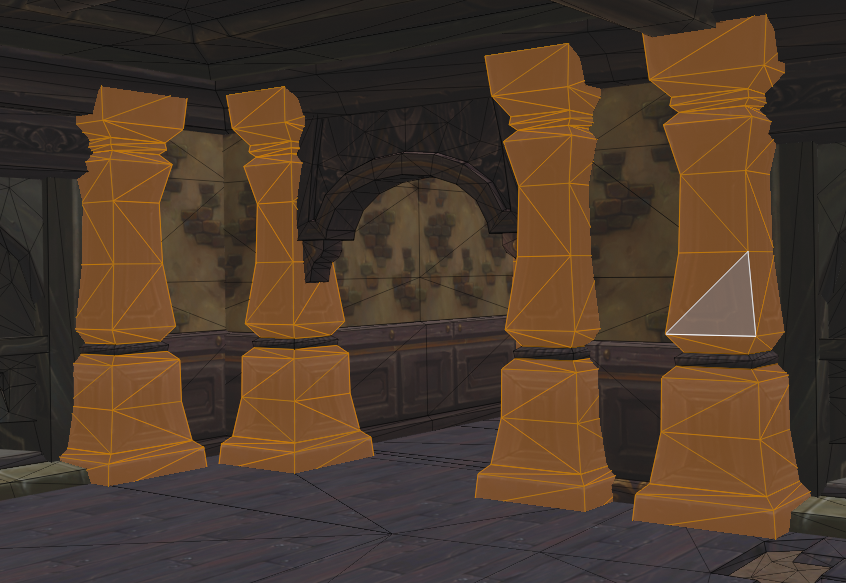

Press **`P`** to separate those faces into a new object.

Exit Edit Mode with `TAB` again and click on the pillars. You can see they're now a separate object (listed as `.001`).

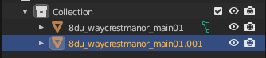

Press **`/`** to isolate it. Since the object is very large and we only want one pillar, zoom in, enter Edit Mode with `TAB`, select a face of the pillar you want, then press **`. DEL`** to center the view on that face.

*This way you can rotate and inspect the pillar up close, with the camera orbiting around that face.*

Now I'll extract a single pillar. In order:

1. Enter Edit Mode with `TAB`.
2. Enable X-Ray with `ALT + Z`.
3. Select all the faces of the pillar.
4. Press `P` to separate it into a new object.
5. Click outside to deselect, then click the new pillar. *(Otherwise you'd still be selecting the whole group — old object + new pillar together.)*

Now press numpad `1` (our custom shortcut) to center the gizmo on the new pillar.

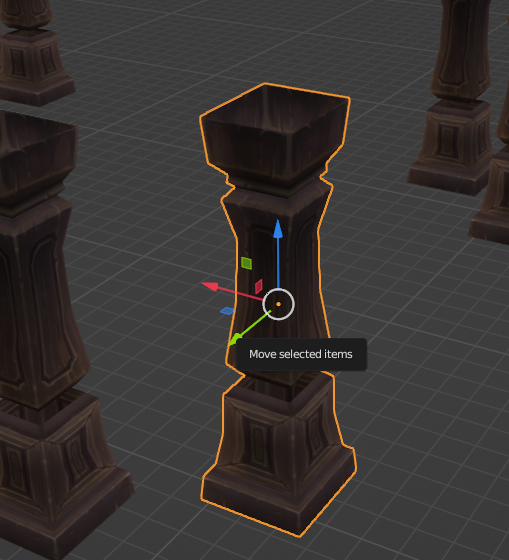

I isolate the new pillar and notice it has a gap in the center. *That's because there was a different texture in that spot.* I could extract it the same way and then merge it with the pillar using `CTRL + J`. But instead, let's fix it manually.

Enter Edit Mode with `TAB`, switch to vertex mode with `1`. At the top, enable the magnet icon and set it to **Vertex**. Now I can drag vertices and snap them to the nearest vertex.

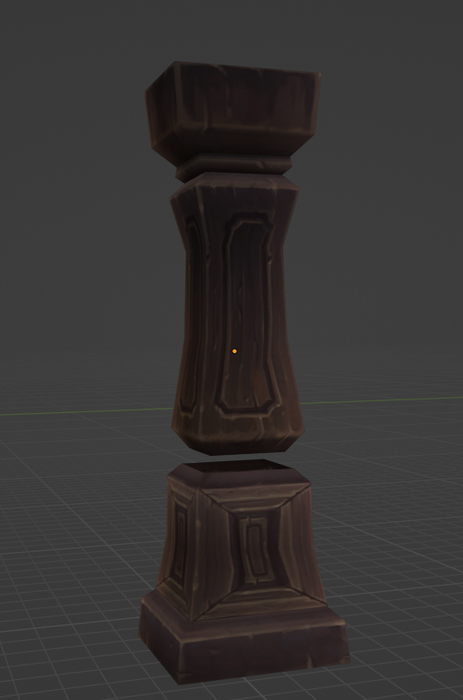

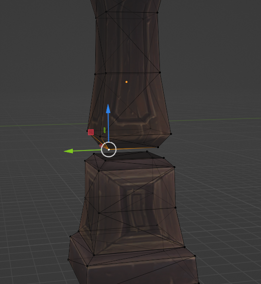

Remember to remove any unused materials the object still has linked from the full mansion (**Remove Unused Slots**).

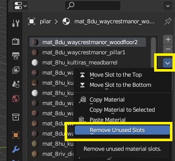

Once isolated, select it and export as FBX:

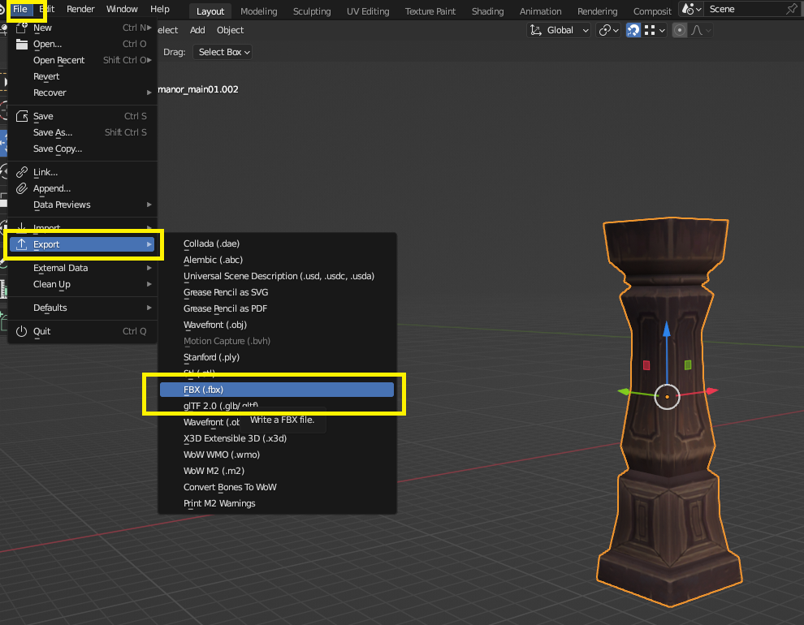

Make sure **Limit to → Selected Objects** is checked, so only the selected object is exported, not everything in the scene.

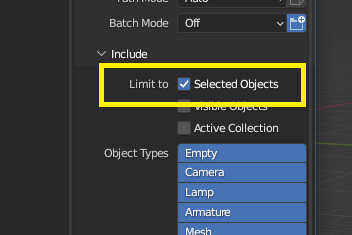

Done! We have our pillar.

---

## Building our basic WMO

In a new scene I import my pillar — and it looks transparent!

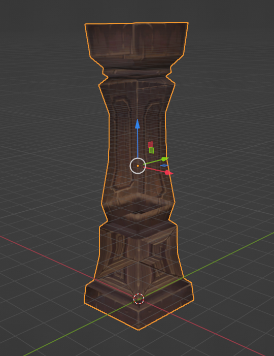

In the materials panel, use the WoW addon and click **"Material appears transparent? Fix it"**.

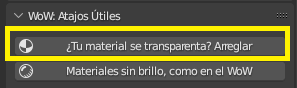

Fixed! Now let's create a wall. Press `SHIFT + A` and select **Plane**:

Scale and rotate the plane 90 degrees to turn it into a wall, then position it.

Enter Edit Mode with `TAB`, switch to edges mode with `2`, and adjust the edges to get the right size.

With the wall selected, go to the material panel and create a new material:

Go to the **Shading** tab in the top menu.

Use **`i`** to add an **Image Texture** node and connect it to **Base Color**. Then click **Open** to choose your texture's PNG.

Here I'm using a wood texture:

Then, in the addon, remember to click **"Flat materials, like in WoW"** so it looks the same as in-game:

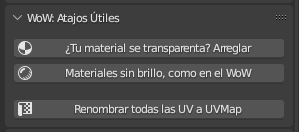

:::tip[Tip]
Name the material the same as the texture. Stay organized — you'll need it later. You can just copy and paste the name.
:::

Switch to the **UV Editing** tab to adjust the UV:

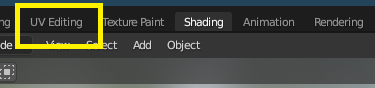

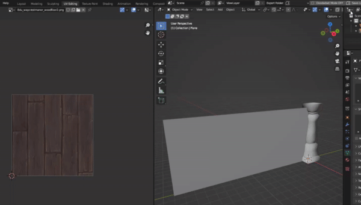

---

## Adjusting UVs

On the left you see the UV. On the right, the object. As you can see, the UV doesn't match the object's shape — so we need to create a new one.

Enter Edit Mode and select the faces that will make up the new UV. You can select all with **`A`**.

In the UV panel at the top, choose one of the projection options:

Each one gives a different result:

- **UNWRAP and SMART UV PROJECT**: Unfold the model like origami. The second option does it more intelligently. *Best for non-geometric models.*
- **CUBE PROJECTION**: Projects the UV as if a cube surrounded the object, taking a "photo" from each of the 6 directions. *Best for boxy, geometric models.*
- **PROJECT FROM VIEW**: Takes a "photo" from exactly the current camera angle. Useful if you position yourself perpendicular to a surface.

For example, here I clicked an axis handle to align myself with the X axis, then used Project from View to get a perfectly perpendicular projection onto the wall:

Now adjust the UV. Remember you can toggle the button in the top-left corner to show all UV faces even when they're not selected.

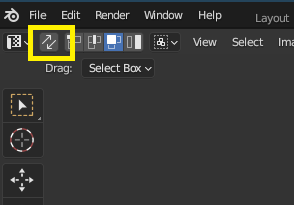

In Edit Mode, the right panel lets me select the object. In the left panel I can then select individual UV faces to edit.

I can freely scale, rotate, and move using the standard shortcuts until the UV fits the texture correctly. There's no size limit — the UV can go outside the texture boundary and it will tile.

*Think of the UV as a representation of the face on the texture canvas — whatever shape you give it, that's how it'll look. Make it narrower and it'll look narrower in-game.*

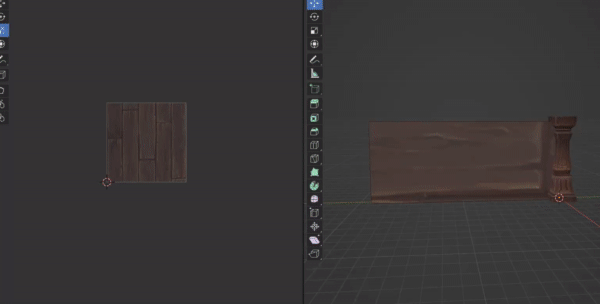

Here's my final result:

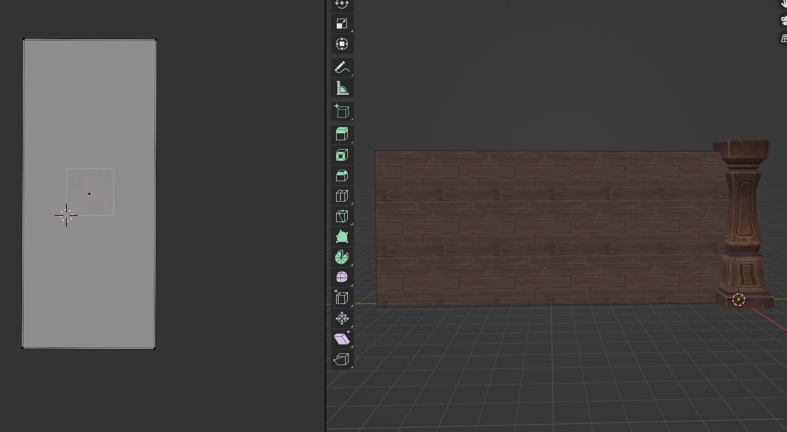

---

## Duplicating pieces and assembling

Let's close off the room. I use **`ALT + D`** and click somewhere to create an exact copy of the pieces. I keep duplicating and placing them until I have a full room.

Remember **`ALT + R`** rotates 90 degrees:

Since it's a bit awkward, I press numpad `1` to center the origin and duplicate from there:

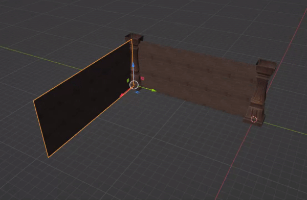

For the last section, I copy the back wall by selecting it as a group:

The room walls are now ready.

---

## Creating openings

What about a door? Let's create one. I've imported a door model, extracted the same way as the pillars. Now I just need the opening in the wall.

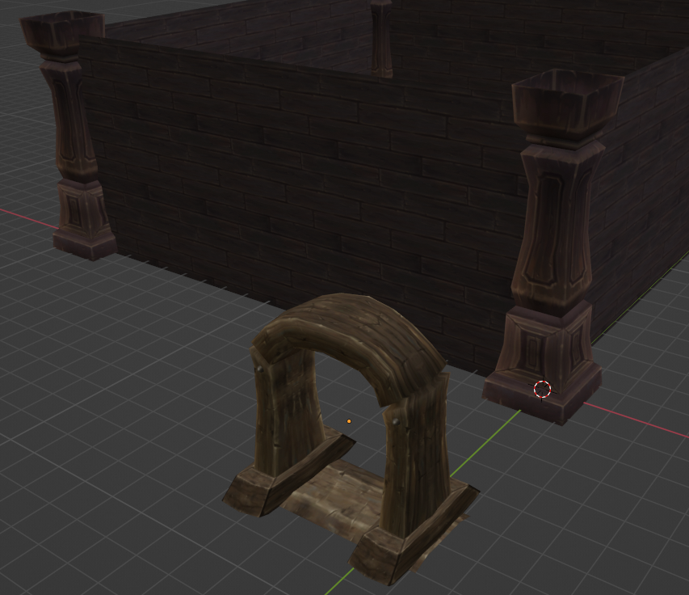

First, position the door where it will permanently sit.

Select the wall and enter Edit Mode with `TAB`. I'll use the **Loop Cut** tool from the left panel — it cuts the model in two by adding a new edge.

After clicking the tool, hover over the wall at the edge you want to cut. A yellow line shows where the cut will be made. Click to confirm.

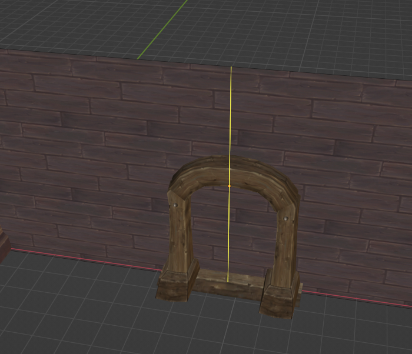

Now press **`N`** (or use the **Edge Slide** tool) to slide the edge to the door's edge position.

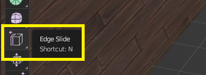

:::tip[Tip]
You can Edge Slide any edge — not just ones you created with Loop Cut. And it won't distort the surrounding geometry, unlike simply moving the edge.
:::

The idea is that the cut should be hidden behind the door frame's thickness. I repeat the same process on the other side and at the top:

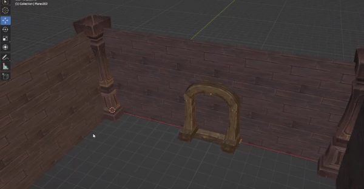

Adjust the positions and it'll look like this:

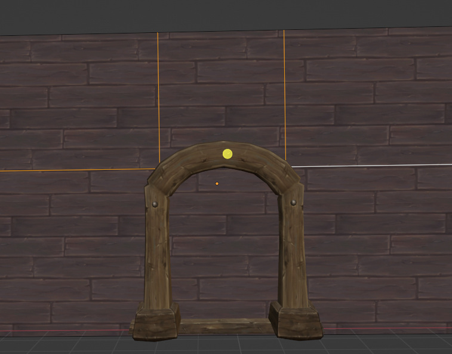

Now enter face mode with `3`, select the center face, and delete it with the `END` shortcut. We've got our opening — and the texture hasn't been distorted at all.

---

## Filling gaps

What if your model comes in with holes? Can you patch them? It's pretty common for Blizzard models to have small errors.

*Imagine this gap was there by default and I need a clean wall:*

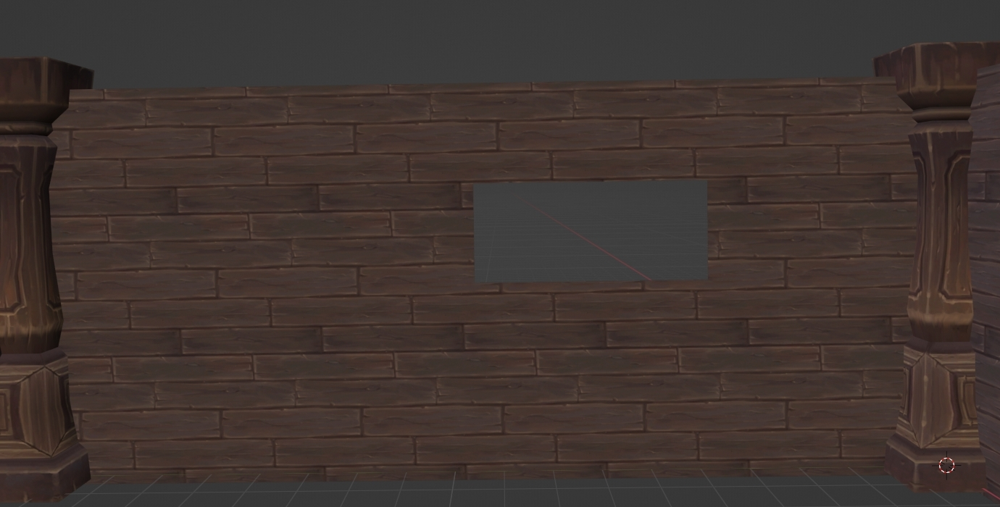

A simple approach: enter Edit Mode, select two facing edges…

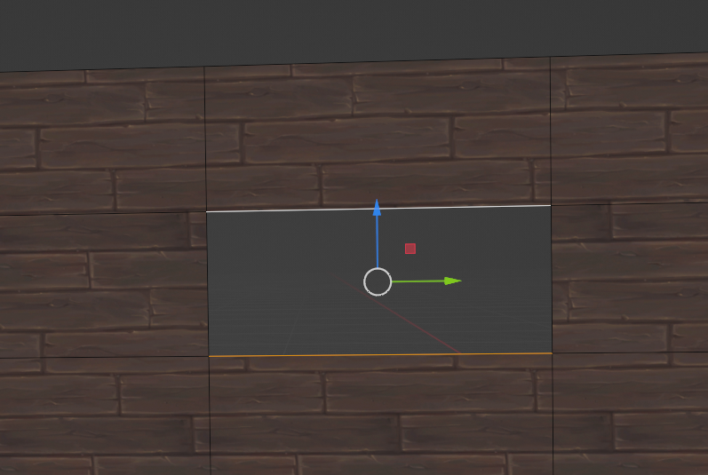

Then go to **Edge > Bridge Edge Loops**. This creates a face between the two edges.

The texture will often be wrong on the new face since it has no UV assigned.

Use one of the UV projection methods to fix it. Here I'll use **Cube Projection**:

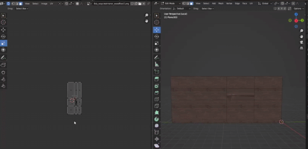

The gap is now fixed.

---

## Normals

Textures are only visible from one side. To check this, enable **Face Orientation** in the viewport overlay:

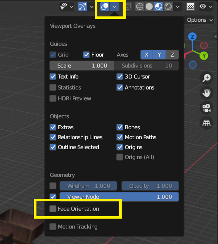

**Red** faces are **not visible**. **Blue** faces **are visible**.

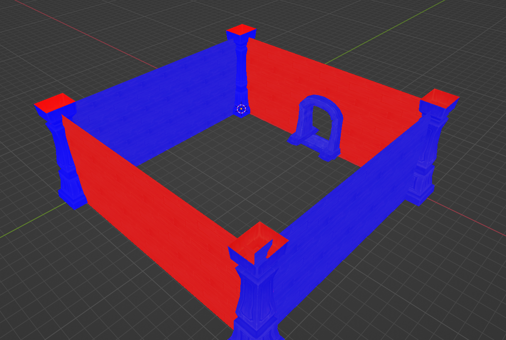

If we were building a room, we'd want it visible only from the inside. Right now, from the inside, some walls would appear transparent.

Let's fix it. Select all the red faces and apply: **Mesh > Normals > Flip**

Make sure you see blue from the inside throughout:

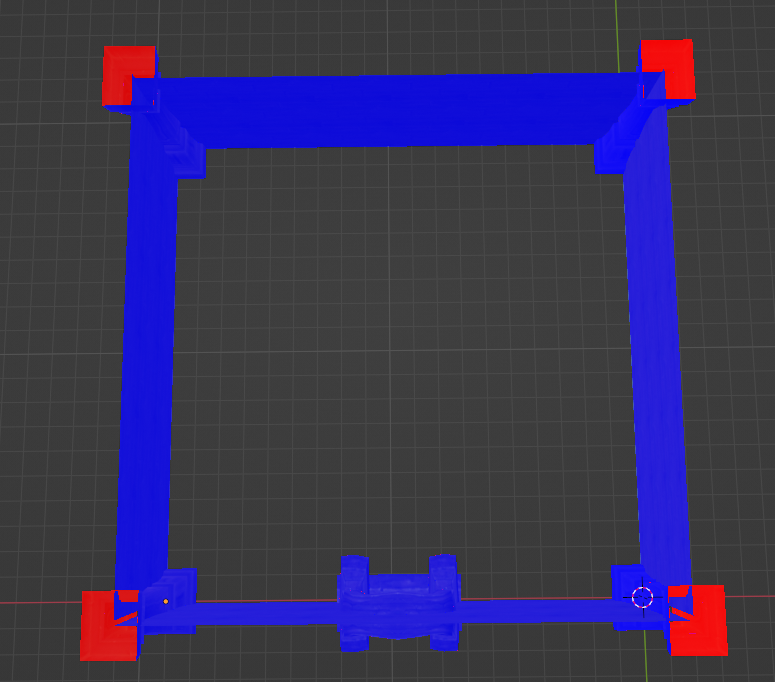

**What if I want something visible from both sides?**

Duplicate the wall with `ALT + D` without moving it — leave it perfectly overlapping the original. Then flip the normals on one of the two copies, so there's a plane facing each direction. The result should appear **purple**:

---

## The polygon limit

WMOs have a vertex and face limit per subgroup. *(A WMO is divided into multiple subgroups.)* Each one can have:

| | Limit |
|---|---|
| Vertices per subgroup | 65,535 |
| Faces per subgroup | 65,535 |

:::warning[Recommendation]
Do **NOT** exceed 40,000 per group.
:::

You can see how many subgroups a WMO has in wow.Export, for example:

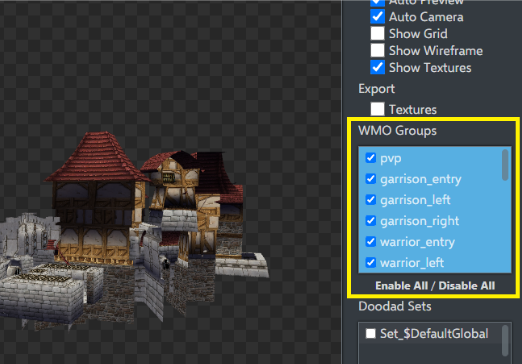

**How do I check my model's face count?**

Enable the **Statistics** overlay — the info will appear on the left side of the viewport:

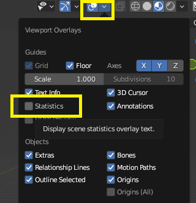

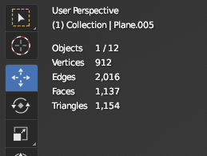

**What if my model has more than 40,000?**

You'll need to split it into separate groups of no more than 40,000 each.

- If the model is **exterior**, no special considerations are needed.
- If the model is **interior**, you'll need to add portals between each group. *This is a more advanced technique, covered in the **Creating a Custom WMO for Epsilon** guide.*

---

## UV naming

The UV on every group must be named **`UVMap`**.

:::tip[Reminder]
The Useful Shortcuts addon can rename all UVs at once with the **"Rename all UVs to UVMap"** button.
:::

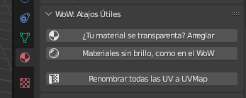

---

## Exporting

From here, follow the WMO export guide: [Creating a Custom WMO for Epsilon](https://nortedwg.github.io/compendio-del-modding/WMO/Crear-un-WMO-custom)
